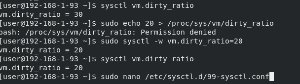

## Boot process
​
1. enable recovery options for grub, update main configuration file and find new item in grub2 config in /boot.

```

GRUB_TIMEOUT=5
GRUB_DISTRIBUTOR="$(sed 's, release .*$,,g' /etc/system-release)"
GRUB_DEFAULT=saved
GRUB_DISABLE_SUBMENU=false
GRUB_TERMINAL_OUTPUT="console"
GRUB_CMDLINE_LINUX="crashkernel=auto rhgb quiet"
GRUB_DISABLE_RECOVERY="false"
```
$ sudo grub2-mkconfig -o /boot/grub2/grub.cfg


3. modify option vm.dirty_ratio:
   - using echo utility
   - using sysctl utility
   - 


   - using sysctl configuration files

```
# sysctl settings are defined through files in
# /usr/lib/sysctl.d/, /run/sysctl.d/, and /etc/sysctl.d/.
#
# Vendors settings live in /usr/lib/sysctl.d/.
# To override a whole file, create a new file with the same in
# /etc/sysctl.d/ and put new settings there. To override
# only specific settings, add a file with a lexically later
# name in /etc/sysctl.d/ and put new settings there.
#
# For more information, see sysctl.conf(5) and sysctl.d(5).
vm.dirty_ratio = 10
```
$ sudo sysctl --system

* extra
1. Inspect initrd file contents. Find all files that are related to XFS filesystem and give a short description for every file.

```
[user@192-168-1-93 initrd]$ sudo lsinitrd /boot/initramfs-3.10.0-1160.49.1.el7.x86_64.img  | more | grep xfs
drwxr-xr-x   2 root     root            0 Dec 16 19:00 usr/lib/modules/3.10.0-1160.49.1.el7.x86_64/kernel/fs/xfs
-rw-r--r--   1 root     root       335816 Nov 30 19:04 usr/lib/modules/3.10.0-1160.49.1.el7.x86_64/kernel/fs/xfs/xfs.ko.xz
-rwxr-xr-x   1 root     root          433 Sep 30  2020 usr/sbin/fsck.xfs
-rwxr-xr-x   1 root     root       590208 Dec 16 19:00 usr/sbin/xfs_db
-rwxr-xr-x   1 root     root          747 Sep 30  2020 usr/sbin/xfs_metadump
-rwxr-xr-x   1 root     root       576720 Dec 16 19:00 usr/sbin/xfs_repair
```
usr/lib/modules/ - modules of kernel to work with xfs
fsck.xfs is called by the generic Linux fsck(8) program at startup to check and repair an XFS filesystem.
xfs_db is  used to examine an XFS filesystem. Under rare circumstances it can also be used to modify an XFS filesystem.
xfs_metadump  is a debugging tool that copies the metadata from an XFS filesystem to a file. 
xfs_repair  repairs  corrupt  or  damaged XFS filesystems 

2. Study dracut utility that is used for rebuilding initrd image. Give an example for adding driver/kernel module for your initrd and recreating it.

according to the docs 
dracut --force --add-drivers <module_name> /boot/<initrd-kernel_version>

so, 
dracut --force --add-drivers kernel /boot/initramfs-$(uname -r).img $(uname -r)

3. Explain the difference between ordinary and rescue initrd images.

I guess, ordinary initrd image acts as a root filesystem with certain modules that are needed for normal start of system.
Rescue initrd image consists of certain modules that are needed for recovering of system.

## Selinux

Disable selinux using kernel cmdline

```
 /etc/default/grub
GRUB_TIMEOUT=5
GRUB_DISTRIBUTOR="$(sed 's, release .*$,,g' /etc/system-release)"
GRUB_DEFAULT=saved
GRUB_DISABLE_SUBMENU=false
GRUB_TERMINAL_OUTPUT="console"
GRUB_CMDLINE_LINUX="crashkernel=auto rhgb quiet selinux=0"
GRUB_DISABLE_RECOVERY="true"
```
$ sudo grub2-mkconfig -o /boot/grub2/grub.cfg
$ reboot

```
$ sestatus 
SELinux status:                 disabled
```
