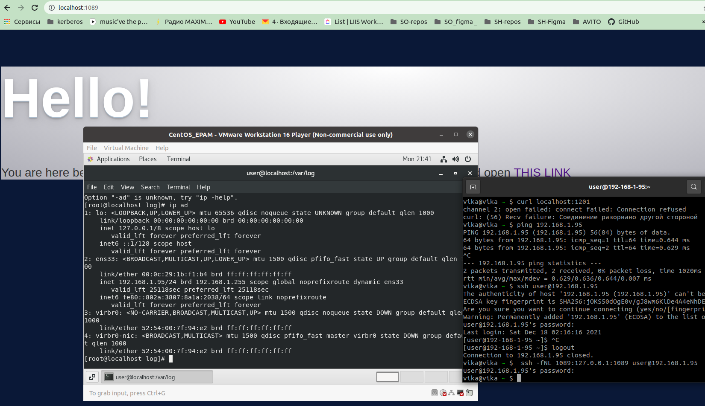
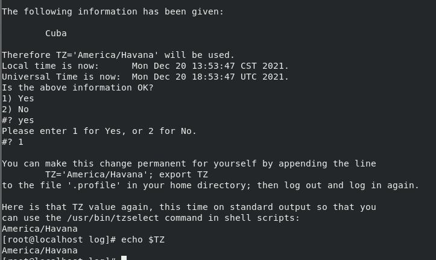

# Task 1.

---------------------
$ cat  ~/.ssh/config

```
Host remotehost
   Hostname 18.221.144.175
   User Viktoriia_Loseva
   IdentityFile /root/.ssh/hw-5
```

----------------

curl 172.31.45.237:80
curl 172.31.45.237:80  #работает веб-сервер nginx/1.20.1

----------------

$ ssh -fNL 1089:172.31.45.237:80 remotehost  #ssh - tunel


curl -I localhost:1089

```
HTTP/1.1 200 OK
Server: nginx/1.20.1
Date: Mon, 20 Dec 2021 18:35:48 GMT
Content-Type: text/html
Content-Length: 1856
Last-Modified: Thu, 16 Dec 2021 09:00:42 GMT
Connection: keep-alive
ETag: "61bb003a-740"
Accept-Ranges: bytes
```


# Task 2.

1. 
$ tzselect
2
16

