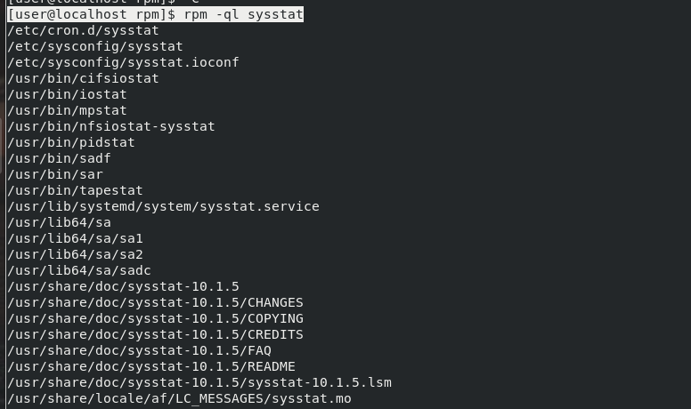
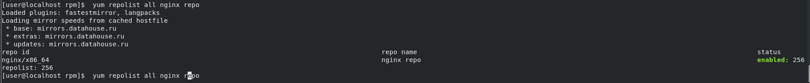
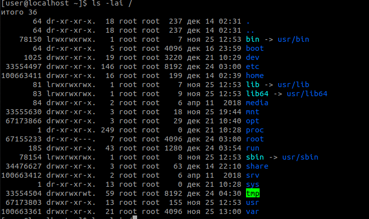
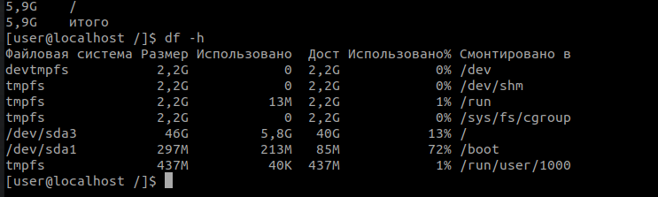

## Repositories and Packages

- Use rpm for the following tasks:
1. 
$ wget http://mirror.centos.org/centos/7/os/x86_64/Packages/sysstat-10.1.5-19.el7.x86_64.rpm

2. 
$ rpm -qip sysstat-10.1.5-19.el7.x86_64.rpm <br/>
$ rpm -ql sysstat <br/>
  <br/>
3. <br/>
$ sudo rpm -ivh sysstat-10.1.5-19.el7.x86_64.rpm <br/>


- Add NGINX repository (need to find repository config on https://www.nginx.com/) and complete the following tasks using yum:
1.
$ yum repolist all nginx repo
 
2. <br/>
$ sudo yum install nginx

3.
$ yum history 

```
Loaded plugins: fastestmirror, langpacks
ID     | Login user               | Date and time    | Action(s)      | Altered
-------------------------------------------------------------------------------
     3 | Vika <user>              | 2021-12-24 02:12 | Install        |    1 EE
     2 | Vika <user>              | 2021-12-16 18:56 | I, U           |  301 EE
     1 | System <unset>           | 2021-11-25 12:53 | Install        | 1407   
history list
```
$ sudo yum history undo 3

4. 
$ sudo yum-config-manager --enable nginx repo
 
5.
$ sudo yum remove sysstat.x86_64 

6. 
$ sudo yum info epel-release.noarch 

7. 
$ yum --disablerepo="*" --enablerepo="epel" list available  | wc -l
13915

8.
$  sudo yum install ncdu.x86_64

-----------------
*Extra task:
    Need to create an rpm package consists of a shell script and a text file. The script should output words count stored in file. <br/>
  ./rpmbuild.zip 

## Work with files
​
1. Find all regular files below 100 bytes inside your home directory. <br/>
find . -type f -size 0b

2. Find an inode number and a hard links count for the root directory. The hard link count should be about 17. Why? <br/>
$ stat --format="innodes"/"%i""  ""links"/"%h" /  <br/>

```
innodes/64  links/18 
```
I supose, that previous  command  doesn't count symlinks. ( Предполагаю, что не считаются symlink, которых 4 штуки. )  <br/>

bin -> usr/bin
lib -> usr/lib
lib64 -> usr/lib64
sbin -> usr/sbin 

Number of hard-links for thees partitions is 1  (У них количество hard link равно 1.)

3. Check what inode numbers have "/" and "/boot" directory. Why? <br/>

Dirs are mounted into different disk partitions. The special boot fs is located in /dev/sda1, and /boot is a root for it as well as / is a root for basic fs. Thats explains an equal inodes number.  <br/>

(Каталоги смонтированы в разные разделы диска (судя по выводу команды df -hl), а в /dev/sda1 , скорее, находится специальная файловая система для загрузки, в которой /boot, является коренем, что объясняет одинаковое количество inodes с основной файловой системой.)  <br/>
``` 
/dev/sda3           46G         5,8G   40G           13% /
/dev/sda1          297M         213M   85M           72% /boot
```
  <br/>
 
4. Check the root directory space usage by du command. Compare it with an information from df. If you find differences, try to find out why it happens.
$ du -ch / 2>/dev/null
$ df -h
  <br/>
 
df показал меньше, потому что не показывает swap отделы. Или же какой-то процесс использует удаленные файлы, после которых остались inodes, а df не учитывает их. <br/>
5. Check disk space usage of /var/log directory using ncdu <br/>
$ ncdu  /var/log <br/>
