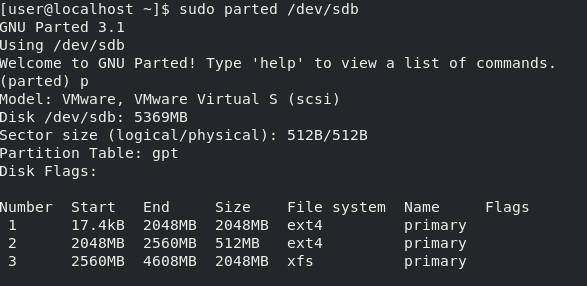
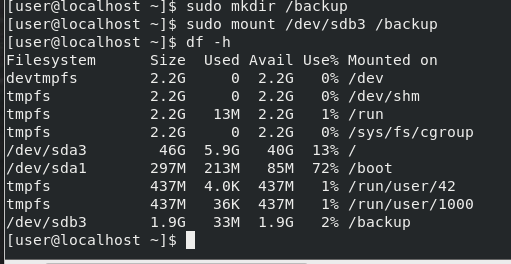
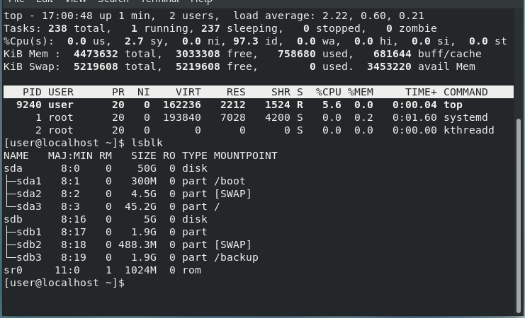
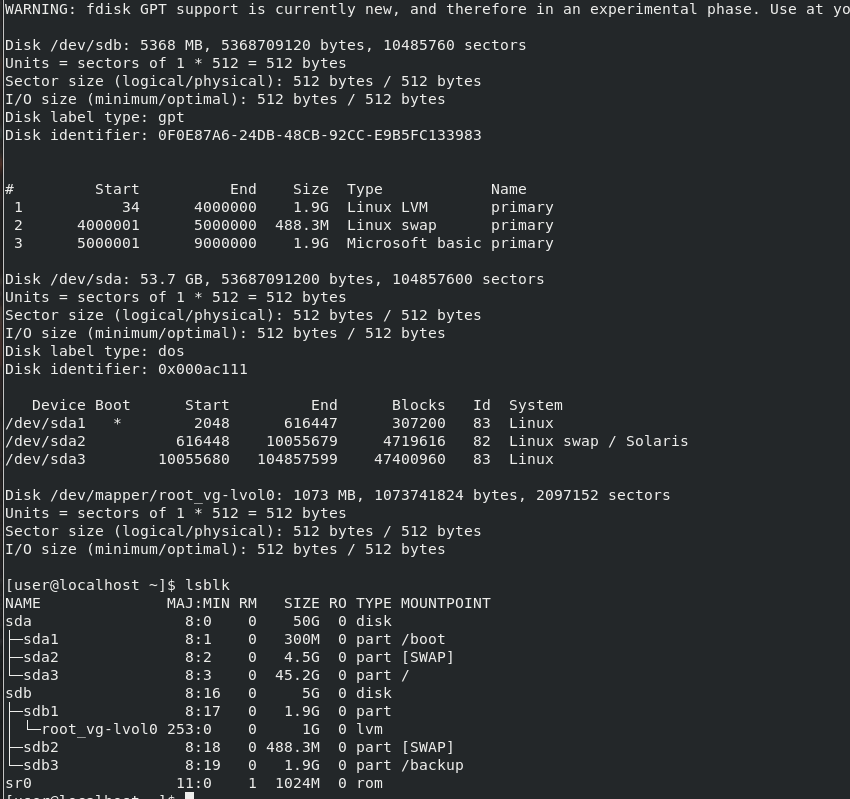
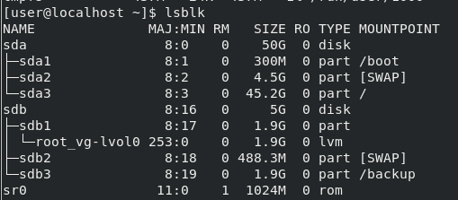

# 1
preparing: Attaching of a new vd


## 1.1
$ sudo fdisk /dev/sdb -l  <br/>
$ parted /dev/sdb  <br/>

   (parted) p <br/>
   (parted) mklable gpt  <br/>
   (parted) mkpart primary 0 2048  <br/>
   (parted) q  <br/>
   
$ sudo mkfs.ext4 /dev/sbd1  <br/>

```
$ fdisk /dev/sdb1
[...]
Command (m for help): t
Partition number (1-3, default 3): 3
Hex code (type L to list all codes): L

Partition type (type L to list all types): 20
Changed type of partition 'Microsoft basic data' to 'Linux filesystem'

Command (m for help): w
The partition table has been altered!

Calling ioctl() to re-read partition table.
Syncing disks.
[user@localhost ~]$  sudo fdisk /dev/sdb -l
WARNING: fdisk GPT support is currently new, and therefore in an experimental phase. Use at your own discretion.

Disk /dev/sdb: 5368 MB, 5368709120 bytes, 10485760 sectors
Units = sectors of 1 * 512 = 512 bytes
Sector size (logical/physical): 512 bytes / 512 bytes
I/O size (minimum/optimal): 512 bytes / 512 bytes
Disk label type: gpt
Disk identifier: 5FB21CC7-9405-4892-8A7A-A59024A83D50


#         Start          End    Size  Type            Name
 1           34      3906250    1.9G  Linux filesyste primary
```


## 1.2

$ sudo parted /dev/sdb  <br/>

  (parted) p  <br/>
  (parted) mkpart primary 2048 2560MB  <br/>
  (parted) q  <br/>
  
$ sudo mkfs.ext4 /dev/sbd2  <br/>

...

```
Partition type (type L to list all types): 19
Changed type of partition 'Microsoft basic data' to 'Linux swap'

Command (m for help): w
The partition table has been altered!

Calling ioctl() to re-read partition table.
Syncing disks.
[user@localhost ~]$  sudo fdisk /dev/sdb -l
WARNING: fdisk GPT support is currently new, and therefore in an experimental phase. Use at your own discretion.

Disk /dev/sdb: 5368 MB, 5368709120 bytes, 10485760 sectors
Units = sectors of 1 * 512 = 512 bytes
Sector size (logical/physical): 512 bytes / 512 bytes
I/O size (minimum/optimal): 512 bytes / 512 bytes
Disk label type: gpt
Disk identifier: 0F0E87A6-24DB-48CB-92CC-E9B5FC133983


#         Start          End    Size  Type            Name
 1           34      4000000    1.9G  Linux filesyste primary
 2      4000001      5000000  488.3M  Linux swap      primary
```


## 1.3

$ parted /dev/sdb  <br/>

  (parted) p  <br/>
  (parted) mkpart primary 2560 4608MB  <br/>
  (parted) q  <br/>
  
$ sudo mkfs.xfs /dev/sdb3  <br/>



## 1.4

$ swapon --show  <br/>
$ sudo mkswap /dev/sdb2  <br/>
$ sudo swapon /dev/sdb2 <br/>


## 1.5



$ sudo blkid /dev/sdb3  <br/>

```
/dev/sdb3: UUID="71f77eaa-f2e3-47ec-ae31-a52d785ae12f" TYPE="xfs" PARTLABEL="primary" PARTUUID="1bfff556-f273-4804-a7d2-6ac5d1a3bd03" 
```

$ nano /etc/fstab  <br/>

```
#
# /etc/fstab
# Created by anaconda on Thu Nov 25 04:53:22 2021
#
# Accessible filesystems, by reference, are maintained under '/dev/disk'
# See man pages fstab(5), findfs(8), mount(8) and/or blkid(8) for more info
#
UUID=81f7e5fa-01b7-491e-9348-a9ffb548dd3e /                       xfs     defaults        0 0
UUID=6c679711-5706-432b-96c1-39355e97ad10 /boot                   xfs     defaults        0 0
UUID=5ab707c0-04c6-43f0-be8e-5fff18adaf1b swap                    swap    defaults        0 0
/dev/sdb2 none swap sw 0 0
UUID=71f77eaa-f2e3-47ec-ae31-a52d785ae12f /backup                xfs     defaults        0 0

```

## 1.6

$ echo '/dev/sdb2 none swap 0 0' | sudo tee -a /etc/fstab  <br/>

## 1.7 



# 2

## 2.1

```
Sector size (logical/physical): 512 bytes / 512 bytes
I/O size (minimum/optimal): 512 bytes / 512 bytes
Disk label type: gpt
Disk identifier: 0F0E87A6-24DB-48CB-92CC-E9B5FC133983


#         Start          End    Size  Type            Name
 1           34      4000000    1.9G  Linux filesyste primary
 2      4000001      5000000  488.3M  Linux swap      primary
 3      5000001      9000000    1.9G  Microsoft basic primary
```

$  sudo fdisk /dev/sdb   <br/>

```
WARNING: fdisk GPT support is currently new, and therefore in an experimental phase. Use at your own discretion.
Welcome to fdisk (util-linux 2.23.2).

Changes will remain in memory only, until you decide to write them.
Be careful before using the write command.


Command (m for help): t
Partition number (1-3, default 3): 1
Partition type (type L to list all types): L

...

```

## 2.2

$ sudo pvcreate /dev/sdb1  <br/>

```
[user@localhost ~]$ pvs
  WARNING: Running as a non-root user. Functionality may be unavailable.
  /run/lvm/lvmetad.socket: access failed: Permission denied
  WARNING: Failed to connect to lvmetad. Falling back to device scanning.
  /run/lock/lvm/P_global:aux: open failed: Permission denied
  Unable to obtain global lock.
[user@localhost ~]$ sudo pvs
  PV         VG Fmt  Attr PSize  PFree 
  /dev/sdb1     lvm2 ---  <1.91g <1.91g
```

## 2.3

$ sudo vgcreate root_vg /dev/sdb1  <br/>

## 2.4

$ sudo lvcreate -L1G root_vg  <br/>

## 2.5



## 2.6 

```
[user@localhost ~]$ sudo lvextend -l +100%FREE /dev/root_vg/lvol0
  Size of logical volume root_vg/lvol0 changed from 1.00 GiB (256 extents) to <1.91 GiB (488 extents).
  Logical volume root_vg/lvol0 successfully resized.
[user@localhost ~]$ sudo lvs
  LV    VG      Attr       LSize  Pool Origin Data%  Meta%  Move Log Cpy%Sync Convert
  lvol0 root_vg -wi-a----- <1.91g      
 ```
 ## 2.7 
 
 
