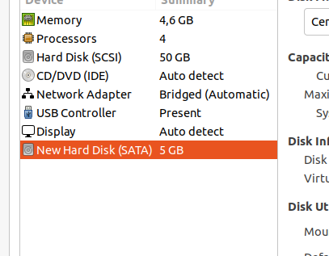

Attaching of a new vd



## 1.1
sudo fdisk /dev/sdb -l  <br/>
parted /dev/sdb  <br/>
(parted) p  <br/>
(parted) mklable gpt  <br/>
(parted) mkpart primary 0 2048MB  <br/>
(parted) q  <br/>
sudo mkfs.ext4 /dev/sbd  <br/>

```
\# fdisk /dev/sdb1
[...]
Command (m for help): t
Partition number (1-3, default 3): 3
Hex code (type L to list all codes): L

Partition type (type L to list all types): 20
Changed type of partition 'Microsoft basic data' to 'Linux filesystem'

Command (m for help): w
The partition table has been altered!

Calling ioctl() to re-read partition table.
Syncing disks.
[user@localhost ~]$  sudo fdisk /dev/sdb -l
WARNING: fdisk GPT support is currently new, and therefore in an experimental phase. Use at your own discretion.

Disk /dev/sdb: 5368 MB, 5368709120 bytes, 10485760 sectors
Units = sectors of 1 * 512 = 512 bytes
Sector size (logical/physical): 512 bytes / 512 bytes
I/O size (minimum/optimal): 512 bytes / 512 bytes
Disk label type: gpt
Disk identifier: 0F0E87A6-24DB-48CB-92CC-E9B5FC133983


#         Start          End    Size  Type            Name
 1           34      4000000    1.9G  Linux filesyste primary
```
