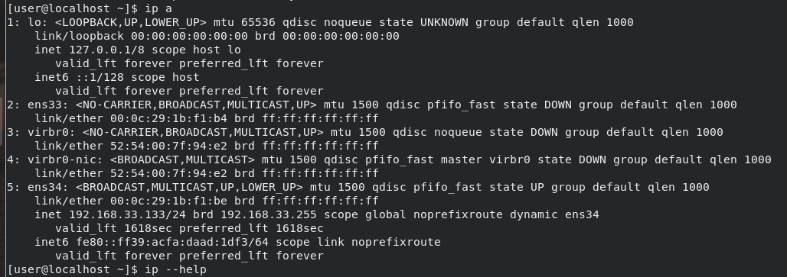

## 1

### 1.1



$ sudo ip address add 192.168.33.200/24 dev ens34


Checking of ssh connection btw host and vm:

<details><summary>$ sudo tcpdump -ni ens34 port 22 -v</summary>
    
```
tcpdump: listening on ens34, link-type EN10MB (Ethernet), capture size 262144 bytes
20:30:50.677919 IP (tos 0x0, ttl 64, id 2160, offset 0, flags [DF], proto TCP (6), length 60)
    192.168.33.1.59112 > 192.168.33.200.ssh: Flags [S], cksum 0xc0b5 (correct), seq 2431541708, win 64240, options [mss 1460,sackOK,TS val 1013559836 ecr 0,nop,wscale 7], length 0
20:30:50.678099 IP (tos 0x0, ttl 64, id 0, offset 0, flags [DF], proto TCP (6), length 60)
    192.168.33.200.ssh > 192.168.33.1.59112: Flags [S.], cksum 0xc448 (incorrect -> 0xe74f), seq 3300602077, ack 2431541709, win 28960, options [mss 1460,sackOK,TS val 3108189 ecr 1013559836,nop,wscale 7], length 0
20:30:50.678298 IP (tos 0x0, ttl 64, id 2161, offset 0, flags [DF], proto TCP (6), length 52)
    192.168.33.1.59112 > 192.168.33.200.ssh: Flags [.], cksum 0x8545 (correct), ack 1, win 502, options [nop,nop,TS val 1013559837 ecr 3108189], length 0
20:30:50.678891 IP (tos 0x0, ttl 64, id 2162, offset 0, flags [DF], proto TCP (6), length 93)
    192.168.33.1.59112 > 192.168.33.200.ssh: Flags [P.], cksum 0x61ec (correct), seq 1:42, ack 1, win 502, options [nop,nop,TS val 1013559837 ecr 3108189], length 41
20:30:50.679026 IP (tos 0x0, ttl 64, id 23939, offset 0, flags [DF], proto TCP (6), length 52)
    192.168.33.200.ssh > 192.168.33.1.59112: Flags [.], cksum 0xc440 (incorrect -> 0x862e), ack 42, win 227, options [nop,nop,TS val 3108190 ecr 1013559837], length 0
20:30:50.698612 IP (tos 0x0, ttl 64, id 23940, offset 0, flags [DF], proto TCP (6), length 73)
    192.168.33.200.ssh > 192.168.33.1.59112: Flags [P.], cksum 0xc455 (incorrect -> 0xc254), seq 1:22, ack 42, win 227, options [nop,nop,TS val 3108210 ecr 1013559837], length 21
20:30:50.699428 IP (tos 0x0, ttl 64, id 2163, offset 0, flags [DF], proto TCP (6), length 52)
    192.168.33.1.59112 > 192.168.33.200.ssh: Flags [.], cksum 0x84dd (correct), ack 22, win 502, options [nop,nop,TS val 1013559858 ecr 3108210], length 0
20:30:50.700283 IP (tos 0x0, ttl 64, id 2164, offset 0, flags [DF], proto TCP (6), length 1564)
    192.168.33.1.59112 > 192.168.33.200.ssh: Flags [P.], cksum 0xca28 (incorrect -> 0xa912), seq 42:1554, ack 22, win 502, options [nop,nop,TS val 1013559859 ecr 3108210], length 1512
20:30:50.700389 IP (tos 0x0, ttl 64, id 23941, offset 0, flags [DF], proto TCP (6), length 52)
    192.168.33.200.ssh > 192.168.33.1.59112: Flags [.], cksum 0xc440 (incorrect -> 0x7fef), ack 1554, win 250, options [nop,nop,TS val 3108211 ecr 1013559859], length 0
20:30:50.706889 IP (tos 0x0, ttl 64, id 23942, offset 0, flags [DF], proto TCP (6), length 1332)
    192.168.33.200.ssh > 192.168.33.1.59112: Flags [P.], cksum 0xc940 (incorrect -> 0x6941), seq 22:1302, ack 1554, win 250, options [nop,nop,TS val 3108218 ecr 1013559859], length 1280
20:30:50.707253 IP (tos 0x0, ttl 64, id 2166, offset 0, flags [DF], proto TCP (6), length 52)
    192.168.33.1.59112 > 192.168.33.200.ssh: Flags [.], cksum 0x79e6 (correct), ack 1302, win 501, options [nop,nop,TS val 1013559866 ecr 3108218], length 0
20:30:50.710383 IP (tos 0x0, ttl 64, id 2167, offset 0, flags [DF], proto TCP (6), length 100)
    192.168.33.1.59112 > 192.168.33.200.ssh: Flags [P.], cksum 0x138c (correct), seq 1554:1602, ack 1302, win 501, options [nop,nop,TS val 1013559869 ecr 3108218], length 48
20:30:50.714653 IP (tos 0x0, ttl 64, id 23943, offset 0, flags [DF], proto TCP (6), length 416)
    192.168.33.200.ssh > 192.168.33.1.59112: Flags [P.], cksum 0xc5ac (incorrect -> 0xe344), seq 1302:1666, ack 1602, win 250, options [nop,nop,TS val 3108226 ecr 1013559869], length 364
20:30:50.715312 IP (tos 0x0, ttl 64, id 2168, offset 0, flags [DF], proto TCP (6), length 52)
    192.168.33.1.59112 > 192.168.33.200.ssh: Flags [.], cksum 0x783b (correct), ack 1666, win 501, options [nop,nop,TS val 1013559873 ecr 3108226], length 0
20:30:50.717608 IP (tos 0x0, ttl 64, id 2169, offset 0, flags [DF], proto TCP (6), length 68)
    192.168.33.1.59112 > 192.168.33.200.ssh: Flags [P.], cksum 0x6dff (correct), seq 1602:1618, ack 1666, win 501, options [nop,nop,TS val 1013559876 ecr 3108226], length 16
20:30:50.757910 IP (tos 0x0, ttl 64, id 23944, offset 0, flags [DF], proto TCP (6), length 52)
    192.168.33.200.ssh > 192.168.33.1.59112: Flags [.], cksum 0xc440 (incorrect -> 0x78f8), ack 1618, win 250, options [nop,nop,TS val 3108269 ecr 1013559876], length 0
20:30:50.758313 IP (tos 0x0, ttl 64, id 2170, offset 0, flags [DF], proto TCP (6), length 96)
    192.168.33.1.59112 > 192.168.33.200.ssh: Flags [P.], cksum 0x1f9d (correct), seq 1618:1662, ack 1666, win 501, options [nop,nop,TS val 1013559917 ecr 3108269], length 44
20:30:50.758412 IP (tos 0x0, ttl 64, id 23945, offset 0, flags [DF], proto TCP (6), length 52)
    192.168.33.200.ssh > 192.168.33.1.59112: Flags [.], cksum 0xc440 (incorrect -> 0x78a3), ack 1662, win 250, options [nop,nop,TS val 3108269 ecr 1013559917], length 0
20:30:50.758627 IP (tos 0x0, ttl 64, id 23946, offset 0, flags [DF], proto TCP (6), length 96)
    192.168.33.200.ssh > 192.168.33.1.59112: Flags [P.], cksum 0xc46c (incorrect -> 0x44f4), seq 1666:1710, ack 1662, win 250, options [nop,nop,TS val 3108270 ecr 1013559917], length 44
20:30:50.759503 IP (tos 0x0, ttl 64, id 2171, offset 0, flags [DF], proto TCP (6), length 112)
    192.168.33.1.59112 > 192.168.33.200.ssh: Flags [P.], cksum 0xaecc (correct), seq 1662:1722, ack 1710, win 501, options [nop,nop,TS val 1013559917 ecr 3108270], length 60
20:30:50.799920 IP (tos 0x0, ttl 64, id 23947, offset 0, flags [DF], proto TCP (6), length 52)
    192.168.33.200.ssh > 192.168.33.1.59112: Flags [.], cksum 0xc440 (incorrect -> 0x7811), ack 1722, win 250, options [nop,nop,TS val 3108311 ecr 1013559917], length 0
20:31:00.775934 IP (tos 0x0, ttl 64, id 23948, offset 0, flags [DF], proto TCP (6), length 136)
    192.168.33.200.ssh > 192.168.33.1.59112: Flags [P.], cksum 0xc494 (incorrect -> 0x3413), seq 1710:1794, ack 1722, win 250, options [nop,nop,TS val 3118284 ecr 1013559917], length 84
20:31:00.778436 IP (tos 0x0, ttl 64, id 2172, offset 0, flags [DF], proto TCP (6), length 552)
    192.168.33.1.59112 > 192.168.33.200.ssh: Flags [P.], cksum 0x7e76 (correct), seq 1722:2222, ack 1794, win 501, options [nop,nop,TS val 1013569937 ecr 3118284], length 500
20:31:00.778579 IP (tos 0x0, ttl 64, id 23949, offset 0, flags [DF], proto TCP (6), length 52)
    192.168.33.200.ssh > 192.168.33.1.59112: Flags [.], cksum 0xc440 (incorrect -> 0x2794), ack 2222, win 273, options [nop,nop,TS val 3118289 ecr 1013569937], length 0
20:31:00.784253 IP (tos 0x0, ttl 64, id 23950, offset 0, flags [DF], proto TCP (6), length 136)
    192.168.33.200.ssh > 192.168.33.1.59112: Flags [P.], cksum 0xc494 (incorrect -> 0x04b3), seq 1794:1878, ack 2222, win 273, options [nop,nop,TS val 3118295 ecr 1013569937], length 84
20:31:00.784653 IP (tos 0x0, ttl 64, id 2173, offset 0, flags [DF], proto TCP (6), length 552)
    192.168.33.1.59112 > 192.168.33.200.ssh: Flags [P.], cksum 0xed56 (correct), seq 2222:2722, ack 1878, win 501, options [nop,nop,TS val 1013569943 ecr 3118295], length 500
20:31:00.785646 IP (tos 0x0, ttl 64, id 23951, offset 0, flags [DF], proto TCP (6), length 136)
    192.168.33.200.ssh > 192.168.33.1.59112: Flags [P.], cksum 0xc494 (incorrect -> 0xeb34), seq 1878:1962, ack 2722, win 296, options [nop,nop,TS val 3118297 ecr 1013569943], length 84
20:31:00.786207 IP (tos 0x0, ttl 64, id 2174, offset 0, flags [DF], proto TCP (6), length 552)
    192.168.33.1.59112 > 192.168.33.200.ssh: Flags [P.], cksum 0x099c (correct), seq 2722:3222, ack 1962, win 501, options [nop,nop,TS val 1013569945 ecr 3118297], length 500
20:31:00.787013 IP (tos 0x0, ttl 64, id 23952, offset 0, flags [DF], proto TCP (6), length 136)
    192.168.33.200.ssh > 192.168.33.1.59112: Flags [P.], cksum 0xc494 (incorrect -> 0xdd13), seq 1962:2046, ack 3222, win 318, options [nop,nop,TS val 3118298 ecr 1013569945], length 84
20:31:00.787599 IP (tos 0x0, ttl 64, id 2175, offset 0, flags [DF], proto TCP (6), length 552)
    192.168.33.1.59112 > 192.168.33.200.ssh: Flags [P.], cksum 0x559d (correct), seq 3222:3722, ack 2046, win 501, options [nop,nop,TS val 1013569946 ecr 3118298], length 500
20:31:00.788459 IP (tos 0x0, ttl 64, id 23953, offset 0, flags [DF], proto TCP (6), length 136)
    192.168.33.200.ssh > 192.168.33.1.59112: Flags [P.], cksum 0xc494 (incorrect -> 0xf414), seq 2046:2130, ack 3722, win 341, options [nop,nop,TS val 3118299 ecr 1013569946], length 84
20:31:00.829161 IP (tos 0x0, ttl 64, id 2176, offset 0, flags [DF], proto TCP (6), length 52)
    192.168.33.1.59112 > 192.168.33.200.ssh: Flags [.], cksum 0x1f48 (correct), ack 2130, win 501, options [nop,nop,TS val 1013569987 ecr 3118299], length 0
20:31:08.343673 IP (tos 0x0, ttl 64, id 2177, offset 0, flags [DF], proto TCP (6), length 136)
    192.168.33.1.59112 > 192.168.33.200.ssh: Flags [P.], cksum 0x0c05 (correct), seq 3722:3806, ack 2130, win 501, options [nop,nop,TS val 1013577502 ecr 3118299], length 84
20:31:08.367709 IP (tos 0x0, ttl 64, id 23954, offset 0, flags [DF], proto TCP (6), length 80)
    192.168.33.200.ssh > 192.168.33.1.59112: Flags [P.], cksum 0xc45c (incorrect -> 0xef14), seq 2130:2158, ack 3806, win 341, options [nop,nop,TS val 3125879 ecr 1013577502], length 28
20:31:08.368105 IP (tos 0x0, ttl 64, id 2178, offset 0, flags [DF], proto TCP (6), length 52)
    192.168.33.1.59112 > 192.168.33.200.ssh: Flags [.], cksum 0xe3c7 (correct), ack 2158, win 501, options [nop,nop,TS val 1013577527 ecr 3125879], length 0
20:31:08.368585 IP (tos 0x0, ttl 64, id 2179, offset 0, flags [DF], proto TCP (6), length 164)
    192.168.33.1.59112 > 192.168.33.200.ssh: Flags [P.], cksum 0x6091 (correct), seq 3806:3918, ack 2158, win 501, options [nop,nop,TS val 1013577527 ecr 3125879], length 112
20:31:08.408584 IP (tos 0x0, ttl 64, id 23955, offset 0, flags [DF], proto TCP (6), length 52)
    192.168.33.200.ssh > 192.168.33.1.59112: Flags [.], cksum 0xc440 (incorrect -> 0xe3ce), ack 3918, win 341, options [nop,nop,TS val 3125920 ecr 1013577527], length 0
20:31:08.627586 IP (tos 0x0, ttl 64, id 23956, offset 0, flags [DF], proto TCP (6), length 552)
    192.168.33.200.ssh > 192.168.33.1.59112: Flags [P.], cksum 0xc634 (incorrect -> 0x26d7), seq 2158:2658, ack 3918, win 341, options [nop,nop,TS val 3126139 ecr 1013577527], length 500
20:31:08.627830 IP (tos 0x0, ttl 64, id 2180, offset 0, flags [DF], proto TCP (6), length 52)
    192.168.33.1.59112 > 192.168.33.200.ssh: Flags [.], cksum 0xdf5c (correct), ack 2658, win 501, options [nop,nop,TS val 1013577786 ecr 3126139], length 0
20:31:08.627890 IP (tos 0x0, ttl 64, id 23957, offset 0, flags [DF], proto TCP (6), length 96)
    192.168.33.200.ssh > 192.168.33.1.59112: Flags [P.], cksum 0xc46c (incorrect -> 0x3e03), seq 2658:2702, ack 3918, win 341, options [nop,nop,TS val 3126139 ecr 1013577786], length 44
20:31:08.628027 IP (tos 0x0, ttl 64, id 2181, offset 0, flags [DF], proto TCP (6), length 52)
    192.168.33.1.59112 > 192.168.33.200.ssh: Flags [.], cksum 0xdf2f (correct), ack 2702, win 501, options [nop,nop,TS val 1013577787 ecr 3126139], length 0
20:31:08.628397 IP (tos 0x10, ttl 64, id 2182, offset 0, flags [DF], proto TCP (6), length 512)
    192.168.33.1.59112 > 192.168.33.200.ssh: Flags [P.], cksum 0xc52b (correct), seq 3918:4378, ack 2702, win 501, options [nop,nop,TS val 1013577787 ecr 3126139], length 460
20:31:08.628468 IP (tos 0x0, ttl 64, id 23958, offset 0, flags [DF], proto TCP (6), length 52)
    192.168.33.200.ssh > 192.168.33.1.59112: Flags [.], cksum 0xc440 (incorrect -> 0xdded), ack 4378, win 363, options [nop,nop,TS val 3126139 ecr 1013577787], length 0
20:31:08.637326 IP (tos 0x10, ttl 64, id 23959, offset 0, flags [DF], proto TCP (6), length 160)
    192.168.33.200.ssh > 192.168.33.1.59112: Flags [P.], cksum 0xc4ac (incorrect -> 0x2df8), seq 2702:2810, ack 4378, win 363, options [nop,nop,TS val 3126148 ecr 1013577787], length 108
20:31:08.637555 IP (tos 0x10, ttl 64, id 2183, offset 0, flags [DF], proto TCP (6), length 52)
    192.168.33.1.59112 > 192.168.33.200.ssh: Flags [.], cksum 0xdce5 (correct), ack 2810, win 501, options [nop,nop,TS val 1013577796 ecr 3126148], length 0
20:31:08.639621 IP (tos 0x10, ttl 64, id 23960, offset 0, flags [DF], proto TCP (6), length 296)
    192.168.33.200.ssh > 192.168.33.1.59112: Flags [P.], cksum 0xc534 (incorrect -> 0x81d7), seq 2810:3054, ack 4378, win 363, options [nop,nop,TS val 3126151 ecr 1013577796], length 244
20:31:08.639829 IP (tos 0x10, ttl 64, id 2184, offset 0, flags [DF], proto TCP (6), length 52)
    192.168.33.1.59112 > 192.168.33.200.ssh: Flags [.], cksum 0xdbec (correct), ack 3054, win 501, options [nop,nop,TS val 1013577798 ecr 3126151], length 0
20:31:08.902074 IP (tos 0x10, ttl 64, id 23961, offset 0, flags [DF], proto TCP (6), length 136)
    192.168.33.200.ssh > 192.168.33.1.59112: Flags [P.], cksum 0xc494 (incorrect -> 0xf3d8), seq 3054:3138, ack 4378, win 363, options [nop,nop,TS val 3126413 ecr 1013577798], length 84
20:31:08.902301 IP (tos 0x10, ttl 64, id 2185, offset 0, flags [DF], proto TCP (6), length 52)
    192.168.33.1.59112 > 192.168.33.200.ssh: Flags [.], cksum 0xd98b (correct), ack 3138, win 501, options [nop,nop,TS val 1013578061 ecr 3126413], length 0
```
    
</details>

Deleting: 
$ sudo ip address del 192.168.33.200/24 dev ens34

### 1.2 (UPDATE)

$ sudo nano /etc/sysconfig/network-scripts/ifcfg-ens34

```
NM_CONTROLLED=no
DEVICE=ens34
ONBOOT=yes
BOOTPROTO=static
IPADDR0=192.168.33.118
PREFIX0=24
IPADDR1=192.168.33.200
PREFIX1=24
```

$ sudo systemctl restart network.service 

Checking of ssh connection btw host and vm:

<details><summary>$ sudo tcpdump -ni ens34 port 22 -vv</summary>

```
[sudo] password for user: 
tcpdump: listening on ens34, link-type EN10MB (Ethernet), capture size 262144 bytes
21:16:07.927048 IP (tos 0x0, ttl 64, id 50097, offset 0, flags [DF], proto TCP (6), length 60)
    192.168.33.1.59946 > 192.168.33.200.ssh: Flags [S], cksum 0x567f (correct), seq 3324714287, win 64240, options [mss 1460,sackOK,TS val 1016277063 ecr 0,nop,wscale 7], length 0
21:16:07.927176 IP (tos 0x0, ttl 64, id 0, offset 0, flags [DF], proto TCP (6), length 60)
    192.168.33.200.ssh > 192.168.33.1.59946: Flags [S.], cksum 0xc448 (incorrect -> 0xb5c6), seq 1946736203, ack 3324714288, win 28960, options [mss 1460,sackOK,TS val 4294762534 ecr 1016277063,nop,wscale 7], length 0
21:16:07.927388 IP (tos 0x0, ttl 64, id 50098, offset 0, flags [DF], proto TCP (6), length 52)
    192.168.33.1.59946 > 192.168.33.200.ssh: Flags [.], cksum 0x53bc (correct), seq 1, ack 1, win 502, options [nop,nop,TS val 1016277064 ecr 4294762534], length 0
21:16:07.928144 IP (tos 0x0, ttl 64, id 50099, offset 0, flags [DF], proto TCP (6), length 93)
    192.168.33.1.59946 > 192.168.33.200.ssh: Flags [P.], cksum 0x3062 (correct), seq 1:42, ack 1, win 502, options [nop,nop,TS val 1016277065 ecr 4294762534], length 41
21:16:07.928246 IP (tos 0x0, ttl 64, id 13930, offset 0, flags [DF], proto TCP (6), length 52)
    192.168.33.200.ssh > 192.168.33.1.59946: Flags [.], cksum 0xc440 (incorrect -> 0x54a4), seq 1, ack 42, win 227, options [nop,nop,TS val 4294762535 ecr 1016277065], length 0
21:16:07.952694 IP (tos 0x0, ttl 64, id 13931, offset 0, flags [DF], proto TCP (6), length 73)
    192.168.33.200.ssh > 192.168.33.1.59946: Flags [P.], cksum 0xc455 (incorrect -> 0x90c6), seq 1:22, ack 42, win 227, options [nop,nop,TS val 4294762559 ecr 1016277065], length 21
21:16:07.953065 IP (tos 0x0, ttl 64, id 50100, offset 0, flags [DF], proto TCP (6), length 52)
    192.168.33.1.59946 > 192.168.33.200.ssh: Flags [.], cksum 0x534b (correct), seq 42, ack 22, win 502, options [nop,nop,TS val 1016277090 ecr 4294762559], length 0
21:16:07.953805 IP (tos 0x0, ttl 64, id 50101, offset 0, flags [DF], proto TCP (6), length 1564)
    192.168.33.1.59946 > 192.168.33.200.ssh: Flags [P.], cksum 0xca28 (incorrect -> 0x082d), seq 42:1554, ack 22, win 502, options [nop,nop,TS val 1016277090 ecr 4294762559], length 1512
21:16:07.953987 IP (tos 0x0, ttl 64, id 13932, offset 0, flags [DF], proto TCP (6), length 52)
    192.168.33.200.ssh > 192.168.33.1.59946: Flags [.], cksum 0xc440 (incorrect -> 0x4e5e), seq 22, ack 1554, win 250, options [nop,nop,TS val 4294762560 ecr 1016277090], length 0
21:16:07.962048 IP (tos 0x0, ttl 64, id 13933, offset 0, flags [DF], proto TCP (6), length 1332)
    192.168.33.200.ssh > 192.168.33.1.59946: Flags [P.], cksum 0xc940 (incorrect -> 0x0499), seq 22:1302, ack 1554, win 250, options [nop,nop,TS val 4294762568 ecr 1016277090], length 1280
21:16:07.962326 IP (tos 0x0, ttl 64, id 50103, offset 0, flags [DF], proto TCP (6), length 52)
    192.168.33.1.59946 > 192.168.33.200.ssh: Flags [.], cksum 0x4852 (correct), seq 1554, ack 1302, win 501, options [nop,nop,TS val 1016277099 ecr 4294762568], length 0
21:16:07.964151 IP (tos 0x0, ttl 64, id 50104, offset 0, flags [DF], proto TCP (6), length 100)
    192.168.33.1.59946 > 192.168.33.200.ssh: Flags [P.], cksum 0xd0c2 (correct), seq 1554:1602, ack 1302, win 501, options [nop,nop,TS val 1016277101 ecr 4294762568], length 48
21:16:07.967503 IP (tos 0x0, ttl 64, id 13934, offset 0, flags [DF], proto TCP (6), length 416)
    192.168.33.200.ssh > 192.168.33.1.59946: Flags [P.], cksum 0xc5ac (incorrect -> 0xdd1d), seq 1302:1666, ack 1602, win 250, options [nop,nop,TS val 4294762574 ecr 1016277101], length 364
21:16:07.967864 IP (tos 0x0, ttl 64, id 50105, offset 0, flags [DF], proto TCP (6), length 52)
    192.168.33.1.59946 > 192.168.33.200.ssh: Flags [.], cksum 0x46ab (correct), seq 1602, ack 1666, win 501, options [nop,nop,TS val 1016277104 ecr 4294762574], length 0
21:16:07.970253 IP (tos 0x0, ttl 64, id 50106, offset 0, flags [DF], proto TCP (6), length 68)
    192.168.33.1.59946 > 192.168.33.200.ssh: Flags [P.], cksum 0x3c6f (correct), seq 1602:1618, ack 1666, win 501, options [nop,nop,TS val 1016277107 ecr 4294762574], length 16
21:16:08.010076 IP (tos 0x0, ttl 64, id 13935, offset 0, flags [DF], proto TCP (6), length 52)
    192.168.33.200.ssh > 192.168.33.1.59946: Flags [.], cksum 0xc440 (incorrect -> 0x4768), seq 1666, ack 1618, win 250, options [nop,nop,TS val 4294762617 ecr 1016277107], length 0
21:16:08.010473 IP (tos 0x0, ttl 64, id 50107, offset 0, flags [DF], proto TCP (6), length 96)
    192.168.33.1.59946 > 192.168.33.200.ssh: Flags [P.], cksum 0xfc3f (correct), seq 1618:1662, ack 1666, win 501, options [nop,nop,TS val 1016277147 ecr 4294762617], length 44
21:16:08.010554 IP (tos 0x0, ttl 64, id 13936, offset 0, flags [DF], proto TCP (6), length 52)
    192.168.33.200.ssh > 192.168.33.1.59946: Flags [.], cksum 0xc440 (incorrect -> 0x4714), seq 1666, ack 1662, win 250, options [nop,nop,TS val 4294762617 ecr 1016277147], length 0
21:16:08.011476 IP (tos 0x0, ttl 64, id 13937, offset 0, flags [DF], proto TCP (6), length 96)
    192.168.33.200.ssh > 192.168.33.1.59946: Flags [P.], cksum 0xc46c (incorrect -> 0x50a6), seq 1666:1710, ack 1662, win 250, options [nop,nop,TS val 4294762617 ecr 1016277147], length 44
21:16:08.012060 IP (tos 0x0, ttl 64, id 50108, offset 0, flags [DF], proto TCP (6), length 112)
    192.168.33.1.59946 > 192.168.33.200.ssh: Flags [P.], cksum 0x6d4c (correct), seq 1662:1722, ack 1710, win 501, options [nop,nop,TS val 1016277149 ecr 4294762617], length 60
21:16:08.052152 IP (tos 0x0, ttl 64, id 13938, offset 0, flags [DF], proto TCP (6), length 52)
    192.168.33.200.ssh > 192.168.33.1.59946: Flags [.], cksum 0xc440 (incorrect -> 0x4680), seq 1710, ack 1722, win 250, options [nop,nop,TS val 4294762659 ecr 1016277149], length 0
21:16:18.034758 IP (tos 0x0, ttl 64, id 13939, offset 0, flags [DF], proto TCP (6), length 136)
    192.168.33.200.ssh > 192.168.33.1.59946: Flags [P.], cksum 0xc494 (incorrect -> 0x5273), seq 1710:1794, ack 1722, win 250, options [nop,nop,TS val 4294772639 ecr 1016277149], length 84
21:16:18.037556 IP (tos 0x0, ttl 64, id 50109, offset 0, flags [DF], proto TCP (6), length 552)
    192.168.33.1.59946 > 192.168.33.200.ssh: Flags [P.], cksum 0xa816 (correct), seq 1722:2222, ack 1794, win 501, options [nop,nop,TS val 1016287168 ecr 4294772639], length 500
21:16:18.037654 IP (tos 0x0, ttl 64, id 13940, offset 0, flags [DF], proto TCP (6), length 52)
    192.168.33.200.ssh > 192.168.33.1.59946: Flags [.], cksum 0xc440 (incorrect -> 0xf5fc), seq 1794, ack 2222, win 273, options [nop,nop,TS val 4294772644 ecr 1016287168], length 0
21:16:18.055449 IP (tos 0x0, ttl 64, id 13941, offset 0, flags [DF], proto TCP (6), length 136)
    192.168.33.200.ssh > 192.168.33.1.59946: Flags [P.], cksum 0xc494 (incorrect -> 0x2436), seq 1794:1878, ack 2222, win 273, options [nop,nop,TS val 4294772662 ecr 1016287168], length 84
21:16:18.056054 IP (tos 0x0, ttl 64, id 50110, offset 0, flags [DF], proto TCP (6), length 552)
    192.168.33.1.59946 > 192.168.33.200.ssh: Flags [P.], cksum 0x4941 (correct), seq 2222:2722, ack 1878, win 501, options [nop,nop,TS val 1016287187 ecr 4294772662], length 500
21:16:18.056833 IP (tos 0x0, ttl 64, id 13942, offset 0, flags [DF], proto TCP (6), length 136)
    192.168.33.200.ssh > 192.168.33.1.59946: Flags [P.], cksum 0xc494 (incorrect -> 0x1f53), seq 1878:1962, ack 2722, win 296, options [nop,nop,TS val 4294772663 ecr 1016287187], length 84
21:16:18.057473 IP (tos 0x0, ttl 64, id 50111, offset 0, flags [DF], proto TCP (6), length 552)
    192.168.33.1.59946 > 192.168.33.200.ssh: Flags [P.], cksum 0x8adf (correct), seq 2722:3222, ack 1962, win 501, options [nop,nop,TS val 1016287188 ecr 4294772663], length 500
21:16:18.058117 IP (tos 0x0, ttl 64, id 13943, offset 0, flags [DF], proto TCP (6), length 136)
    192.168.33.200.ssh > 192.168.33.1.59946: Flags [P.], cksum 0xc494 (incorrect -> 0x44f0), seq 1962:2046, ack 3222, win 318, options [nop,nop,TS val 4294772665 ecr 1016287188], length 84
21:16:18.058711 IP (tos 0x0, ttl 64, id 50112, offset 0, flags [DF], proto TCP (6), length 552)
    192.168.33.1.59946 > 192.168.33.200.ssh: Flags [P.], cksum 0x66e8 (correct), seq 3222:3722, ack 2046, win 501, options [nop,nop,TS val 1016287189 ecr 4294772665], length 500
21:16:18.059356 IP (tos 0x0, ttl 64, id 13944, offset 0, flags [DF], proto TCP (6), length 136)
    192.168.33.200.ssh > 192.168.33.1.59946: Flags [P.], cksum 0xc494 (incorrect -> 0xe05f), seq 2046:2130, ack 3722, win 341, options [nop,nop,TS val 4294772666 ecr 1016287189], length 84
21:16:18.101181 IP (tos 0x0, ttl 64, id 50113, offset 0, flags [DF], proto TCP (6), length 52)
    192.168.33.1.59946 > 192.168.33.200.ssh: Flags [.], cksum 0xed96 (correct), seq 3722, ack 2130, win 501, options [nop,nop,TS val 1016287232 ecr 4294772666], length 0
21:16:21.865102 IP (tos 0x0, ttl 64, id 50114, offset 0, flags [DF], proto TCP (6), length 136)
    192.168.33.1.59946 > 192.168.33.200.ssh: Flags [P.], cksum 0x4daf (correct), seq 3722:3806, ack 2130, win 501, options [nop,nop,TS val 1016290993 ecr 4294772666], length 84
21:16:21.886407 IP (tos 0x0, ttl 64, id 13945, offset 0, flags [DF], proto TCP (6), length 80)
    192.168.33.200.ssh > 192.168.33.1.59946: Flags [P.], cksum 0xc45c (incorrect -> 0xa27e), seq 2130:2158, ack 3806, win 341, options [nop,nop,TS val 4294776493 ecr 1016290993], length 28
21:16:21.886716 IP (tos 0x0, ttl 64, id 50115, offset 0, flags [DF], proto TCP (6), length 52)
    192.168.33.1.59946 > 192.168.33.200.ssh: Flags [.], cksum 0xcf6c (correct), seq 3806, ack 2158, win 501, options [nop,nop,TS val 1016291015 ecr 4294776493], length 0
21:16:21.887082 IP (tos 0x0, ttl 64, id 50116, offset 0, flags [DF], proto TCP (6), length 164)
    192.168.33.1.59946 > 192.168.33.200.ssh: Flags [P.], cksum 0x22a8 (correct), seq 3806:3918, ack 2158, win 501, options [nop,nop,TS val 1016291015 ecr 4294776493], length 112
21:16:21.927190 IP (tos 0x0, ttl 64, id 13946, offset 0, flags [DF], proto TCP (6), length 52)
    192.168.33.200.ssh > 192.168.33.1.59946: Flags [.], cksum 0xc440 (incorrect -> 0xcf73), seq 2158, ack 3918, win 341, options [nop,nop,TS val 4294776534 ecr 1016291015], length 0
21:16:22.267925 IP (tos 0x0, ttl 64, id 13947, offset 0, flags [DF], proto TCP (6), length 552)
    192.168.33.200.ssh > 192.168.33.1.59946: Flags [P.], cksum 0xc634 (incorrect -> 0xa469), seq 2158:2658, ack 3918, win 341, options [nop,nop,TS val 4294776874 ecr 1016291015], length 500
21:16:22.268140 IP (tos 0x0, ttl 64, id 50117, offset 0, flags [DF], proto TCP (6), length 52)
    192.168.33.1.59946 > 192.168.33.200.ssh: Flags [.], cksum 0xca0e (correct), seq 3918, ack 2658, win 501, options [nop,nop,TS val 1016291396 ecr 4294776874], length 0
21:16:22.268379 IP (tos 0x0, ttl 64, id 13948, offset 0, flags [DF], proto TCP (6), length 96)
    192.168.33.200.ssh > 192.168.33.1.59946: Flags [P.], cksum 0xc46c (incorrect -> 0x4e7e), seq 2658:2702, ack 3918, win 341, options [nop,nop,TS val 4294776874 ecr 1016291396], length 44
21:16:22.268592 IP (tos 0x0, ttl 64, id 50118, offset 0, flags [DF], proto TCP (6), length 52)
    192.168.33.1.59946 > 192.168.33.200.ssh: Flags [.], cksum 0xc9e1 (correct), seq 3918, ack 2702, win 501, options [nop,nop,TS val 1016291397 ecr 4294776874], length 0
21:16:22.269054 IP (tos 0x10, ttl 64, id 50119, offset 0, flags [DF], proto TCP (6), length 512)
    192.168.33.1.59946 > 192.168.33.200.ssh: Flags [P.], cksum 0xd931 (correct), seq 3918:4378, ack 2702, win 501, options [nop,nop,TS val 1016291397 ecr 4294776874], length 460
21:16:22.269128 IP (tos 0x0, ttl 64, id 13949, offset 0, flags [DF], proto TCP (6), length 52)
    192.168.33.200.ssh > 192.168.33.1.59946: Flags [.], cksum 0xc440 (incorrect -> 0xc89e), seq 2702, ack 4378, win 363, options [nop,nop,TS val 4294776875 ecr 1016291397], length 0
21:16:22.278028 IP (tos 0x10, ttl 64, id 13950, offset 0, flags [DF], proto TCP (6), length 160)
    192.168.33.200.ssh > 192.168.33.1.59946: Flags [P.], cksum 0xc4ac (incorrect -> 0x7ac0), seq 2702:2810, ack 4378, win 363, options [nop,nop,TS val 4294776884 ecr 1016291397], length 108
21:16:22.278426 IP (tos 0x10, ttl 64, id 50120, offset 0, flags [DF], proto TCP (6), length 52)
    192.168.33.1.59946 > 192.168.33.200.ssh: Flags [.], cksum 0xc796 (correct), seq 4378, ack 2810, win 501, options [nop,nop,TS val 1016291406 ecr 4294776884], length 0
21:16:22.283130 IP (tos 0x10, ttl 64, id 13951, offset 0, flags [DF], proto TCP (6), length 128)
    192.168.33.200.ssh > 192.168.33.1.59946: Flags [P.], cksum 0xc48c (incorrect -> 0x2d37), seq 2810:2886, ack 4378, win 363, options [nop,nop,TS val 4294776890 ecr 1016291406], length 76
21:16:22.283637 IP (tos 0x10, ttl 64, id 50121, offset 0, flags [DF], proto TCP (6), length 52)
    192.168.33.1.59946 > 192.168.33.200.ssh: Flags [.], cksum 0xc73e (correct), seq 4378, ack 2886, win 501, options [nop,nop,TS val 1016291412 ecr 4294776890], length 0
21:16:22.566473 IP (tos 0x10, ttl 64, id 13952, offset 0, flags [DF], proto TCP (6), length 136)
    192.168.33.200.ssh > 192.168.33.1.59946: Flags [P.], cksum 0xc494 (incorrect -> 0x806c), seq 2886:2970, ack 4378, win 363, options [nop,nop,TS val 4294777173 ecr 1016291412], length 84
21:16:22.566665 IP (tos 0x10, ttl 64, id 50122, offset 0, flags [DF], proto TCP (6), length 52)
    192.168.33.1.59946 > 192.168.33.200.ssh: Flags [.], cksum 0xc4b4 (correct), seq 4378, ack 2970, win 501, options [nop,nop,TS val 1016291695 ecr 4294777173], length 0
21:16:24.786870 IP (tos 0x10, ttl 64, id 50123, offset 0, flags [DF], proto TCP (6), length 88)
    192.168.33.1.59946 > 192.168.33.200.ssh: Flags [P.], cksum 0x469a (correct), seq 4378:4414, ack 2970, win 501, options [nop,nop,TS val 1016293913 ecr 4294777173], length 36
21:16:24.787625 IP (tos 0x10, ttl 64, id 13953, offset 0, flags [DF], proto TCP (6), length 96)
    192.168.33.200.ssh > 192.168.33.1.59946: Flags [P.], cksum 0xc46c (incorrect -> 0x2cfd), seq 2970:3014, ack 4414, win 363, options [nop,nop,TS val 4294779394 ecr 1016293913], length 44
21:16:24.788062 IP (tos 0x10, ttl 64, id 50124, offset 0, flags [DF], proto TCP (6), length 52)
    192.168.33.1.59946 > 192.168.33.200.ssh: Flags [.], cksum 0xb30b (correct), seq 4414, ack 3014, win 501, options [nop,nop,TS val 1016293915 ecr 4294779394], length 0
21:16:24.790463 IP (tos 0x10, ttl 64, id 13954, offset 0, flags [DF], proto TCP (6), length 228)
    192.168.33.200.ssh > 192.168.33.1.59946: Flags [P.], cksum 0xc4f0 (incorrect -> 0xa0a9), seq 3014:3190, ack 4414, win 363, options [nop,nop,TS val 4294779396 ecr 1016293915], length 176
21:16:24.790689 IP (tos 0x10, ttl 64, id 50125, offset 0, flags [DF], proto TCP (6), length 52)
    192.168.33.1.59946 > 192.168.33.200.ssh: Flags [.], cksum 0xb257 (correct), seq 4414, ack 3190, win 501, options [nop,nop,TS val 1016293917 ecr 4294779396], length 0
21:16:24.790994 IP (tos 0x10, ttl 64, id 50126, offset 0, flags [DF], proto TCP (6), length 88)
    192.168.33.1.59946 > 192.168.33.200.ssh: Flags [P.], cksum 0x52c0 (correct), seq 4414:4450, ack 3190, win 501, options [nop,nop,TS val 1016293918 ecr 4294779396], length 36
21:16:24.791074 IP (tos 0x10, ttl 64, id 50127, offset 0, flags [DF], proto TCP (6), length 112)
    192.168.33.1.59946 > 192.168.33.200.ssh: Flags [P.], cksum 0xc184 (correct), seq 4450:4510, ack 3190, win 501, options [nop,nop,TS val 1016293918 ecr 4294779396], length 60
21:16:24.791079 IP (tos 0x10, ttl 64, id 50128, offset 0, flags [DF], proto TCP (6), length 52)
    192.168.33.1.59946 > 192.168.33.200.ssh: Flags [F.], cksum 0xb1f5 (correct), seq 4510, ack 3190, win 501, options [nop,nop,TS val 1016293918 ecr 4294779396], length 0
21:16:24.793034 IP (tos 0x10, ttl 64, id 13955, offset 0, flags [DF], proto TCP (6), length 52)
    192.168.33.200.ssh > 192.168.33.1.59946: Flags [.], cksum 0xc440 (incorrect -> 0xb27c), seq 3190, ack 4511, win 363, options [nop,nop,TS val 4294779399 ecr 1016293918], length 0
21:16:24.808169 IP (tos 0x10, ttl 64, id 13956, offset 0, flags [DF], proto TCP (6), length 52)
    192.168.33.200.ssh > 192.168.33.1.59946: Flags [F.], cksum 0xc440 (incorrect -> 0xb26b), seq 3190, ack 4511, win 363, options [nop,nop,TS val 4294779415 ecr 1016293918], length 0
21:16:24.808404 IP (tos 0x10, ttl 64, id 0, offset 0, flags [DF], proto TCP (6), length 52)
    192.168.33.1.59946 > 192.168.33.200.ssh: Flags [.], cksum 0xb1d0 (correct), seq 4511, ack 3191, win 501, options [nop,nop,TS val 1016293935 ecr 4294779415], length 0
^C
60 packets captured
60 packets received by filter
0 packets dropped by kernel
```
</details>    

$ sudo rm  /etc/sysconfig/network-scripts/ifcfg-ens34
$ sudo reboot


## 1.3


$ sudo reboot


Checking of ssh connection btw host and vm:

<details><summary>$ sudo tcpdump -ni ens34 port 22 -vv</summary>

```
tcpdump: listening on ens34, link-type EN10MB (Ethernet), capture size 262144 bytes
21:26:09.568741 IP (tos 0x0, ttl 64, id 2564, offset 0, flags [DF], proto TCP (6), length 60)
    192.168.33.1.60114 > 192.168.33.200.ssh: Flags [S], cksum 0xd5f6 (correct), seq 1402528110, win 64240, options [mss 1460,sackOK,TS val 1016878706 ecr 0,nop,wscale 7], length 0
21:26:09.568967 IP (tos 0x0, ttl 64, id 0, offset 0, flags [DF], proto TCP (6), length 60)
    192.168.33.200.ssh > 192.168.33.1.60114: Flags [S.], cksum 0xc448 (incorrect -> 0x4a8c), seq 3933191980, ack 1402528111, win 28960, options [mss 1460,sackOK,TS val 4294798223 ecr 1016878706,nop,wscale 7], length 0
21:26:09.569206 IP (tos 0x0, ttl 64, id 2565, offset 0, flags [DF], proto TCP (6), length 52)
    192.168.33.1.60114 > 192.168.33.200.ssh: Flags [.], cksum 0xe881 (correct), seq 1, ack 1, win 502, options [nop,nop,TS val 1016878707 ecr 4294798223], length 0
21:26:09.569939 IP (tos 0x0, ttl 64, id 2566, offset 0, flags [DF], proto TCP (6), length 93)
    192.168.33.1.60114 > 192.168.33.200.ssh: Flags [P.], cksum 0xc528 (correct), seq 1:42, ack 1, win 502, options [nop,nop,TS val 1016878707 ecr 4294798223], length 41
21:26:09.570040 IP (tos 0x0, ttl 64, id 54434, offset 0, flags [DF], proto TCP (6), length 52)
    192.168.33.200.ssh > 192.168.33.1.60114: Flags [.], cksum 0xc440 (incorrect -> 0xe96a), seq 1, ack 42, win 227, options [nop,nop,TS val 4294798224 ecr 1016878707], length 0
21:26:09.597045 IP (tos 0x0, ttl 64, id 54435, offset 0, flags [DF], proto TCP (6), length 73)
    192.168.33.200.ssh > 192.168.33.1.60114: Flags [P.], cksum 0xc455 (incorrect -> 0x258b), seq 1:22, ack 42, win 227, options [nop,nop,TS val 4294798250 ecr 1016878707], length 21
21:26:09.597370 IP (tos 0x0, ttl 64, id 2567, offset 0, flags [DF], proto TCP (6), length 52)
    192.168.33.1.60114 > 192.168.33.200.ssh: Flags [.], cksum 0xe80c (correct), seq 42, ack 22, win 502, options [nop,nop,TS val 1016878735 ecr 4294798250], length 0
21:26:09.597974 IP (tos 0x0, ttl 64, id 2568, offset 0, flags [DF], proto TCP (6), length 1564)
    192.168.33.1.60114 > 192.168.33.200.ssh: Flags [P.], cksum 0xca28 (incorrect -> 0xc6e6), seq 42:1554, ack 22, win 502, options [nop,nop,TS val 1016878735 ecr 4294798250], length 1512
21:26:09.598077 IP (tos 0x0, ttl 64, id 54436, offset 0, flags [DF], proto TCP (6), length 52)
    192.168.33.200.ssh > 192.168.33.1.60114: Flags [.], cksum 0xc440 (incorrect -> 0xe31e), seq 22, ack 1554, win 250, options [nop,nop,TS val 4294798252 ecr 1016878735], length 0
21:26:09.610747 IP (tos 0x0, ttl 64, id 54437, offset 0, flags [DF], proto TCP (6), length 1332)
    192.168.33.200.ssh > 192.168.33.1.60114: Flags [P.], cksum 0xc940 (incorrect -> 0x85fc), seq 22:1302, ack 1554, win 250, options [nop,nop,TS val 4294798264 ecr 1016878735], length 1280
21:26:09.611030 IP (tos 0x0, ttl 64, id 2570, offset 0, flags [DF], proto TCP (6), length 52)
    192.168.33.1.60114 > 192.168.33.200.ssh: Flags [.], cksum 0xdd0a (correct), seq 1554, ack 1302, win 501, options [nop,nop,TS val 1016878748 ecr 4294798264], length 0
21:26:09.614211 IP (tos 0x0, ttl 64, id 2571, offset 0, flags [DF], proto TCP (6), length 100)
    192.168.33.1.60114 > 192.168.33.200.ssh: Flags [P.], cksum 0x079a (correct), seq 1554:1602, ack 1302, win 501, options [nop,nop,TS val 1016878752 ecr 4294798264], length 48
21:26:09.617870 IP (tos 0x0, ttl 64, id 54438, offset 0, flags [DF], proto TCP (6), length 416)
    192.168.33.200.ssh > 192.168.33.1.60114: Flags [P.], cksum 0xc5ac (incorrect -> 0x4caf), seq 1302:1666, ack 1602, win 250, options [nop,nop,TS val 4294798271 ecr 1016878752], length 364
21:26:09.618176 IP (tos 0x0, ttl 64, id 2572, offset 0, flags [DF], proto TCP (6), length 52)
    192.168.33.1.60114 > 192.168.33.200.ssh: Flags [.], cksum 0xdb5f (correct), seq 1602, ack 1666, win 501, options [nop,nop,TS val 1016878756 ecr 4294798271], length 0
21:26:09.622226 IP (tos 0x0, ttl 64, id 2573, offset 0, flags [DF], proto TCP (6), length 68)
    192.168.33.1.60114 > 192.168.33.200.ssh: Flags [P.], cksum 0xd122 (correct), seq 1602:1618, ack 1666, win 501, options [nop,nop,TS val 1016878760 ecr 4294798271], length 16
21:26:09.661944 IP (tos 0x0, ttl 64, id 54439, offset 0, flags [DF], proto TCP (6), length 52)
    192.168.33.200.ssh > 192.168.33.1.60114: Flags [.], cksum 0xc440 (incorrect -> 0xdc19), seq 1666, ack 1618, win 250, options [nop,nop,TS val 4294798316 ecr 1016878760], length 0
21:26:09.662201 IP (tos 0x0, ttl 64, id 2574, offset 0, flags [DF], proto TCP (6), length 96)
    192.168.33.1.60114 > 192.168.33.200.ssh: Flags [P.], cksum 0x6647 (correct), seq 1618:1662, ack 1666, win 501, options [nop,nop,TS val 1016878800 ecr 4294798316], length 44
21:26:09.662266 IP (tos 0x0, ttl 64, id 54440, offset 0, flags [DF], proto TCP (6), length 52)
    192.168.33.200.ssh > 192.168.33.1.60114: Flags [.], cksum 0xc440 (incorrect -> 0xdbc5), seq 1666, ack 1662, win 250, options [nop,nop,TS val 4294798316 ecr 1016878800], length 0
21:26:09.662632 IP (tos 0x0, ttl 64, id 54441, offset 0, flags [DF], proto TCP (6), length 96)
    192.168.33.200.ssh > 192.168.33.1.60114: Flags [P.], cksum 0xc46c (incorrect -> 0x126f), seq 1666:1710, ack 1662, win 250, options [nop,nop,TS val 4294798316 ecr 1016878800], length 44
21:26:09.663007 IP (tos 0x0, ttl 64, id 2575, offset 0, flags [DF], proto TCP (6), length 112)
    192.168.33.1.60114 > 192.168.33.200.ssh: Flags [P.], cksum 0xe6ac (correct), seq 1662:1722, ack 1710, win 501, options [nop,nop,TS val 1016878800 ecr 4294798316], length 60
21:26:09.705987 IP (tos 0x0, ttl 64, id 54442, offset 0, flags [DF], proto TCP (6), length 52)
    192.168.33.200.ssh > 192.168.33.1.60114: Flags [.], cksum 0xc440 (incorrect -> 0xdb31), seq 1710, ack 1722, win 250, options [nop,nop,TS val 4294798360 ecr 1016878800], length 0
21:26:29.682819 IP (tos 0x0, ttl 64, id 54443, offset 0, flags [DF], proto TCP (6), length 136)
    192.168.33.200.ssh > 192.168.33.1.60114: Flags [P.], cksum 0xc494 (incorrect -> 0x7d34), seq 1710:1794, ack 1722, win 250, options [nop,nop,TS val 4294818335 ecr 1016878800], length 84
21:26:29.684849 IP (tos 0x0, ttl 64, id 2576, offset 0, flags [DF], proto TCP (6), length 552)
    192.168.33.1.60114 > 192.168.33.200.ssh: Flags [P.], cksum 0xf09f (correct), seq 1722:2222, ack 1794, win 501, options [nop,nop,TS val 1016898835 ecr 4294818335], length 500
21:26:29.684948 IP (tos 0x0, ttl 64, id 54444, offset 0, flags [DF], proto TCP (6), length 52)
    192.168.33.200.ssh > 192.168.33.1.60114: Flags [.], cksum 0xc440 (incorrect -> 0x3c84), seq 1794, ack 2222, win 273, options [nop,nop,TS val 4294818339 ecr 1016898835], length 0
21:26:29.692234 IP (tos 0x0, ttl 64, id 54445, offset 0, flags [DF], proto TCP (6), length 136)
    192.168.33.200.ssh > 192.168.33.1.60114: Flags [P.], cksum 0xc494 (incorrect -> 0x9dea), seq 1794:1878, ack 2222, win 273, options [nop,nop,TS val 4294818346 ecr 1016898835], length 84
21:26:29.692603 IP (tos 0x0, ttl 64, id 2577, offset 0, flags [DF], proto TCP (6), length 552)
    192.168.33.1.60114 > 192.168.33.200.ssh: Flags [P.], cksum 0x2c35 (correct), seq 2222:2722, ack 1878, win 501, options [nop,nop,TS val 1016898843 ecr 4294818346], length 500
21:26:29.693753 IP (tos 0x0, ttl 64, id 54446, offset 0, flags [DF], proto TCP (6), length 136)
    192.168.33.200.ssh > 192.168.33.1.60114: Flags [P.], cksum 0xc494 (incorrect -> 0x3dd6), seq 1878:1962, ack 2722, win 296, options [nop,nop,TS val 4294818347 ecr 1016898843], length 84
21:26:29.694375 IP (tos 0x0, ttl 64, id 2578, offset 0, flags [DF], proto TCP (6), length 552)
    192.168.33.1.60114 > 192.168.33.200.ssh: Flags [P.], cksum 0xa5b0 (correct), seq 2722:3222, ack 1962, win 501, options [nop,nop,TS val 1016898844 ecr 4294818347], length 500
21:26:29.695081 IP (tos 0x0, ttl 64, id 54447, offset 0, flags [DF], proto TCP (6), length 136)
    192.168.33.200.ssh > 192.168.33.1.60114: Flags [P.], cksum 0xc494 (incorrect -> 0x7628), seq 1962:2046, ack 3222, win 318, options [nop,nop,TS val 4294818349 ecr 1016898844], length 84
21:26:29.695559 IP (tos 0x0, ttl 64, id 2579, offset 0, flags [DF], proto TCP (6), length 552)
    192.168.33.1.60114 > 192.168.33.200.ssh: Flags [P.], cksum 0xd83d (correct), seq 3222:3722, ack 2046, win 501, options [nop,nop,TS val 1016898846 ecr 4294818349], length 500
21:26:29.696252 IP (tos 0x0, ttl 64, id 54448, offset 0, flags [DF], proto TCP (6), length 136)
    192.168.33.200.ssh > 192.168.33.1.60114: Flags [P.], cksum 0xc494 (incorrect -> 0xbc17), seq 2046:2130, ack 3722, win 341, options [nop,nop,TS val 4294818350 ecr 1016898846], length 84
21:26:29.737352 IP (tos 0x0, ttl 64, id 2580, offset 0, flags [DF], proto TCP (6), length 52)
    192.168.33.1.60114 > 192.168.33.200.ssh: Flags [.], cksum 0x3435 (correct), seq 3722, ack 2130, win 501, options [nop,nop,TS val 1016898887 ecr 4294818350], length 0
21:26:36.295990 IP (tos 0x0, ttl 64, id 2581, offset 0, flags [DF], proto TCP (6), length 136)
    192.168.33.1.60114 > 192.168.33.200.ssh: Flags [P.], cksum 0x6433 (correct), seq 3722:3806, ack 2130, win 501, options [nop,nop,TS val 1016905446 ecr 4294818350], length 84
21:26:36.319079 IP (tos 0x0, ttl 64, id 54449, offset 0, flags [DF], proto TCP (6), length 80)
    192.168.33.200.ssh > 192.168.33.1.60114: Flags [P.], cksum 0xc45c (incorrect -> 0xc73d), seq 2130:2158, ack 3806, win 341, options [nop,nop,TS val 4294824973 ecr 1016905446], length 28
21:26:36.319472 IP (tos 0x0, ttl 64, id 2582, offset 0, flags [DF], proto TCP (6), length 52)
    192.168.33.1.60114 > 192.168.33.200.ssh: Flags [.], cksum 0x002f (correct), seq 3806, ack 2158, win 501, options [nop,nop,TS val 1016905470 ecr 4294824973], length 0
21:26:36.319750 IP (tos 0x0, ttl 64, id 2583, offset 0, flags [DF], proto TCP (6), length 164)
    192.168.33.1.60114 > 192.168.33.200.ssh: Flags [P.], cksum 0xe2a1 (correct), seq 3806:3918, ack 2158, win 501, options [nop,nop,TS val 1016905470 ecr 4294824973], length 112
21:26:36.359682 IP (tos 0x0, ttl 64, id 54450, offset 0, flags [DF], proto TCP (6), length 52)
    192.168.33.200.ssh > 192.168.33.1.60114: Flags [.], cksum 0xc440 (incorrect -> 0x0037), seq 2158, ack 3918, win 341, options [nop,nop,TS val 4294825013 ecr 1016905470], length 0
21:26:36.628083 IP (tos 0x0, ttl 64, id 54451, offset 0, flags [DF], proto TCP (6), length 552)
    192.168.33.200.ssh > 192.168.33.1.60114: Flags [P.], cksum 0xc634 (incorrect -> 0xd29c), seq 2158:2658, ack 3918, win 341, options [nop,nop,TS val 4294825281 ecr 1016905470], length 500
21:26:36.628413 IP (tos 0x0, ttl 64, id 2584, offset 0, flags [DF], proto TCP (6), length 52)
    192.168.33.1.60114 > 192.168.33.200.ssh: Flags [.], cksum 0xfb61 (correct), seq 3918, ack 2658, win 501, options [nop,nop,TS val 1016905779 ecr 4294825281], length 0
21:26:36.628481 IP (tos 0x0, ttl 64, id 54452, offset 0, flags [DF], proto TCP (6), length 96)
    192.168.33.200.ssh > 192.168.33.1.60114: Flags [P.], cksum 0xc46c (incorrect -> 0x22b4), seq 2658:2702, ack 3918, win 341, options [nop,nop,TS val 4294825282 ecr 1016905779], length 44
21:26:36.628608 IP (tos 0x0, ttl 64, id 2585, offset 0, flags [DF], proto TCP (6), length 52)
    192.168.33.1.60114 > 192.168.33.200.ssh: Flags [.], cksum 0xfb34 (correct), seq 3918, ack 2702, win 501, options [nop,nop,TS val 1016905779 ecr 4294825282], length 0
21:26:36.628871 IP (tos 0x10, ttl 64, id 2586, offset 0, flags [DF], proto TCP (6), length 512)
    192.168.33.1.60114 > 192.168.33.200.ssh: Flags [P.], cksum 0x07e4 (correct), seq 3918:4378, ack 2702, win 501, options [nop,nop,TS val 1016905779 ecr 4294825282], length 460
21:26:36.628953 IP (tos 0x0, ttl 64, id 54453, offset 0, flags [DF], proto TCP (6), length 52)
    192.168.33.200.ssh > 192.168.33.1.60114: Flags [.], cksum 0xc440 (incorrect -> 0xf9f2), seq 2702, ack 4378, win 363, options [nop,nop,TS val 4294825282 ecr 1016905779], length 0
21:26:36.639702 IP (tos 0x10, ttl 64, id 54454, offset 0, flags [DF], proto TCP (6), length 160)
    192.168.33.200.ssh > 192.168.33.1.60114: Flags [P.], cksum 0xc4ac (incorrect -> 0x41e2), seq 2702:2810, ack 4378, win 363, options [nop,nop,TS val 4294825293 ecr 1016905779], length 108
21:26:36.639917 IP (tos 0x10, ttl 64, id 2587, offset 0, flags [DF], proto TCP (6), length 52)
    192.168.33.1.60114 > 192.168.33.200.ssh: Flags [.], cksum 0xf8e6 (correct), seq 4378, ack 2810, win 501, options [nop,nop,TS val 1016905790 ecr 4294825293], length 0
21:26:36.644706 IP (tos 0x10, ttl 64, id 54455, offset 0, flags [DF], proto TCP (6), length 128)
    192.168.33.200.ssh > 192.168.33.1.60114: Flags [P.], cksum 0xc48c (incorrect -> 0xf207), seq 2810:2886, ack 4378, win 363, options [nop,nop,TS val 4294825298 ecr 1016905790], length 76
21:26:36.645209 IP (tos 0x10, ttl 64, id 2588, offset 0, flags [DF], proto TCP (6), length 52)
    192.168.33.1.60114 > 192.168.33.200.ssh: Flags [.], cksum 0xf890 (correct), seq 4378, ack 2886, win 501, options [nop,nop,TS val 1016905795 ecr 4294825298], length 0
21:26:36.900223 IP (tos 0x10, ttl 64, id 54456, offset 0, flags [DF], proto TCP (6), length 136)
    192.168.33.200.ssh > 192.168.33.1.60114: Flags [P.], cksum 0xc494 (incorrect -> 0xf4ea), seq 2886:2970, ack 4378, win 363, options [nop,nop,TS val 4294825554 ecr 1016905795], length 84
21:26:36.900550 IP (tos 0x10, ttl 64, id 2589, offset 0, flags [DF], proto TCP (6), length 52)
    192.168.33.1.60114 > 192.168.33.200.ssh: Flags [.], cksum 0xf63c (correct), seq 4378, ack 2970, win 501, options [nop,nop,TS val 1016906051 ecr 4294825554], length 0
21:26:40.559635 IP (tos 0x10, ttl 64, id 2590, offset 0, flags [DF], proto TCP (6), length 88)
    192.168.33.1.60114 > 192.168.33.200.ssh: Flags [P.], cksum 0x26fb (correct), seq 4378:4414, ack 2970, win 501, options [nop,nop,TS val 1016909710 ecr 4294825554], length 36
21:26:40.562027 IP (tos 0x10, ttl 64, id 54457, offset 0, flags [DF], proto TCP (6), length 96)
    192.168.33.200.ssh > 192.168.33.1.60114: Flags [P.], cksum 0xc46c (incorrect -> 0xb0bc), seq 2970:3014, ack 4414, win 363, options [nop,nop,TS val 4294829216 ecr 1016909710], length 44
21:26:40.562311 IP (tos 0x10, ttl 64, id 2591, offset 0, flags [DF], proto TCP (6), length 52)
    192.168.33.1.60114 > 192.168.33.200.ssh: Flags [.], cksum 0xd950 (correct), seq 4414, ack 3014, win 501, options [nop,nop,TS val 1016909713 ecr 4294829216], length 0
21:26:40.563177 IP (tos 0x10, ttl 64, id 54458, offset 0, flags [DF], proto TCP (6), length 228)
    192.168.33.200.ssh > 192.168.33.1.60114: Flags [P.], cksum 0xc4f0 (incorrect -> 0x2aa8), seq 3014:3190, ack 4414, win 363, options [nop,nop,TS val 4294829216 ecr 1016909713], length 176
21:26:40.563678 IP (tos 0x10, ttl 64, id 2592, offset 0, flags [DF], proto TCP (6), length 52)
    192.168.33.1.60114 > 192.168.33.200.ssh: Flags [.], cksum 0xd89f (correct), seq 4414, ack 3190, win 501, options [nop,nop,TS val 1016909714 ecr 4294829216], length 0
21:26:40.563873 IP (tos 0x10, ttl 64, id 2593, offset 0, flags [DF], proto TCP (6), length 88)
    192.168.33.1.60114 > 192.168.33.200.ssh: Flags [P.], cksum 0x329e (correct), seq 4414:4450, ack 3190, win 501, options [nop,nop,TS val 1016909714 ecr 4294829216], length 36
21:26:40.563888 IP (tos 0x10, ttl 64, id 2594, offset 0, flags [DF], proto TCP (6), length 112)
    192.168.33.1.60114 > 192.168.33.200.ssh: Flags [P.], cksum 0x9a00 (correct), seq 4450:4510, ack 3190, win 501, options [nop,nop,TS val 1016909714 ecr 4294829216], length 60
21:26:40.563891 IP (tos 0x10, ttl 64, id 2595, offset 0, flags [DF], proto TCP (6), length 52)
    192.168.33.1.60114 > 192.168.33.200.ssh: Flags [F.], cksum 0xd83e (correct), seq 4510, ack 3190, win 501, options [nop,nop,TS val 1016909714 ecr 4294829216], length 0
21:26:40.563992 IP (tos 0x10, ttl 64, id 54459, offset 0, flags [DF], proto TCP (6), length 52)
    192.168.33.200.ssh > 192.168.33.1.60114: Flags [.], cksum 0xc440 (incorrect -> 0xd8c6), seq 3190, ack 4511, win 363, options [nop,nop,TS val 4294829218 ecr 1016909714], length 0
21:26:40.582547 IP (tos 0x10, ttl 64, id 54460, offset 0, flags [DF], proto TCP (6), length 52)
    192.168.33.200.ssh > 192.168.33.1.60114: Flags [F.], cksum 0xc440 (incorrect -> 0xd8b3), seq 3190, ack 4511, win 363, options [nop,nop,TS val 4294829236 ecr 1016909714], length 0
21:26:40.582804 IP (tos 0x10, ttl 64, id 0, offset 0, flags [DF], proto TCP (6), length 52)
    192.168.33.1.60114 > 192.168.33.200.ssh: Flags [.], cksum 0xd816 (correct), seq 4511, ack 3191, win 501, options [nop,nop,TS val 1016909733 ecr 4294829236], length 0
^C
60 packets captured
60 packets received by filter
0 packets dropped by kernel   
```
    
 </details>     

## 2 

As we see from previous captured dump, that first couple segments are SYN and ACK. <br/>
(Из предыдущего захваченного трафика видно,что первые два пакета - это Syn Ack запросы.)

A client - 192.168.33.1 - send SYN to server (192.168.33.200) with values of seq and win (buffer size - how much packages is he ready to recive without approvement) <br/>
(Клиент - 192.168.33.1 - отправляет SYN серверу - 192.168.33.200 -  со значениями seq и win.)

```
tcpdump: listening on ens34, link-type EN10MB (Ethernet), capture size 262144 bytes
21:26:09.568741 IP (tos 0x0, ttl 64, id 2564, offset 0, flags [DF], proto TCP (6), length 60)
    192.168.33.1.60114 > 192.168.33.200.ssh: Flags [S], cksum 0xd5f6 (correct), seq 1402528110, win 64240, options [mss 1460,sackOK,TS val 1016878706 ecr 0,nop,wscale 7], length 0
21:26:09.568967 IP (tos 0x0, ttl 64, id 0, offset 0, flags [DF], proto TCP (6), length 60)
    192.168.33.200.ssh > 192.168.33.1.60114: Flags [S.], cksum 0xc448 (incorrect -> 0x4a8c), seq 3933191980, ack 1402528111, win 28960, options [mss 1460,sackOK,TS val 4294798223 ecr 1016878706,nop,wscale 7], length 0
```
Third fragment shows us that client has approved receving of segment <br/>
(В третем пакете видно, что клиент подтверждает получение сегмента от сервера.)

```
21:26:09.569206 IP (tos 0x0, ttl 64, id 2565, offset 0, flags [DF], proto TCP (6), length 52)
    192.168.33.1.60114 > 192.168.33.200.ssh: Flags [.], cksum 0xe881 (correct), seq 1, ack 1, win 502, options [nop,nop,TS val 1016878707 ecr 4294798223], length 0
```

The connection is established,  Flags [P.] approves it. <br/>
(Далее соединение в состоянии Established, Flags [P.] тому подтверждение.)

## 3

Flags [F.] is a sign of connection finishing. <br/>
(Знаком завершения TCP является фрагмент с Flags [F.].)

The client had inisilized the clousing of connection. The client and server are exchanging with last fragments. <br/>
(Клиент инициировал завершение соединения. Клиент и серрвер обменияваются заключительными пакетами и подтвержениями их получения.)

```
192.168.33.1.60114 > 192.168.33.200.ssh: Flags [F.], cksum 0xd83e (correct), seq 4510, ack 3190, win 501, options [nop,nop,TS val 1016909714 ecr 4294829216], length 0
21:26:40.563992 IP (tos 0x10, ttl 64, id 54459, offset 0, flags [DF], proto TCP (6), length 52)
    192.168.33.200.ssh > 192.168.33.1.60114: Flags [.], cksum 0xc440 (incorrect -> 0xd8c6), seq 3190, ack 4511, win 363, options [nop,nop,TS val 4294829218 ecr 1016909714], length 0
21:26:40.582547 IP (tos 0x10, ttl 64, id 54460, offset 0, flags [DF], proto TCP (6), length 52)
    192.168.33.200.ssh > 192.168.33.1.60114: Flags [F.], cksum 0xc440 (incorrect -> 0xd8b3), seq 3190, ack 4511, win 363, options [nop,nop,TS val 4294829236 ecr 1016909714], length 0
21:26:40.582804 IP (tos 0x10, ttl 64, id 0, offset 0, flags [DF], proto TCP (6), length 52)
    192.168.33.1.60114 > 192.168.33.200.ssh: Flags [.], cksum 0xd816 (correct), seq 4511, ack 3191, win 501, options [nop,nop,TS val 1016909733 ecr 4294829236], length 0
```

## 4  (UPDATE)

<details><summary>$ sudo sudo tcpdump -ni ens33 'tcp port 80 and (((ip[2:2] - ((ip[0]&0xf)<<2)) - ((tcp[12]&0xf0)>>2)) != 0)' and host 192.168.0.20 -X</summary>

```
tcpdump: verbose output suppressed, use -v or -vv for full protocol decode
listening on ens33, link-type EN10MB (Ethernet), capture size 262144 bytes
17:25:48.255129 IP 192.168.0.20.sp-remotetablet > 173.249.26.55.http: Flags [P.], seq 1804606992:1804608144, ack 1520482631, win 229, options [nop,nop,TS val 5445302 ecr 411460629], length 1152: HTTP: GET /wiki/%D0%AD%D0%BB%D0%B5%D0%BA%D1%82%D1%80%D0%BE%D0%BD%D0%BD%D0%B0%D1%8F_%D0%B1%D0%B8%D0%B1%D0%BB%D0%B8%D0%BE%D1%82%D0%B5%D0%BA%D0%B0 HTTP/1.1
	0x0000:  4500 04b4 0fab 4000 4006 9dac c0a8 0014  E.....@.@.......
	0x0010:  adf9 1a37 b796 0050 6b90 1e10 5aa0 b947  ...7...Pk...Z..G
	0x0020:  8018 00e5 8d93 0000 0101 080a 0053 16b6  .............S..
	0x0030:  1886 6415 4745 5420 2f77 696b 692f 2544  ..d.GET./wiki/%D
	0x0040:  3025 4144 2544 3025 4242 2544 3025 4235  0%AD%D0%BB%D0%B5
	0x0050:  2544 3025 4241 2544 3125 3832 2544 3125  %D0%BA%D1%82%D1%
	0x0060:  3830 2544 3025 4245 2544 3025 4244 2544  80%D0%BE%D0%BD%D
	0x0070:  3025 4244 2544 3025 4230 2544 3125 3846  0%BD%D0%B0%D1%8F
	0x0080:  5f25 4430 2542 3125 4430 2542 3825 4430  _%D0%B1%D0%B8%D0
	0x0090:  2542 3125 4430 2542 4225 4430 2542 3825  %B1%D0%BB%D0%B8%
	0x00a0:  4430 2542 4525 4431 2538 3225 4430 2542  D0%BE%D1%82%D0%B
	0x00b0:  3525 4430 2542 4125 4430 2542 3020 4854  5%D0%BA%D0%B0.HT
	0x00c0:  5450 2f31 2e31 0d0a 486f 7374 3a20 7777  TP/1.1..Host:.ww
	0x00d0:  772e 7362 7570 2e63 6f6d 0d0a 5573 6572  w.sbup.com..User
	0x00e0:  2d41 6765 6e74 3a20 4d6f 7a69 6c6c 612f  -Agent:.Mozilla/
	0x00f0:  352e 3020 2858 3131 3b20 4c69 6e75 7820  5.0.(X11;.Linux.
	0x0100:  7838 365f 3634 3b20 7276 3a39 312e 3029  x86_64;.rv:91.0)
	0x0110:  2047 6563 6b6f 2f32 3031 3030 3130 3120  .Gecko/20100101.
	0x0120:  4669 7265 666f 782f 3931 2e30 0d0a 4163  Firefox/91.0..Ac
	0x0130:  6365 7074 3a20 7465 7874 2f68 746d 6c2c  cept:.text/html,
	0x0140:  6170 706c 6963 6174 696f 6e2f 7868 746d  application/xhtm
	0x0150:  6c2b 786d 6c2c 6170 706c 6963 6174 696f  l+xml,applicatio
	0x0160:  6e2f 786d 6c3b 713d 302e 392c 696d 6167  n/xml;q=0.9,imag
	0x0170:  652f 7765 6270 2c2a 2f2a 3b71 3d30 2e38  e/webp,*/*;q=0.8
	0x0180:  0d0a 4163 6365 7074 2d4c 616e 6775 6167  ..Accept-Languag
	0x0190:  653a 2065 6e2d 5553 2c65 6e3b 713d 302e  e:.en-US,en;q=0.
	0x01a0:  350d 0a41 6363 6570 742d 456e 636f 6469  5..Accept-Encodi
	0x01b0:  6e67 3a20 677a 6970 2c20 6465 666c 6174  ng:.gzip,.deflat
	0x01c0:  650d 0a43 6f6e 6e65 6374 696f 6e3a 206b  e..Connection:.k
	0x01d0:  6565 702d 616c 6976 650d 0a52 6566 6572  eep-alive..Refer
	0x01e0:  6572 3a20 6874 7470 3a2f 2f77 7777 2e73  er:.http://www.s
	0x01f0:  6275 702e 636f 6d2f 7769 6b69 2f25 4430  bup.com/wiki/%D0
	0x0200:  2539 3225 4430 2542 4525 4431 2538 3125  %92%D0%BE%D1%81%
	0x0210:  4431 2538 3225 4430 2542 4525 4431 2538  D1%82%D0%BE%D1%8
	0x0220:  3725 4430 2542 4425 4430 2542 3025 4431  7%D0%BD%D0%B0%D1
	0x0230:  2538 465f 2544 3025 4242 2544 3025 4238  %8F_%D0%BB%D0%B8
	0x0240:  2544 3125 3832 2544 3025 4235 2544 3125  %D1%82%D0%B5%D1%
	0x0250:  3830 2544 3025 4230 2544 3125 3832 2544  80%D0%B0%D1%82%D
	0x0260:  3125 3833 2544 3125 3830 2544 3025 4230  1%83%D1%80%D0%B0
	0x0270:  5f28 2544 3125 3831 2544 3025 4230 2544  _(%D1%81%D0%B0%D
	0x0280:  3025 4239 2544 3125 3832 290d 0a43 6f6f  0%B9%D1%82)..Coo
	0x0290:  6b69 653a 205f 6761 3d47 4131 2e32 2e39  kie:._ga=GA1.2.9
	0x02a0:  3933 3136 3431 3438 2e31 3634 3038 3932  93164148.1640892
	0x02b0:  3236 333b 2066 6964 3d39 3561 3265 6265  263;.fid=95a2ebe
	0x02c0:  372d 6332 3762 2d34 6430 352d 6135 3038  7-c27b-4d05-a508
	0x02d0:  2d32 6363 3438 3862 6435 6664 343b 205f  -2cc488bd5fd4;._
	0x02e0:  796d 5f75 6964 3d31 3634 3038 3932 3236  ym_uid=164089226
	0x02f0:  3637 3931 3336 3734 3837 3b20 5f79 6d5f  6791367487;._ym_
	0x0300:  643d 3136 3430 3839 3232 3636 3b20 5f5f  d=1640892266;.__
	0x0310:  6761 6473 3d49 443d 3536 3432 3730 3634  gads=ID=56427064
	0x0320:  6462 3631 3734 3134 2d32 3234 3665 3161  db617414-2246e1a
	0x0330:  6431 3263 6430 3035 633a 543d 3136 3430  d12cd005c:T=1640
	0x0340:  3839 3232 3638 3a53 3d41 4c4e 495f 4d59  892268:S=ALNI_MY
	0x0350:  5971 3854 3472 4c72 6233 765f 4e61 3762  Yq8T4rLrb3v_Na7b
	0x0360:  4552 3043 4833 426b 6170 773b 2050 4850  ER0CH3Bkapw;.PHP
	0x0370:  5345 5353 4944 3d6d 3364 6971 7034 6c73  SESSID=m3diqp4ls
	0x0380:  6e62 316f 6574 7176 7233 3674 716d 3331  nb1oetqvr36tqm31
	0x0390:  303b 205f 6769 643d 4741 312e 322e 3737  0;._gid=GA1.2.77
	0x03a0:  3135 3836 3534 322e 3136 3431 3133 3332  1586542.16411332
	0x03b0:  3137 3b20 5f79 6d5f 6973 6164 3d32 3b20  17;._ym_isad=2;.
	0x03c0:  6374 6f5f 6275 6e64 6c65 3d69 4176 7046  cto_bundle=iAvpF
	0x03d0:  5639 4864 314e 5764 564e 565a 6d4a 7659  V9Hd1NWdVNVZmJvY
	0x03e0:  3341 6c4d 6b49 6c4d 6b49 3159 5763 7965  3AlMkIlMkI1YWcye
	0x03f0:  566c 464e 3052 5352 6a46 7355 5870 5651  VlFN0RSRjFsUXpVQ
	0x0400:  5570 6f61 5739 4653 5852 5353 6b46 464a  UpoaW9FSXRSSkFFJ
	0x0410:  544a 4351 3252 4453 444a 7462 3368 4351  TJCQ2RDSDJtb3hCQ
	0x0420:  6d59 794e 4539 6b55 6b52 505a 5464 7762  mYyNE9kUkRPZTdwb
	0x0430:  7a46 7a4a 544a 474d 3030 3351 576f 7a63  zFzJTJGM003QWozc
	0x0440:  334e 425a 476f 335a 4868 3055 5738 7a54  3NBZGo3ZHh0UW8zT
	0x0450:  3170 4b54 446c 6f56 5656 7357 4449 775a  1pKTDloVVVsWDIwZ
	0x0460:  564a 5063 446c 344e 6d31 304d 554a 4664  VJPcDl4Nm10MUJFd
	0x0470:  6d67 7757 486c 5364 3268 564e 306c 744a  mgwWHlSd2hVN0ltJ
	0x0480:  544a 434e 326f 324e 4449 3b20 5f67 6174  TJCN2o2NDI;._gat
	0x0490:  3d31 0d0a 5570 6772 6164 652d 496e 7365  =1..Upgrade-Inse
	0x04a0:  6375 7265 2d52 6571 7565 7374 733a 2031  cure-Requests:.1
	0x04b0:  0d0a 0d0a                                ....
17:25:48.895219 IP 173.249.26.55.http > 192.168.0.20.sp-remotetablet: Flags [.], seq 1:5761, ack 1152, win 245, options [nop,nop,TS val 411462496 ecr 5445302], length 5760: HTTP: HTTP/1.1 200 OK
	0x0000:  4500 16b4 d072 4000 3a06 d0e4 adf9 1a37  E....r@.:......7
	0x0010:  c0a8 0014 0050 b796 5aa0 b947 6b90 2290  .....P..Z..Gk.".
	0x0020:  8010 00f5 9f93 0000 0101 080a 1886 6b60  ..............k`
	0x0030:  0053 16b6 4854 5450 2f31 2e31 2032 3030  .S..HTTP/1.1.200
	0x0040:  204f 4b0d 0a44 6174 653a 2053 756e 2c20  .OK..Date:.Sun,.
	0x0050:  3032 204a 616e 2032 3032 3220 3134 3a32  02.Jan.2022.14:2
	0x0060:  353a 3438 2047 4d54 0d0a 5365 7276 6572  5:48.GMT..Server
	0x0070:  3a20 4170 6163 6865 0d0a 436f 6e74 656e  :.Apache..Conten
	0x0080:  742d 6c61 6e67 7561 6765 3a20 7275 0d0a  t-language:.ru..
	0x0090:  5661 7279 3a20 4163 6365 7074 2d45 6e63  Vary:.Accept-Enc
	0x00a0:  6f64 696e 672c 436f 6f6b 6965 0d0a 582d  oding,Cookie..X-
	0x00b0:  5661 7279 2d4f 7074 696f 6e73 3a20 4163  Vary-Options:.Ac
	0x00c0:  6365 7074 2d45 6e63 6f64 696e 673b 6c69  cept-Encoding;li
	0x00d0:  7374 2d63 6f6e 7461 696e 733d 677a 6970  st-contains=gzip
	0x00e0:  2c43 6f6f 6b69 653b 7374 7269 6e67 2d63  ,Cookie;string-c
	0x00f0:  6f6e 7461 696e 733d 7365 6f6d 6173 7465  ontains=seomaste
	0x0100:  5f72 7573 7769 6b69 6462 5f72 7573 5f77  _ruswikidb_rus_w
	0x0110:  5f54 6f6b 656e 3b73 7472 696e 672d 636f  _Token;string-co
	0x0120:  6e74 6169 6e73 3d73 656f 6d61 7374 655f  ntains=seomaste_
	0x0130:  7275 7377 696b 6964 625f 7275 735f 775f  ruswikidb_rus_w_
	0x0140:  4c6f 6767 6564 4f75 743b 7374 7269 6e67  LoggedOut;string
	0x0150:  2d63 6f6e 7461 696e 733d 7365 6f6d 6173  -contains=seomas
	0x0160:  7465 5f72 7573 7769 6b69 6462 5f72 7573  te_ruswikidb_rus
	0x0170:  5f77 5f5f 7365 7373 696f 6e0d 0a45 7870  _w__session..Exp
	0x0180:  6972 6573 3a20 5468 752c 2030 3120 4a61  ires:.Thu,.01.Ja
	0x0190:  6e20 3139 3730 2030 303a 3030 3a30 3020  n.1970.00:00:00.
	0x01a0:  474d 540d 0a43 6163 6865 2d43 6f6e 7472  GMT..Cache-Contr
	0x01b0:  6f6c 3a20 7072 6976 6174 652c 206d 7573  ol:.private,.mus
	0x01c0:  742d 7265 7661 6c69 6461 7465 2c20 6d61  t-revalidate,.ma
	0x01d0:  782d 6167 653d 300d 0a43 6f6e 7465 6e74  x-age=0..Content
	0x01e0:  2d45 6e63 6f64 696e 673a 2067 7a69 700d  -Encoding:.gzip.
	0x01f0:  0a4c 6173 742d 4d6f 6469 6669 6564 3a20  .Last-Modified:.
	0x0200:  5375 6e2c 2030 3520 4a61 6e20 3230 3230  Sun,.05.Jan.2020
	0x0210:  2032 323a 3232 3a34 3220 474d 540d 0a4b  .22:22:42.GMT..K
	0x0220:  6565 702d 416c 6976 653a 2074 696d 656f  eep-Alive:.timeo
	0x0230:  7574 3d33 2c20 6d61 783d 3630 0d0a 436f  ut=3,.max=60..Co
	0x0240:  6e6e 6563 7469 6f6e 3a20 4b65 6570 2d41  nnection:.Keep-A
	0x0250:  6c69 7665 0d0a 5472 616e 7366 6572 2d45  live..Transfer-E
	0x0260:  6e63 6f64 696e 673a 2063 6875 6e6b 6564  ncoding:.chunked
	0x0270:  0d0a 436f 6e74 656e 742d 5479 7065 3a20  ..Content-Type:.
	0x0280:  7465 7874 2f68 746d 6c3b 2063 6861 7273  text/html;.chars
	0x0290:  6574 3d55 5446 2d38 0d0a 0d0a 3363 6230  et=UTF-8....3cb0
	0x02a0:  0d0a 1f8b 0800 0000 0000 0003 ed7d e972  .............}.r
	0x02b0:  1cc7 95ee 6ff1 294a ed2b 91b4 d9dd 0048  ....o.)J.+.....H
	0x02c0:  9004 48c0 0170 b138 a185 21d2 9667 180a  ..H..p.8..!..g..
	0x02d0:  44a1 bb00 34d9 9b7b 2108 3b1c a1c5 b23d  D...4..{!.;....=
	0x02e0:  571a 6d96 ef55 f8ce c8d2 8ce2 de89 704c  W.m..U........pL
	0x02f0:  8c16 52a2 4499 8ae0 1334 5e61 5e60 5ee1  ..R.D....4^a^`^.
	0x0300:  7edf 3959 5959 5b6f 684a d68c bd34 1b5d  ~.9YYY[ohJ...4.]
	0x0310:  5559 9927 33cf fa9d 93ff 79ef ebb3 8f9e  UY.'3.....y.....
	0x0320:  7fe6 dcd5 bfbd 7cc1 dbe9 35ea dee5 1faf  ......|...5.....
	0x0330:  3f79 e99c 5728 96cb cf1d 3f57 2e9f bf7a  ?y..W(....?W...z
	0x0340:  defb e913 579f 7ad2 9b2f cd79 573b 7eb3  ....W.z../.yW;~.
	0x0350:  5beb d55a 4dbf 5e2e 5f78 bae0 1576 7abd  [..ZM.^._x...vz.
	0x0360:  f672 b9bc bbbb 5bda 3d5e 6a75 b6cb 579f  .r....[.=^ju..W.
	0x0370:  2ddf 625b f37c d87c 2df6 9c27 4bd5 5eb5  -.b[.|.|-..'K.^.
	0x0380:  b07a e8ac bcb0 ee37 b757 0a9d 7ec1 bbd5  .z.....7.W..~...
	0x0390:  a837 bb2b 190d ce2f 2d2d 693b 72d3 72f4  .7.+.../--i;r.r.
	0x03a0:  48f4 ad5a ebac 14ea bd0e da7d e4ec 4ee0  H..Z.......}..N.
	0x03b0:  57f1 ef23 671b 41cf f79a 7e23 5829 dcac  W..#g.A...~#X)..
	0x03c0:  05bb ed56 a757 f02a ad66 2f68 f656 0abb  ...V.W.*.f/h.V..
	0x03d0:  b56a 6f67 a51a dcac 5582 a2fc 71cc ab35  .jog....U...q..5
	0x03e0:  313c bf5e ec56 fc7a b032 7fcc 6bf8 b76a  1<.^.V.z.2..k..j
	0x03f0:  8d7e 23fc a150 8e1a e6d0 8bc1 cffa b59b  .~#..P..........
	0x0400:  2b85 73da 68f1 ea5e 3b70 5ed1 0b6e f5ca  +.s.h..^;p^..n..
	0x0410:  ecf9 19af b2e3 77ba 416f e5c7 572f 164f  ......w.Ao..W/.O
	0x0420:  17bc 11ed 5ce9 edd5 83cc d62a dd6e ec69  ....\......*.n.i
	0x0430:  1dde 76d0 0c3a 7eaf d571 5efe 5450 adf9  ..v..:~..q^.TP..
	0x0440:  cfd5 6ed4 3077 f38b a5f9 8cc7 6e04 7bbb  ..n.0w......n.{.
	0x0450:  ad4e 152d 5aaa 0cfe 6d70 6f70 67f0 e5fe  .N.-Z...mpopg...
	0x0460:  4bfb 2f0c ee0f fe8c ff7e b4ff 8637 f878  K./......~...7.x
	0x0470:  7017 ffbf 87cf fbfb 2ff1 86c1 47c7 2ef4  p......./...G...
	0x0480:  3bad 76e0 37fd 6317 6b15 2e8b f556 ebc6  ;.v.7.c.k....V..
	0x0490:  b11f b55a dbf5 c03b 825b ee0f be1a 7c3d  ...Z...;.[....|=
	0x04a0:  f808 6ddc dd7f e368 7885 7779 5702 bf53  ..m....hx.wyW..S
	0x04b0:  d939 c6b5 75ec 9976 d0f4 ced7 3a41 0523  .9..u..v....:A.#
	0x04c0:  d8f3 2e77 5ad7 f1f5 d865 cc97 bf89 a6ce  ...wZ....e......
	0x04d0:  b72a fd06 c8eb 5d6c 751a 7eef d8e0 cdc1  .*....]lu.~.....
	0x04e0:  bdfd d706 b7d1 8d8f d1bb 17f8 06bc 2fa3  ............../.
	0x04f0:  8b47 71ef fe0b fbaf a0db 9f78 8377 077f  .Gq........x.w..
	0x0500:  66df f1c0 9ff1 f912 4630 782b 3d2c 6ff0  f.......F0x+=,o.
	0x0510:  8f68 f0cb fd17 71e9 abc1 47fc f3fe fe6f  .h....q...G....o
	0x0520:  6534 9f0c 3e0a a958 af35 6f78 9da0 be52  e4..>..X.5ox...R
	0x0530:  e8ee a09f 957e cfab 8188 056f a713 6cad  .....~.....o..l.
	0x0540:  14ca 5b3e d655 ab59 c247 c623 32f8 82d7  ..[>.U.Y.G.#2...
	0x0550:  c372 5929 f8ed 76bd 56f1 49c0 32e8 d9ec  .rY)..v.V.I.2...
	0x0560:  cad5 6ad0 ad74 6a6d fefa 032c 7bdb f0ae  ..j..tjm...,{...
	0x0570:  73cf 066f 2ab5 77da 68aa d6c3 8a2d 5c09  s..o*.w.h....-\.
	0x0580:  5a9e cc79 d11b fc11 3dbe 8b61 989e 7316  Z..y....=..a..s.
	0x0590:  df1b 7c8d 7173 5c77 079f 8374 bfe6 c478  ..|.qs\w...t...x
	0x05a0:  83bb b859 a6fb 5321 e657 bc2e 7f63 c09c  ...Y..S!.W...c..
	0x05b0:  bcc1 1def 48a7 7f34 3d10 bfde 0b3a 4dbf  ....H..4=....:M.
	0x05c0:  8745 9f1e 4ba7 dbd5 9e3f ecbe fdc7 0bef  .E..K....?......
	0x05d0:  78cf 5eb9 5294 95cb 29c6 2c99 69d8 2dd7  x.^.R...).,.i.-.
	0x05e0:  9ad5 e016 69f4 43ed c663 e7e7 1e5b 9be7  ....i.C..c...[..
	0x05f0:  e7fa fa63 e7e7 1f3b 7d5c be9f 94cf 45f9  ...c...;}\....E.
	0x0600:  d4ab e7e5 734e eeb9 b8fc 6c50 c10a 3cb7  ....sN....lP..<.
	0x0610:  037e 1574 1ff7 1bed 335b 4150 5dc1 1827  .~.t....3[AP]..'
	0x0620:  a40a 7669 e31b 21cb 83f7 4997 35bc eedb  ..vi..!...I.5...
	0x0630:  200c 8719 5246 08bf 3a01 6739 5bd6 47c8  ....RF..:.g9[.G.
	0x0640:  c49d 8d46 a6d8 dd09 0270 713b bddd 1bb5  ...F.....pq;....
	0x0650:  66b7 5c69 351a d83d 5d30 d9a0 5a02 8ffc  f.\i5..=]0..Z...
	0x0660:  e1c2 dca9 704d 0a17 16be d920 4bc4 8ead  ....pM......K...
	0x0670:  7482 005b 5599 f024 2fd0 f75c eed4 9abd  t..[U..$/..\....
	0x0680:  916f 69f3 ae89 5e82 a65b 9b60 8ee5 865f  .oi...^..[.`..._
	0x0690:  6b8e 6c3f 3e8a 478b c56b b52d afde f32e  k.l?>.G..k.-....
	0x06a0:  5df0 164b 8b73 7373 cfaf 8e37 36fb da4b  ]..K.sss...76..K
	0x06b0:  1716 e72e d66e 05dd 09de 7df6 d16b 41b3  .....n....}..kA.
	0x06c0:  5adb 7abe 5814 6a9a 7e1c a813 8bb3 ebc4  Z.z.X.j.~.......
	0x06d0:  c929 8870 7286 4438 35c5 fb4f 1df8 fd23  .).pr.D85..O...#
	0x06e0:  9674 9225 5a4d 61f9 9cac 6f4e bfb0 b87e  .t.%ZMa...oN...~
	0x06f0:  3768 74b7 2b7e 6527 58d9 336c af22 8c9e  7ht.+~e'X.3l."..
	0x0700:  7bea b185 8be1 8d5d e849 fe36 34a6 d358  {......].I.64..X
	0x0710:  77f2 a82f 0ac1 4ac7 df95 3fdd ebe9 7d39  w../..J...?...}9
	0x0720:  d646 ccef b5dd 8fdf 68a7 0d33 9964 9be7  .F......h..3.d..
	0x0730:  0fe1 29b3 f5bf 1ba4 2f8e 9a62 b90e a574  ..)...../..b...t
	0x0740:  45d8 aeaa 0611 1bd6 e98e 712c ee13 d577  E.........q,...w
	0x0750:  dcbb affb 377d fdb5 e075 3b15 a855 bbe5  ....7}...u;..U..
	0x0760:  18c3 bf74 4159 c575 65f8 ab67 cb7a 7bb6  ...tAY.ue..g.z{.
	0x0770:  965e 6b60 8df6 5aad faa6 ef2a ca4d d1d0  .^k`..Z....*.M..
	0x0780:  628c 8cfd 73bb e369 ef9d feac 96bf 8f27  b...s..i.......'
	0x0790:  ce9d 5fbb ba76 edfb 65dc 7fd3 ef78 ec9b  .._..v..e....x..
	0x07a0:  b7e2 1542 8e5a 3813 5ea0 e86a fbbd 1d5e  ...B.Z8.^..j...^
	0x07b0:  0d07 61af ee6e af75 7ab5 4a3d b86c ef80  ..a..n.uz.J=.l..
	0x07c0:  0a57 fe1f f3ce 1d57 645c d10d a94b a665  .W.....Wd\...K.e
	0x07d0:  bbc4 9c1b 7ee2 776a 7eb3 177f c996 5fef  ....~.wj~....._.
	0x07e0:  0661 ffd0 03d9 af6c bf8b 967e f1cb e8ca  .a.....l...~....
	0x07f0:  95a0 7333 e8b0 79c7 d8eb 6ef6 db25 4843  ..s3..y...n..%HC
	0x0800:  e72d e7fc 66ab 093d b6fe 344c 926e dbaf  .-..f..=..4L.n..
	0x0810:  047c 26eb 862b eda0 022b eb32 6683 f7e2  .|&..+...+.2f...
	0x0820:  b644 676c 0b4f f71b 9bf2 eeb9 a83f ce63  .Dgl.O.......?.c
	0x0830:  856c 9d62 23cb 1470 3a72 95ca 053b 3781  .l.b#..p:r...;7.
	0x0840:  4ae2 4e96 908a cfd3 aa4c cfe2 a52a af1d  J.N......L...*..
	0x0850:  9f5f 38e9 5cbb d435 e4c7 b55e a7ef 50fe  ._8.\..5...^..P.
	0x0860:  c7dd a063 c8d0 ecd7 ebd1 4079 e147 9d56  ...c......@y.G.V
	0x0870:  bfcd 1949 5f7a 12aa 681f 24e4 cb60 4047  ...I_z..h.$..`@G
	0x0880:  cf19 6334 f7fa 7a27 f06f 5cec 7096 d2a4  ..c4..z'.o\.p...
	0x0890:  3fd7 ef3c 0b93 b88b 11ca 3830 8a85 f9a8  ?..<......80....
	0x08a0:  ed9f 041d 5ee2 3b8d 5519 5dbb d0a4 b5b6  ....^.;.U.].....
	0x08b0:  76f9 526a 887a e5b9 4ead 9779 f90a b686  v.Rj.z..N..y....
	0x08c0:  58af e260 d882 9177 55ec be15 ef5a e1d8  X..`...wU....Z..
	0x08d0:  23a5 c231 aff0 e0fd 478e 159e 8fde 75be  #..1....G.....u.
	0x08e0:  b65d eb65 dcce 7bdd fb9e 0dba bd8e 1aa7  .].e..{.........
	0x08f0:  17aa b51e 9b74 5a71 ae3e d5ba 292f 94ab  .....tZq.>..)/..
	0x0900:  e5ef 3fff fcea f7cb 1137 49f2 8314 3bc8  ..?......7I...;.
	0x0910:  664f bbd8 c69b b59e c39f c0f4 bcf0 57ef  fO............W.
	0x0920:  7ad7 83d6 14e3 59bc fe04 fc17 9eee 77b9  z.....Y.......w.
	0x0930:  61ca 97fb d7fd 5bd9 8c71 3c46 9b14 5699  a.....[..q<F..V.
	0x0940:  4c9f 3cfe ba55 16c8 ff56 2cf3 034b c568  L.<..U...V,..K.h
	0x0950:  e030 0a52 230d 992b 3d38 5cc3 2b05 97d5  .0.R#..+=8\.+...
	0x0960:  3bf2 222d 01b4 f3dd f2b6 b819 e07c a8ef  ;."-.........|..
	0x0970:  8177 92c4 31f6 7fb6 ac6e a0b3 9bad ea9e  .w..1....n......
	0x0980:  57a9 fb5d 3897 4464 93fc d093 3b5e b35b  W..]8.Dd....;^.[
	0x0990:  9ce3 47b7 bf49 7f83 d746 478a 1370 1461  ..G..I...FG..p.a
	0x09a0:  f7c5 68b8 703d 556b 37bd 5a15 fe98 7a6b  ..h.p=Uk7.Z...zk
	0x09b0:  d3af 3fd7 8169 1f88 532a ba54 69d5 fb8d  ..?..i..S*.Ti...
	0x09c0:  66d1 385c c461 153e e5fc f6c8 d9d0 73d5  f.8\.a.>......s.
	0x09d0:  6bc1 ba67 9bfc 82c5 e2b3 3515 9f9e 71b5  k..g......5...q.
	0x09e0:  a8c3 c0db dc83 8193 5830 0720 f0d3 c1ae  ........X0......
	0x09f0:  d2b8 dfdb 4a52 575f 7fa1 591d d685 9d79  ....JRW_..Y....y
	0x0a00:  e9f7 56ad d3ed 714d d79a db70 34e9 4cc4  ..V...qM...p4.L.
	0x0a10:  7e9c cc34 dc99 8fd1 93f3 6b38 9e10 1afe  ~..4......k8....
	0x0a20:  bfe3 f25e 2ebc 2bfd cdc2 2afd 39c6 ef73  ...^..+...*.9..s
	0x0a30:  17fe 8c7b f077 0c3e 8703 eae1 784a b0f0  ...{.w.>....xJ..
	0x0a40:  8e6b 3f12 d32a 7d39 5bc6 af3a 83f2 1f7b  .k?..*}9[..:...{
	0x0a50:  d3f5 7ea3 5dec b58a 4dff 267a fc47 f152  ..~.]...M.&z.G.R
	0x0a60:  dd19 7c41 6f8d 37f8 72d9 c37a 509b f77b  ..|Ao.7.r..zP..{
	0x0a70:  6601 b59a 016e 8477 0e4e 9abb 834f 4367  f....n.w.N...OCg
	0x0a80:  0e17 c831 e76e 5d1b 979a ed7e 0fb7 7f1d  ...1.n]....~....
	0x0a90:  ba84 789b f625 5c4b dd9e dfe9 857e 40b3  ..x..%\K.....~@.
	0x0aa0:  8a1e 39db 5e3d bb39 d9f4 6cae aae3 61ff  ..9.^=.9..l...a.
	0x0ab0:  65be 0dce b737 e0a8 bbbf ff1b ba66 4267  e....7.......fBg
	0x0ac0:  223d 52f7 8c9f 515d 50e2 77fa 1cd7 f104  "=R...Q]P.w.....
	0x0ad0:  2ede 861b e7d5 fd57 bcfd 7f48 7a23 e567  .......W...Hz#.g
	0x0ae0:  b608 0fdd cbf0 53a9 c307 9eaa 631e 5c5d  ......S.....c.\]
	0x0af0:  24c7 c783 cff4 5dda c28b 42c8 dbf8 f725  $.....]...B....%
	0x0b00:  7167 c1b5 e525 c9c6 9ff0 3f4b 9dc1 4725  qg...%....?K..G%
	0x0b10:  71fb b1a5 fd97 e0fc 4453 2fed bf16 91b5  q.......DS/.....
	0x0b20:  4c26 52a6 8368 69c1 751c 15c5 5ba4 fe23  L&R..hi.u...[..#
	0x0b30:  788e f0b9 24bf 2c58 27d8 e06d 7a2d 8be8  x...$.,X'..mz-..
	0x0b40:  eb47 9c5d ccc9 27b1 1fe8 33d5 39c4 9cc2  .G.]..'...3.9...
	0x0b50:  c329 bd92 cedf c137 a5e1 7d1d 005c b0f8  .).....7..}..\..
	0x0b60:  892e 598c 6bff 75f4 f0c5 8892 f819 3407  ..Y.k.u.......4.
	0x0b70:  0dd0 845d 3bd0 3c33 dd61 ee18 d6c2 21b0  ...];.<3.a....!.
	0x0b80:  dbae 9e0f ded9 93bf e162 a181 b902 8fb2  .........b......
	0x0b90:  d9cd 4da8 41a1 976f f0cf e23e 468f bd23  ..M.A..o...>F..#
	0x0ba0:  74c5 89fb f10b ce03 3dca ea0b fef5 feab  t.......=.......
	0x0bb0:  1cc2 1dfe faf2 fedf 83c8 323b 9850 90fb  ..........2;.P..
	0x0bc0:  6861 553d ccf2 c8ab 2406 5afa 0d86 881b  haU=....$.Z.....
	0x0bd0:  3d8e d76c 666c 6a3c 0d67 2e07 097a 9130  =..lflj<.g...z.0
	0x0be0:  e68d 9837 99d1 7bfb af73 f2f8 d76d 2cc5  ...7..{..s...m,.
	0x0bf0:  9741 5338 3371 ef27 4239 b8b2 31ab 5c4d  .AS83q.'B9..1.\M
	0x0c00:  d863 eaad de7f 8d94 5427 b1ae b5af e39e  .c......T'......
	0x0c10:  d1a3 d230 17de 6db4 f5d1 feaf 3891 78d1  ...0..m.....8.x.
	0x0c20:  ab68 9533 f219 def4 2a06 2c4c 86ad 7279  .h.3....*.,L..ry
	0x0c30:  e2dd ba18 6501 727d eb9c 922f 99bd 21cd  ....e.r}.../..!.
	0x0c40:  c249 2d5d 1692 c99d 6685 eb1f 89e5 8851  .I-]....f......Q
	0x0c50:  4833 b2c2 f98c b86b 3dd0 8a24 129e 27db  H3.....k=..$..'.
	0x0c60:  e72b ace6 945b 5fa9 92f6 99cb e0e8 097e  .+...[_........~
	0x0c70:  d95d f920 1dfd c058 ab18 0a47 4107 3c09  .].....X...GA.<.
	0x0c80:  8fed c49d 673a f1d5 fe1b 9825 f12f cb62  ....g:.....%./.b
	0x0c90:  1c7c a94b 95b1 036e f93b 9cf3 df1a e7b2  .|.K...n.;......
	0x0ca0:  507c ff65 8c1a ede0 3a27 882f 8f31 6b38  P|.e....:'./.1k8
	0x0cb0:  e019 49c0 32ca dc7d bad5 4e3b 6e5b 3875  ..I.2..}..N;n[8u
	0x0cc0:  ed2f 1774 f339 3b14 ab9b 5b73 43b6 ee39  ./.t.9;...[sC..9
	0x0cd0:  679f da65 6f1f 3657 dd5b b53d 7d9b b684  g..eo.6W.[.=}...
	0x0ce0:  5ff0 a96f 988b f6c0 e461 85d5 c943 11b2  _..o.....a...C..
	0x0cf0:  3340 5aec 884c dab8 9400 9dd0 7375 66c3  3@Z..L......suf.
	0x0d00:  e16d 9994 3abc d7a2 9eff 1fce 1567 02b3  .m..:........g..
	0x0d10:  8c3d 08fe 94f8 856f 3d8a b58e 75e2 cce9  .=.....o=...u...
	0x0d20:  8b64 4e0c 2770 6948 70c1 0d20 d885 923f  .dN.'piHp......?
	0x0d30:  936b 271c 67bc bade f18b 65a3 3a19 da5b  .k'.g.....e.:..[
	0x0d40:  5cb5 b3aa 4c56 1df9 7a4f cc6d 8fc9 c305  \...LV..zO.m....
	0x0d50:  fd49 c961 061c 36a1 44b1 13a9 7726 9bb0  .I.a..6.D...w&..
	0x0d60:  2181 89d7 5944 d70f 6507 dd96 fd6f 8214  !...YD..e....o..
	0x0d70:  ba87 24bc 9696 73b9 5137 ccc8 ccda 7257  ..$...s.Q7....rW
	0x0d80:  90e1 7312 facb 5a4e 2666 02fa 25b6 9459  ..s...ZN&f..%..Y
	0x0d90:  fc1a 2791 dd12 8557 123b 441f 76c3 2bba  ..'....W.;D.v.+.
	0x0da0:  a374 75a2 21ce 6244 b30f 244a 7747 c41b  .tu.!.bD..$JwG..
	0x0db0:  78c9 07e4 d8c2 8228 e895 f3bd 0672 8c73  x......(.....r.s
	0x0dc0:  9b11 a9a4 f6af 0d57 140d 816c 163f 9233  .......W...l.?.3
	0x0dd0:  df27 330c 4514 7923 342b e5dd 7c2b 17bc  .'3.E.y#4+..|+..
	0x0de0:  84ce a824 7cc2 af46 4221 8a98 c1e3 dec0  ...$|..FB!......
	0x0df0:  53e0 6f9e 44d9 de40 a7ef 8133 be4e de48  S.o.D..@...3.N.H
	0x0e00:  9102 39c5 ddf5 b148 295d 102a d63f c9dc  ..9....H)].*.?..
	0x0e10:  c8ba ecdc 65af 84d4 95ab abd5 cc4b 44bc  ....e........KD.
	0x0e20:  44b0 1374 4a86 3fef 9028 a543 67cb 50f2  D..tJ.?..(.Cg.P.
	0x0e30:  daab 83f7 0c0d eeb3 57e8 9308 28e9 932a  ........W...(..*
	0x0e40:  7160 ce79 ea58 4a8a c8b8 4562 909d 43a0  q`.y.XJ...Eb..C.
	0x0e50:  729c b1e0 6b31 5bf4 7082 5ea6 e232 b85f  r...k1[.p.^..2._
	0x0e60:  e48c 18bd 5044 9bca 33d9 33a2 51f0 4f95  ....PD..3.3.Q.O.
	0x0e70:  1677 416b 8821 ce52 4ae0 868d 60b2 4526  .wAk.!.RJ...`.E&
	0x0e80:  cb1e 9480 b4cc db1d 79cb 2b22 93d1 5ba3  ........y.+"..[.
	0x0e90:  2b70 ba30 4d71 f544 c38b 1a31 1dd6 b54f  +p.0Mq.D...1...O
	0x0ea0:  4935 d11a b8d6 d006 e465 44e6 0904 311e  I5.......eD...1.
	0x0eb0:  e42b 4179 5543 a94a a85e 47d5 078a 0b7e  .+AyUC.J.^G....~
	0x0ec0:  e04a e202 fa2c d277 a10f e009 46f0 8d76  .J...,.w....F..v
	0x0ed0:  44cd c359 ba46 f594 858b 21ca c20f 57a0  D..Y.F....!...W.
	0x0ee0:  a32a 5a0d d7c8 ccd4 c6d7 c0a9 ee60 5d8a  .*Z..........`].
	0x0ef0:  58a8 122c 15e9 6ac5 8fcb 2fec ad2a 8a74  X..,..j.../..*.t
	0x0f00:  cbab 40b2 ab19 df0d af56 f69d a14e cbef  ..@......V...N..
	0x0f10:  ebd1 62ff 8359 1d20 3de8 8e19 5aa6 d8ca  ..b..Y..=...Z...
	0x0f20:  d213 5507 83e6 bdff 2ab6 4486 3249 dd67  ..U.....*.D.2I.g
	0x0f30:  705f b686 3778 db25 3ac3 e042 f251 faf4  p_..7x.%:..B.Q..
	0x0f40:  0c86 be24 8c94 51e9 347d ac50 5c9f 463d  ...$..Q.4}.P\.F=
	0x0f50:  cfa6 0bd8 e067 ba5c c442 9e5a 73cf a768  .....g.\.B.Zs..h
	0x0f60:  ec05 838f 9421 1b63 0f8a 25b4 c23b 24bc  .....!.c..%..;$.
	0x0f70:  511b 45e1 d345 4b0b e88e ae79 d9f9 b2bd  Q.E..EK....y....
	0x0f80:  d21b 193c 953a 0bef fdad 3253 d150 ee50  ...<.:....2S.P.P
	0x0f90:  0be7 6624 ffa1 7ef2 b5ea 28aa be92 19b3  ..f$..~...(.....
	0x0fa0:  2965 c1b2 bbad ad12 ed21 720e b62b 6ab6  )e.......!r..+j.
	0x0fb0:  70a4 4477 d3d8 120c 2d65 bae6 8a74 b585  p.Dw....-e...t..
	0x0fc0:  44b2 c04a 1143 98d8 16f0 20ee 7ba5 0885  D..J.C......{...
	0x0fd0:  9428 ca5f cb30 c1ef 6480 dcbb 248a 0898  .(._.0..d...$...
	0x0fe0:  e86e ed2d 98a3 8e4a 2927 6f50 d68e 91a8  .n.-...J)'oP....
	0x0ff0:  6129 a229 626b d294 9225 a987 e3c2 d41b  a).)bk...%......
	0x1000:  c228 0431 8bd8 dddb 17dc 3f54 9f50 c55a  .(.1......?T.P.Z
	0x1010:  b7be 7e57 7550 a59d fe62 36c9 4547 73b4  ..~WuP...b6.EGs.
	0x1020:  c00e abc6 bbdc 4b41 1e2a 4e55 115c 9a66  ......KA.*NU.\.f
	0x1030:  0b7d a01c 4494 067e c00c 135d 185e 0b35  .}..D..~...].^.5
	0x1040:  dc30 4706 2c05 cb45 561d 5c39 d36f aa90  .0G.,..EV.\9.o..
	0x1050:  6519 3d65 fc57 9a4d 36fe 4a34 362c ac36  e.=e.W.M6.J46,.6
	0x1060:  6e19 752d 41e9 c2cf b238 ad86 6497 256d  n.u-A....8..d.%m
	0x1070:  38b2 5c0a 4fca ee50 5ffa 2ab4 9b45 9fe4  8.\.O..P_.*..E..
	0x1080:  dae5 da33 b482 d8a6 32c1 750c 53d3 988e  ...3....2.u.S...
	0x1090:  14ac af63 4d63 e7fc 4615 0f65 e6ba 1bf0  ...cMc..F..e....
	0x10a0:  6764 6d88 9d0b 8127 1dd3 ad63 9c3c da24  gdm....'...c.<.$
	0x10b0:  a523 373c 6fa3 e014 19e7 087e 9aff f41f  .#7<o......~....
	0x10c0:  8943 2036 5b94 b454 0254 6286 1a9e a87f  .C.6[..T.Tb.....
	0x10d0:  ea1f 40c7 8549 705e c99d 3e09 9591 d0cd  ..@..Ip^..>.....
	0x10e0:  f42a 3609 b154 d016 ff81 c318 8012 785a  .*6..T........xZ
	0x10f0:  c949 52f0 5995 2366 935b 4694 d0cf 8aae  .IR.Y.#f.[F.....
	0x1100:  46ae 2aa8 6398 7304 f497 99ae 501b 003b  F.*.c.s.....P..;
	0x1110:  a07b 831c eaae 7ad0 686d ff4a a888 31a9  .{....z.hm.J..1.
	0x1120:  8b4b 38ae 280c 34f0 c5f9 606e 044f 1026  .K8.(.4...`n.O.&
	0x1130:  2c1a ceb2 f1a4 888a f092 d00a 2e30 2e64  ,............0.d
	0x1140:  5108 d32b 4ad6 7dda 9b10 733e 851a c577  Q..+J.}...s>...w
	0x1150:  df94 c854 d35d 7dc8 5a34 96d3 a4cd 24e3  ...T.]}.Z4....$.
	0x1160:  4250 8ea6 4c49 9b70 1c09 bfb3 ce3f 6304  BP..LI.p.....?c.
	0x1170:  7d29 730e 772f b417 1597 6221 29cf 3617  })s.w/....b!).6.
	0x1180:  d5ac bbad 4aac f149 8582 d361 4dba d8c3  ....J..I...aM...
	0x1190:  0b91 b543 41a3 6251 6c2d 2376 d585 8727  ...CA.bQl-#v...'
	0x11a0:  d40b 4967 955a 61d4 b3ec 1a87 f120 06a4  ..Ig.Za.........
	0x11b0:  5921 a1f7 2a5c 8571 58a1 766f bc6d 25ee  Y!..*\.qX.vo.m%.
	0x11c0:  5d1d 2ea4 165d 81d6 c796 b6d3 920e b02f  ]....]........./
	0x11d0:  22a6 a254 99c0 90e1 46a3 b62f ce47 e246  "..T....F../.G.F
	0x11e0:  5f31 9053 6e66 c592 de57 edfe d059 85ab  _1.Snf...W...Y..
	0x11f0:  6ab0 a662 bda3 f2bd db6f 34fc cede 4a01  j..b.....o4...J.
	0x1200:  e62a 3929 9ffc ccd8 4877 1017 e875 f0ff  .*9)....Hw...u..
	0x1210:  eaaa 8d07 e021 c1c0 e1d2 ce02 6ddc d443  .....!......m..C
	0x1220:  0834 2c84 f184 b3fd 3a5e 5faf 850e 593c  .4,.....:^_...Y<
	0x1230:  5d0f 6e06 f5e2 3c9e b791 83d2 f9b9 d2d2  ].n...<.........
	0x1240:  e9d2 f9f9 d2e9 79f9 5ce0 2feb 17e4 fb9c  ......y.\./.....
	0x1250:  7cd7 ab17 37e4 9ff3 f2d3 ba7c 2eca e75a  |...7......|...Z
	0x1260:  f898 7d00 0fe3 77bd 139f f81d f7e3 7311  ..}...w.......s.
	0x1270:  4de0 27bc 475b b5df b539 fd45 dfac bd30  M.'.G[...9.E...0
	0x1280:  2f40 7f81 1d68 3a03 690a 06a0 b03a 8f40  /@...h:.i....:.@
	0x1290:  29ae ac7a c91b 08cd c06e 78d7 2c0e d1ff  )..z.....nx.,...
	0x12a0:  c79f 61d3 aa06 44ea b531 c9b8 7622 45ba  ..a...D..1..v"E.
	0x12b0:  73f2 0bc8 a843 2225 9406 e68f 9080 96a4  s....C"%........
	0x12c0:  4a71 34a4 44d3 3bb5 094b 0f34 9a24 e945  Jq4.D.;..K.4.$.E
	0x12d0:  67ba 94fa 4acc 534e 134a 4ced a37e d719  g...J.SN.JL..~..
	0x12e0:  d23b 97f2 89bc 3082 c81f aa34 1111 0b89  .;....0....4....
	0x12f0:  4285 f44b 6808 1f89 d35b e4ad 119f 46d2  B..Kh....[....F.
	0x1300:  182e 22a2 4e94 eb29 c93d f552 2401 a65c  ..".N..).=.R$..\
	0x1310:  8a86 620b e7f4 f934 dd75 71bb fbc3 4c97  ..b....4.uq...L.
	0x1320:  3ea0 f3a8 b39f d869 ba03 7543 e93e c0e7  >......i..uC.>..
	0x1330:  71fd 9e7e 9b6d 888d eae5 d3e6 1fbb d7ec  q..~.m..........
	0x1340:  86c4 74e3 bb4e 747a ea17 f3a7 fef8 88a9  ..t..Ntz........
	0x1350:  1fdf 7141 7551 f40c 260c c882 709c 6906  ..qAuQ..&...p.i.
	0x1360:  906e 9d24 5432 2171 68ce 50eb 72b4 9001  .n.$T2!qh.P.r...
	0x1370:  1c54 b2e3 27dd 9b4a 5acc 97ae 784b 6c25  .T..'..JZ...xKl%
	0x1380:  f39a 924e 5794 e57a f8ae 8fe9 4dee a49a  ...NW..z....M...
	0x1390:  f593 b9cb 12ac 34c9 01ff e298 e889 1193  ......4.........
	0x13a0:  fc01 ed63 d197 3322 3771 9d60 6880 36a5  ...c..3"7q.`h.6.
	0x13b0:  093a 5379 2857 5a2d 24a5 d55a de54 eabe  .:Sy(WZ-$..Z.T..
	0x13c0:  31bb 6062 2113 db43 ba4e 2c27 cddc 9a2e  1.`b!..C.N,'....
	0x13d0:  0be7 72b0 37a5 a5a9 ee39 c308 f277 db89  ..r.7....9...w..
	0x13e0:  d228 7916 4e85 98fa 191e d658 c05a cc76  .(y.N......X.Z.v
	0x13f0:  09a8 4ae4 4d5c a38c 9d8e b17f d244 5746  ..J.M\.......DWF
	0x1400:  e44a 0c2b a295 cdd8 e1eb f651 89af f2cf  .J.+.......Q....
	0x1410:  ee00 b29f 61c3 1f25 69fe 45e4 453a e038  ....a..%i.E.E:.8
	0x1420:  1e53 480d 6a29 219e 2d77 4cff ae1b 5d57  .SH.j)!.-wL...]W
	0x1430:  98c3 6e31 4415 a82e 2388 dd3b 6cb8 a3b8  ..n1D...#..;l...
	0x1440:  abc1 a838 0e6d 618a 509c 2598 4635 3e3d  ...8.ma.P.%.F5>=
	0x1450:  9b65 51fb c6d7 5a96 5c19 a65d d7e1 abd0  .eQ...Z.\..]....
	0x1460:  500d 42e7 d4ce 3ed5 c1fc 812d 8ee0 2762  P.B...>....-..'b
	0x1470:  0a8b cb09 0e3c 352d c75a 9469 bdd5 ea8d  .....<5-.Z.i....
	0x1480:  aec6 68a5 9eab 7661 f946 bfe7 77fd e488  ..h...va.F..w...
	0x1490:  aea7 1da5 1933 308e ca6d 98d8 b992 320e  .....30..m....2.
	0x14a0:  57c9 d345 7652 e720 bfab a746 726d 84f8  W..EvR.....Frm..
	0x14b0:  e966 c132 0146 603a 0ab3 9b56 9c29 b5f5  .f.2.F`:...V.)..
	0x14c0:  d3f0 dafc ee9d 1ed5 3d70 a457 a10a 8093  ........=p.W....
	0x14d0:  e5ae 61da 3e65 1a41 6531 a246 a0c1 573d  ..a.>e.Ae1.F..W=
	0x14e0:  e4ba 1cd9 0598 a5b5 5b42 02de eed5 56e5  ........[B....V.
	0x14f0:  6a6b 1b60 b5a3 de2f 3c42 b161 015d e1ef  jk.`.../<B.a.]..
	0x1500:  b00d 04e9 4bff 154d 61c6 e318 363c 13de  ....K..Ma...6<..
	0x1510:  f544 ad1a 8477 d16d 4747 8db9 23d6 f091  .D...w.mGG..#...
	0x1520:  a367 bc5f 7a11 5833 860f 3f9c 8087 1f16  .g._z.X3..?.....
	0x1530:  3ce8 e172 634f 30e7 4850 6ab4 377a f5ae  <..rcO0.HPj.7z..
	0x1540:  e086 36fc 6a15 80ba c311 f2d3 82fd 48ef  ..6.j.........H.
	0x1550:  bf78 0b4d 0cdc ef44 4f55 7384 991c b719  .x.M...DOUs.....
	0x1560:  1bbb 4582 4301 6282 798d b4d0 e90c 47ae  ..E.C.b.y.....G.
	0x1570:  05d5 4ef1 8243 62b8 1b38 546f 0726 2b50  ..N..Cb..8To.&+P
	0x1580:  deb5 ed1d 18a6 a92b b526 9275 e111 604e  .......+.&.u..`N
	0x1590:  8049 435e 9e3f bdd0 be75 c651 7f22 8419  .IC^.?...u.Q."..
	0x15a0:  9111 36e4 0338 19a1 0ccb 9790 6fdc 6906  ..6..8......o.i.
	0x15b0:  bd8d 35a0 fb6a 3783 0de6 8d6d 206d 996d  ..5..j7....m.m.m
	0x15c0:  6fcc 97ae b781 b534 7997 830f 15a2 641f  o......4y.....d.
	0x15d0:  f2cc 431e 1ff2 cc43 c812 e643 4017 8c7f  ..C....C...C@...
	0x15e0:  b738 9abc d400 2bbe a4ad c646 332c 0fd3  .8....+....F3,..
	0x15f0:  bae8 13d1 ec58 26d1 b8f0 b30f 649b d351  .....X&.....d..Q
	0x1600:  f3c2 f41e f7c1 1f44 fb90 a0aa 0484 a246  .......D.......F
	0x1610:  d5b9 061f e86f 85e1 7e5c c425 fae6 5ea0  .....o..~\.%..^.
	0x1620:  7b54 022b 5931 540d 77ea a746 1ed4 e1b7  {T.+Y1T.w..F....
	0x1630:  a0f0 a209 22fc 490f e1b0 fc66 cca6 bd4c  ....".I....f...L
	0x1640:  232b 9500 6d60 110c 68fc b908 5c89 00f4  #+..m`..h...\...
	0x1650:  242b 58d2 8615 21ea 7e1e 2252 40d1 a954  $+X...!.~."R@..T
	0x1660:  3813 6e7e f176 1b47 bfeb 717f 7d02 8f31  8.n~.v.G..q.}..1
	0x1670:  741e 41c6 210a 9945 480d f6b8 989d 18a2  t.A.!..EH.......
	0x1680:  67e3 b173 0b8f ad49 f878 49c3 cafa e962  g..s...I.xI....b
	0x1690:  c0d4 e1aa 9122 1748 719c cfae 3b51 65cd  .....".Hq...;Qe.
	0x16a0:  8956 87e6 833f 0d7e 271e 73fa 3110 56c4  .V...?.~'.s.1.V.
	0x16b0:  a54f 1fdc                                .O..
17:25:48.900205 IP 173.249.26.55.http > 192.168.0.20.sp-remotetablet: Flags [.], seq 5761:14401, ack 1152, win 245, options [nop,nop,TS val 411462496 ecr 5445302], length 8640: HTTP
	0x0000:  4500 21f4 d076 4000 3a06 c5a0 adf9 1a37  E.!..v@.:......7
	0x0010:  c0a8 0014 0050 b796 5aa0 cfc7 6b90 2290  .....P..Z...k.".
	0x0020:  8010 00f5 aad3 0000 0101 080a 1886 6b60  ..............k`
	0x0030:  0053 16b6 0381 47df a408 c661 41e3 f9a5  .S....G....aA...
	0x0040:  53f3 1af0 b53e 6406 bca6 884d b125 899c  S....>d....M.%..
	0x0050:  0c6e 4fbf fa9d 4604 ed25 71bf 8cc9 58b3  .nO...F..%q...X.
	0x0060:  78b2 7c18 cafb 1230 4114 06a4 b2df a9a2  x.|....0A.......
	0x0070:  7017 6998 921e 56ec b1b1 630a 219c 54a0  p.i...V...c.!.T.
	0x0080:  661f fd57 8705 6654 3518 5ea1 208e eaf9  f..W..fT5.^.....
	0x0090:  4062 ec2a e1b0 3b05 1b4a 5889 46e4 240e  @b.*..;..JX.F.$.
	0x00a0:  fe39 834b 0e5c 1481 9c34 18d6 40a0 9230  .9.K.\...4..@..0
	0x00b0:  1e8d 4abf b8ff 9689 cf01 3ecb 1812 5ce5  ..J.......>...\.
	0x00c0:  8af1 2658 c5a0 7b19 c323 b895 ae40 455d  ..&X..{..#...@E]
	0x00d0:  b133 0238 1074 4baa 3b68 4b00 cd19 1870  .3.8.tK.;hK....p
	0x00e0:  4571 db58 08ff 9445 aa81 4341 ff7e 2221  Eq.X...E..CA.~"!
	0x00f0:  4100 52a3 316b 043c 6fcc f7f7 7f05 6b8b  A.R.1k.<o.....k.
	0x0100:  becc 2f34 a4ae 3195 b4e5 2df0 330a 07e9  ../4..1...-.3...
	0x0110:  38fb 8877 ffb3 2016 a85e 86cb 1a95 32b0  8..w.....^....2.
	0x0120:  0951 bde4 14e0 f00b 7373 0b66 5f8a dfd4  .Q......ss.f_...
	0x0130:  1bc4 ed5b c5aa e0ff 1e8a 5b7c 418c 1231  ...[......[|A..1
	0x0140:  4939 5414 44b8 dc2e 8f89 934d 8414 bb45  I9T.D......M...E
	0x0150:  6391 c8e6 1719 1274 109a 04e0 833b 1347  c......t.....;.G
	0x0160:  b030 f7e0 fdc7 e0a4 03ec 2d5c 0e43 4993  .0........-\.CI.
	0x0170:  172d 098d 7362 2632 47be 148e 1c4c 8030  .-..sb&2G....L.0
	0x0180:  775d 0f4e ffd8 9be3 8bec 4ee9 6cb7 df16  w].N......N.l...
	0x0190:  cdb2 82bc 8d0d a43a 1411 0633 0a15 fe0a  .......:...3....
	0x01a0:  3a41 b3c2 6848 9407 c1fb 9aad 5ec0 1b8d  :A..hH......^...
	0x01b0:  aa53 58bd 36ff bcba 0bd1 1c38 0c96 04e2  .SX.6......8....
	0x01c0:  f380 3980 2cf8 aa41 5918 a48c a52a 9844  ..9.,..AY....*.D
	0x01d0:  429a 9930 685d a182 6775 43c8 b255 40dc  B..0h]..guC..U@.
	0x01e0:  cc75 c985 6730 d277 f9d8 2b46 a40a 2c1a  .u..g0.w..+F..,.
	0x01f0:  7f09 9683 d135 fa3a 119a 4527 64ae ed62  .....5.:..E'd..b
	0x0200:  8e80 626f 73ed cc85 8b06 c8e8 7427 25e8  ..bos.......t'%.
	0x0210:  ca8d f667 a9dc 61b0 6644 4afe ebe0 4d49  ...g..a.fDJ...MI
	0x0220:  5b60 b68b 1987 ecb1 b844 fb23 4647 c8b6  [`.......D.#FG..
	0x0230:  80c9 de34 c810 01d3 3db8 a7fb 49cb 8130  ...4....=...I..0
	0x0240:  da6d 91f0 5144 5f83 ee21 943d 8141 89e3  .m..QD_..!.=.A..
	0x0250:  220c 245e 1039 82d2 c13e 6360 517f 376d  ".$^.9...>c`Q.7m
	0x0260:  3065 8490 f1ec 1d9f 010d 0fd5 0de3 f312  0e..............
	0x0270:  ec17 1983 8c3f 6345 4519 0b23 5614 6e8c  .....?cEE..#V.n.
	0x0280:  56d4 82b3 a22c 5af2 6dec a268 4bbf 9c94  V....,Z.m..hK...
	0x0290:  429a 99b5 7144 84ba 0b15 5790 32b4 18ab  B...qD....W.2...
	0x02a0:  d2db f82f a173 a8b1 625e 9c5b 46a7 b0aa  .../.s..b^.[F...
	0x02b0:  9754 8426 d9a8 e2f9 349f 4274 1543 6277  .T.&....4.Bt.Cbw
	0x02c0:  e615 0744 74e2 5df0 3cad f322 a004 c350  ...Dt.].<.."...P
	0x02d0:  3328 8704 96f1 f662 94e9 82bd 783c b117  3(.....b....x<..
	0x02e0:  85f7 533d a795 7d87 143c 61d6 37d9 a62c  ..S=..}..<a.7..,
	0x02f0:  57e9 19be fe4f 079a c49f ec32 26b7 d375  W....O.....2&..u
	0x0300:  c994 0189 4225 3686 c247 1527 e60c 1baf  ....B%6..G.'....
	0x0310:  78f0 2743 55a9 18f0 e09e c05d 6c82 0657  x.'CU......]l..W
	0x0320:  e227 ecd4 a2bb e974 0f85 f0af 10ad 1be6  .'.....t........
	0x0330:  5ae0 8107 7f4a a846 66ee 59e6 6843 cb1c  Z....J.Ff.Y.hC..
	0x0340:  2527 d5a9 8044 0d12 9d15 85db 4e80 c9aa  %'...D......N...
	0x0350:  e30c 6323 866b 6e01 cc80 11f7 3704 a0ff  ..c#.kn.....7...
	0x0360:  067b 7ada 215f c4ae c0d7 7f25 6ad7 9782  .{z.!_.....%j...
	0x0370:  3d22 7bb0 687c 031c d580 b620 0738 ff8c  ="{.h|.......8..
	0x0380:  e97f a156 0e05 a6bb 30f2 aa3f 2557 bc2d  ...V....0..?%W.-
	0x0390:  0665 071b fdb2 6abf c694 9305 a8aa 4861  .e....j.......Ha
	0x03a0:  1236 c2a8 3c06 b414 0dc8 8df7 4712 0d52  .6..<.......G..R
	0x03b0:  1a83 3189 0606 0b6c e034 2e48 25cb 7450  ..1....l.4.H%.tP
	0x03c0:  b0a9 d5fb b101 7533 2a6a d505 539b a23f  ......u3*j..S..?
	0x03d0:  8a4a b3a0 317c d724 05d7 fac8 8075 4c99  .J..1|.$.....uL.
	0x03e0:  93e2 a488 51ba 4b0e 8de0 31c7 9d11 2ca5  ....Q.K...1...,.
	0x03f0:  b763 4f8a a2ec ce65 0e48 075e 3907 08be  .cO....e.H.^9...
	0x0400:  704a 396d 723e 28b6 c450 a43d 5414 2350  pJ9mr>(..P.=T.#P
	0x0410:  0110 1f0b 70f4 5391 a3b2 85b1 975d d010  ....p.S......]..
	0x0420:  3522 9963 aa26 1208 a6d6 64d6 5a56 aa7e  5".c.&....d.ZV.~
	0x0430:  048a 072f 7fcb 407a 01db f506 bfa7 f226  .../..@z.......&
	0x0440:  b30f ba28 e09b 4073 8a50 e815 ce6e 1693  ...(..@s.P...n..
	0x0450:  028b db00 bb43 d997 1057 21da 2917 2d90  .....C...W!.).-.
	0x0460:  0182 3428 4a8d b258 89f3 be48 4196 0cbb  ..4(J..X...HA...
	0x0470:  9bc1 3d8f 8fcb 3d71 6324 774e 24e5 cea1  ..=...=qc$wN$...
	0x0480:  87e6 73fc 8ec3 19ac 47f2 3b3e 8ef1 fc95  ..s.....G.;>....
	0x0490:  07c6 6024 3c97 48ff 0895 eabc 0451 7541  ..`$<.H......QuA
	0x04a0:  ba50 7f9b 3b67 51fc ebca 2e33 bc95 0e64  .P..;gQ....3...d
	0x04b0:  77aa 8cd2 f880 c38c 4baa 2dd3 fb38 e0e6  w.......K.-..8..
	0x04c0:  7490 2ca2 4b89 5221 5870 c846 07c9 9285  t.,.K.R!Xp.F....
	0x04d0:  77cc b10d 5d3d 3905 7d09 7338 254f d581  w...]=9.}.s8%O..
	0x04e0:  79d3 8aa3 022e 10ef db54 db04 b527 a69d  y........T...'..
	0x04f0:  4968 8042 ae49 d506 cda9 f81b 83b3 2053  Ih.B.I.........S
	0x0500:  a315 4d38 28f9 60a8 f531 e955 d16e 04d4  ..M8(.`..1.U.n..
	0x0510:  86a9 2b0e ae35 e63b c974 d02e 29d0 fa3c  ..+..5.;.t..)..<
	0x0520:  f29a e976 4e39 a2cf 4fe1 a242 1142 f81a  ...vN9..O..B.B..
	0x0530:  8d9d 7d80 0984 5a63 9b31 896c d3d2 4785  ..}...Zc.1.l..G.
	0x0540:  112d 5353 f0d0 22ee 538e 9044 762d 6c7f  .-SS..".S..Dv-l.
	0x0550:  6b12 5038 3281 8800 70ea 5450 c198 f5a5  k.P82...p.TP....
	0x0560:  09ca 90c4 cedc c55d 5f79 b39d 5062 582b  .......]_y..PbX+
	0x0570:  d3ca 07f9 6395 9fc6 87ab f073 49b7 1e9d  ....c......sI...
	0x0580:  a032 a58a 3241 2eec 340b 2327 6bd6 a9be  .2..2A..4.#'k...
	0x0590:  7980 e592 e347 731a 8f72 044d c288 644a  y....Gs..r.M..dJ
	0x05a0:  50cb 48a3 dc08 7175 92d4 2520 e0cc ef81  P.H...qu..%.....
	0x05b0:  92ee 5d76 a989 4e36 db21 9bbf 4e43 6b9b  ..]v..N6.!..NCk.
	0x05c0:  a5af 9e2e 5d9f 1226 9a9e c657 7f7a d5e4  ....]..&...W.z..
	0x05d0:  4d7d 607c 2ed4 16c1 ec04 092f ee17 ad01  M}`|......./....
	0x05e0:  806c 8130 2b62 59c0 f8ae bb2e 232f c540  .l.0+bY.....#/.@
	0x05f0:  e933 11e6 77bd 23f0 9384 76e4 518d d548  .3..w.#...v.Q..H
	0x0600:  d2a6 6868 f0c1 c46c 4541 36c7 3211 43ad  ..hh...lEA6.2.C.
	0x0610:  5510 cd74 a1bc 46f5 97ec 981c 5c13 0b25  U..t..F.....\..%
	0x0620:  d326 4c89 d004 42c9 6976 8c56 5a70 09ef  .&L...B.iv.VZp..
	0x0630:  a234 2198 1ccd fa17 8bf4 defe 5bf8 42be  .4!.........[.B.
	0x0640:  c23f 638b 8655 27c4 8fa8 1e4c 09a4 10ff  .?c..U'....L....
	0x0650:  21ee 3cfc 9fdf b3b0 40aa f94a e901 c62b  !.<.....@..J...+
	0x0660:  42ab 3729 8044 1ed0 292b a913 51d7 4d46  B.7).D..)+..Q.MF
	0x0670:  2cfd 3ee2 2296 b21a 1481 144b 51f6 9109  ,.>."......KQ...
	0x0680:  cba8 c38a d12e 1ad9 e251 3420 70f5 442a  .........Q4.p.D*
	0x0690:  7da3 bd40 651d 7324 1d94 4ab4 4237 7147  }..@e.s$..J.B7qG
	0x06a0:  b3c0 056c 5593 1e2b 2e21 7a2d 4769 234b  ...lU..+.!z-Gi#K
	0x06b0:  aa62 a8d9 a69c 4c3d 2c6e 6ef2 54b1 c377  .b....L=,nn.T..w
	0x06c0:  4ce0 4b8a 034f bf0f 647d 7319 4a3b 1a42  L.K..O..d}s.J;.B
	0x06d0:  b152 22a1 bd19 099d 2181 54e2 8b7d 437a  .R".....!.T..}Cz
	0x06e0:  4b0d e318 7e5e c5ca 286a ade5 16f7 f8ae  K...~^..(j......
	0x06f0:  f399 3343 c7fe 6cad b2b3 4160 c786 568d  ..3C..l...A`..V.
	0x0700:  9e82 49b2 094f b021 dac4 f42b e2d9 ab17  ..I..O.!...+....
	0x0710:  4315 65d4 7c99 d5ed 66c1 e94a 3fa5 aa58  C.e.|...f..J?..X
	0x0720:  9e44 c855 cec7 52cb 379e aa55 3aad 6e6b  .D.U..R.7..U:.nk
	0x0730:  abb7 f11c 2a82 6f2c 9d7a ecc2 023d 1d4b  ....*.o,.z...=.K
	0x0740:  27e0 9599 7233 31b0 1756 a149 e83f 3125  '...r31..V.I.?1%
	0x0750:  debe dbe3 bbbd 3060 3237 3dbd 51d4 9ef4  ......0`27=.Q...
	0x0760:  1ebe 429e 6a6d d6da adca 0da0 284a 979f  ..B.jm......(J..
	0x0770:  3d37 c502 895a f0d8 c2f4 fd4d 34a4 11e3  =7...Z.....M4...
	0x0780:  b8c2 98a1 ca87 fe5a 633a 7c09 8901 1fa2  .......Zc:|.....
	0x0790:  d429 1056 6c02 0cf0 dd33 84eb 4816 5372  .).Vl....3..H.Sr
	0x07a0:  8646 475c 5385 9110 d753 132a a853 e7dd  .FG\S....S.*.S..
	0x07b0:  6aa2 ee6f abce 1f26 f9d0 cdbd b368 0aa7  j..o...&.....h..
	0x07c0:  5888 faf0 aca9 6202 26d6 5cc9 4a28 76eb  X.....b.&.\.J(v.
	0x07d0:  f2a4 ac2c e6df 99b0 f284 9535 94e1 fe17  ...,.......5....
	0x07e0:  021d 189b d1d4 070a ab08 88a6 2a9a 9e5a  ............*..Z
	0x07f0:  abf9 1288 61aa 9452 a3b1 af58 7264 8679  ....a..R...Xrd.y
	0x0800:  0335 2b12 5a7c cd30 b6f7 7797 2e33 5262  .5+.Z|.0..w..3Rb
	0x0810:  95db 83b1 b2a3 536c 64f4 20b1 df5c 0675  ......Sld....\.u
	0x0820:  74fa 8d8d 86dd 6c3c a3f6 206f 5593 5ce9  t.....l<...oU.\.
	0x0830:  304d 1812 5ae7 29ae a0d9 7c36 d9b1 a2d0  0M..Z.)...|6....
	0x0840:  4a2a a906 d7a9 a31a 1660 ea5d 31b8 8854  J*.......`.]1..T
	0x0850:  5873 8603 1cfb 120d c234 882a ebbc 5a63  Xs.......4.*..Zc
	0x0860:  0326 8956 9db7 0a2b 57d7 2e54 3329 9b81  .&.V...+W..T3)..
	0x0870:  2503 cc80 14e6 805f 4496 85f8 19a4 609b  %......_D.....`.
	0x0880:  8933 4959 8c44 ad2c 9b84 1896 cb90 908d  .3IY.D.,........
	0x0890:  f637 b6b4 dcbc 5bd7 8c62 d2b9 d59c 1493  .7....[..b......
	0x08a0:  8588 2d47 21a8 05da 74ec 9614 56d1 b225  ..-G!...t...V..%
	0x08b0:  ea36 3165 4122 fa08 60c0 e6c2 c230 1795  .61eA"..`....0..
	0x08c0:  5c72 e805 0e21 34d7 7256 c41f bda2 6df0  \r...!4.rV....m.
	0x08d0:  4fcd 7d96 9b44 9557 7459 ec78 0419 b966  O.}..D.WtY.x...f
	0x08e0:  d50b 9885 ea9f 7874 6275 621c 3bcb 7a9e  ......xtbub.;.z.
	0x08f0:  64da 6c28 5a12 a44d 5f18 9c31 af36 79c4  d.l(Z..M_..1.6y.
	0x0900:  4c99 6615 0453 9645 22c8 5178 5953 30e5  L.f..S.E".QxYS0.
	0x0910:  fc06 8990 842b 4334 fa98 65ca 945e a968  .....+C4..e..^.h
	0x0920:  2761 b2a1 1bf3 fcf5 9ff4 a7d8 4d7c 6cfa  'a..........M|l.
	0x0930:  2dc3 a733 9425 260f 8727 826c 8427 8218  -..3.%&..'.l.'..
	0x0940:  ddce caa2 bc23 430a ab97 cf8b 0626 7230  .....#C......&r0
	0x0950:  b43c d426 f170 4957 ae48 4eb5 520c b02d  .<.&.pIW.HN.R..-
	0x0960:  0cf7 69f2 9ac9 9f0e ab09 3273 c954 5d08  ..i.......2s.T].
	0x0970:  eb07 99ec 7f8b b831 b14c 0993 3366 e104  .......1.L..3f..
	0x0980:  6431 5b5a 7346 24ae 5ade b21a a412 9a5d  d1[ZsF$.Z......]
	0x0990:  e1b2 d9b5 a021 6116 c3d8 e8d5 4b17 2f4e  .....!a.....K./N
	0x09a0:  315b 7c6c fad9 e2d3 2ae9 65d6 d3db 5af3  1[|l....*.e...Z.
	0x09b0:  ef13 025f bd64 8456 8415 5b5e 1a7c 65aa  ..._.d.V..[^.|e.
	0x09c0:  0c30 ed98 201d 532f 2974 a719 f613 6e2c  .0....S/)t....n,
	0x09d0:  1253 4d7d c1f3 d0eb a53e 55ad cdf7 6701  .SM}.....>U...g.
	0x09e0:  2289 f56d 0bf4 911b 092d ed6c bf48 108f  "..m.....-.l.H..
	0x09f0:  0042 9c5a 2196 f9bd 16b1 9e7f c283 52e3  .B.Z!.........R.
	0x0a00:  41fc 0a2f a1a7 7cb9 0243 d215 0cb3 010c  A../..|..C......
	0x0a10:  18b0 868b 8839 d132 2b16 c114 ba77 e121  .....9.2+....w.!
	0x0a20:  514c 45c8 e059 a240 5279 d466 8e2a 1260  QLE..Y.@Ry.f.*.`
	0x0a30:  8166 577d 4b9b 7bd6 94c8 8d72 2af0 3051  .fW}K.{....r*.0Q
	0x0a40:  9bc7 5ad9 d6be 76f2 d2df 96ae 6800 cc9c  ..Z...v.....h...
	0x0a50:  1064 790f b715 6291 841f d85b 0c6b 0df9  .dy...b....[.k..
	0x0a60:  b6bb aa21 64c0 668d b648 3f91 ec47 0415  ...!d.f..H?..G..
	0x0a70:  254b 5a2a 47d1 1f21 0c55 1641 8430 136f  %KZ*G..!.U.A.0.o
	0x0a80:  b791 6e50 214d 5dc6 70ee 4970 4112 bc85  ..nP!M].p.IpA...
	0x0a90:  0a88 a114 79bc de3b 1315 666d efdd acb5  ....y..;..fm....
	0x0aa0:  0ae5 c7b7 7b67 4c0a b75b 1b79 96a8 feb5  ....{gL..[.y....
	0x0ab0:  bf66 b086 e9cd 07cd 608d a27d 7fa5 e9ac  .f......`..}....
	0x0ac0:  683a 5ee4 f15b 4801 4ec5 2a51 9737 02ee  h:^..[H.N.*Q.7..
	0x0ad0:  e561 f032 f17c b1d2 175a 942e a798 6c8e  .a.2.|...Z....l.
	0x0ae0:  0755 cf41 b315 a5c8 a705 f91f c230 0d1c  .U.A.........0..
	0x0af0:  45fc ba34 7b3f 5597 2693 de12 d504 550f  E..4{?U.&.....U.
	0x0b00:  0738 016c 4d01 81d4 0de2 b5eb c82b c50b  .8.lM........+..
	0x0b10:  2dd0 3b2d df14 c2a5 a57e 4ea2 ee2b 6e7c  -.;-.....~N..+n|
	0x0b20:  dd7d 0d5c d812 3f8c db17 0625 6aca f229  .}.\..?....%j..)
	0x0b30:  c016 52c7 a909 37a6 836a 516b 1dbb b6da  ..R...7..jQk....
	0x0b40:  e214 dac7 e09d c19d 2226 8378 b0e9 ab8e  ........"&.x....
	0x0b50:  4152 9846 5473 54b3 66e4 48dc 429f 6e6d  AR.FTsT.f.H.B.nm
	0x0b60:  54b7 4294 5b9e 6551 41fa 8aff 5138 5142  T.B.[.eQA...Q8QB
	0x0b70:  b826 3cd2 1a3e 35a0 7e7d d84d 60b0 0db1  .&<..>5.~}.M`...
	0x0b80:  d169 8807 bd44 6ab5 9aba 3d54 6d6c 3514  .i...Dj...=Tml5.
	0x0b90:  a31d 2512 eda7 a731 c5bc becb 5474 a467  ..%....1....Tt.g
	0x0ba0:  5ac0 a734 1121 69d3 ef36 5a34 15e5 44b1  Z..4.!i..6Z4..D.
	0x0bb0:  4986 9f24 7620 469b 165f 93ba ccaa 007d  I..$v.F.._.....}
	0x0bc0:  2eb1 d3d7 a88e 0b28 3a16 c319 39ad e942  .......(:...9..B
	0x0bd0:  3cfa 8b85 26d8 541c b74c 4f3a 4524 a30e  <...&.T..LO:E$..
	0x0be0:  ac5b a5d6 4020 a699 372d eb43 0d87 3475  .[..@...7-.C..4u
	0x0bf0:  c09a 82bb 928a 8f8c 414d 3f59 f92f 1013  ........AM?Y./..
	0x0c00:  e51d bec0 d4d6 1e63 a398 824d 6eb1 6313  .......c...Mn.c.
	0x0c10:  6bd1 7aaf 4a58 4dc4 b1df 13ea a45b 7bed  k.z.JXM......[{.
	0x0c20:  f434 3463 091c 06e8 c0b6 3f14 1d99 cc50  .44c......?....P
	0x0c30:  abab 21be 642d b709 4b8d 4b65 1d69 9631  ..!.d-..K.Ke.i.1
	0x0c40:  bf54 c3a1 629a 46b0 8991 386a 2932 43c6  .T..b.F...8j)2C.
	0x0c50:  0267 74b1 d9d0 3be1 bed3 d0c1 42cd b052  .gt...;.....B..R
	0x0c60:  a61f f6fb 830f 8555 8e1a 8129 92ed cead  .......U...)....
	0x0c70:  bb51 dc99 5f38 a6f8 00fd cdc5 562a abb4  .Q.._8......V*..
	0x0c80:  3542 7155 4bf7 2da5 4197 6edc c32d ebac  5BqUK.-.A.n..-..
	0x0c90:  1dd0 ab26 1e32 0df1 fe51 560e 4d13 0211  ...&.2...QV.M...
	0x0ca0:  7168 00e4 0f81 965a 300e 3be3 4d31 67e8  qh.....Z0.;.M1g.
	0x0cb0:  9aa3 5949 7f0e 7c29 07a0 73e2 851a 347e  ..YI..|)..s...4~
	0x0cc0:  076e 08e0 d345 5419 90be d6d7 d3e2 1b70  .n...ET........p
	0x0cd0:  3045 f3e2 1cba d4d9 2e75 fa65 c27e cbf3  0E.......u.e.~..
	0x0ce0:  73e5 85a5 f266 6db3 5e43 06c4 0dbf 586d  s....fm.^C....Xm
	0x0cf0:  dd28 e919 b906 a78d b015 8fe6 ac7b 521e  .(...........{R.
	0x0d00:  2984 154e dc9a 1c71 da6c 6db5 eaf5 168b  )..N...q.lm.....
	0x0d10:  fcfb 1d1c a1b5 52d8 d8c4 c922 370a ab05  ......R...."7...
	0x0d20:  77cb d8a2 f09a 0ea2 c2c1 1b44 d848 8518  w..........D.H..
	0x0d30:  0b07 4a6f 612a 431e c1a7 2ccd 07b5 c841  ..Joa*C...,....A
	0x0d40:  393f 787f f069 c97b da9b 3f7d 1c59 8ac7  9?x..i.{..?}.Y..
	0x0d50:  91ce fd9e 961f a315 6e7d 33e9 429e e2b8  ........n}3.B...
	0x0d60:  5421 c2ba fe78 3ef6 625b 4c58 64a4 edb1  T!...x>.b[LXd...
	0x0d70:  00c5 f986 6c5c 39e6 4faa 730e ee3c b8a7  ....l\9.O.s..<..
	0x0d80:  b831 ba00 c43c b50a 9c28 7ff7 e3d0 f0ec  .1...<...(......
	0x0d90:  0cd8 210c 82db 2415 e38e a0c9 56b1 d026  ..!...$.....V..&
	0x0da0:  343c 78e0 1078 72b2 441e a1dc 1cc8 73d0  4<x..xr.D.....s.
	0x0db0:  a878 e63a 889a 160d e181 60ed 59e1 4db3  .x.:......`.Y.M.
	0x0dc0:  99f0 2780 c532 d3f4 ee84 a70e 48ce 8864  ..'..2......H..d
	0x0dd0:  db86 2e86 bcfc c43c ee3b 2e71 dd02 e533  .......<.;.q...3
	0x0de0:  d322 a684 5f45 08f1 9c59 1aaa 5464 00a0  .".._E...Y..Td..
	0x0df0:  e0a5 c999 94bc 9686 21c8 47ca 12ad f1bf  ........!.G.....
	0x0e00:  a4a3 4f43 4a8d 7a61 a488 65f5 ea7e 4aaa  ..OCJ.za..e..~J.
	0x0e10:  da2a 3f5c f4bd 4bd4 8720 393e 841b 8979  .*?\..K...9>...y
	0x0e20:  4a92 2e03 b9f1 3656 a771 6ff1 0fb1 f366  J.....6V.qo....f
	0x0e30:  2433 624d 2ba3 34ef e516 5936 9eaa cd3a  $3bM+.4...Y6...:
	0x0e40:  62d7 3feb 83fd 87a5 04b6 ea2d bfb7 8c53  b.?........-...S
	0x0e50:  f882 3338 ccaa ca03 9796 bde3 ed5b defc  ..38.........[..
	0x0e60:  223e c22f 6790 f6df a906 9de5 de0e 4e2b  ">./g.........N+
	0x0e70:  ecb6 eab5 aaf7 bd60 8eff e5b1 eccc f81e  .......`........
	0x0e80:  fc3f 016c 092e 91e2 c896 7b4d e60c a5d1  .?.l......{M....
	0x0e90:  485a 4fd4 cd6e d3b3 79a4 3d06 7f08 1772  HZO..n..y.=....r
	0x0ea0:  cc15 667b 89b8 9593 4022 9302 7f50 4e33  ..f{....@"...PN3
	0x0eb0:  db85 12e3 0e24 e607 ea31 37d5 df43 f8bd  .....$...17..C..
	0x0ec0:  d81f 12d3 80a8 91dc 52a3 4f9b dc48 135f  ........R.O..H._
	0x0ed0:  96dc 6d49 cd13 9854 9873 2a5c 4500 6859  ..mI...T.s*\E.hY
	0x0ee0:  1596 72a2 9f32 1f02 2e0b 3df3 6245 7361  ..r..2....=.bEsa
	0x0ef0:  084b 3205 fdc3 f2d2 4934 949c aa6e 6bcc  .K2.....I4...nk.
	0x0f00:  c20b c011 31ec 43c7 300f 8ec9 8926 a91f  ....1.C.0....&..
	0x0f10:  d4c4 bad4 7207 95d4 4110 e612 9a68 9d93  ....r...A....h..
	0x0f20:  f4c1 f098 13f9 523a 8687 e1d8 546a 5d5f  ......R:....Tj]_
	0x0f30:  4a49 1bee 1262 4b97 1895 90f3 c2e3 6252  JI...bK.......bR
	0x0f40:  3cf5 f0d7 8b22 2e98 696a e754 a05e 943c  <...."..ij.T.^.<
	0x0f50:  3e7a 670d d565 8ea1 9b87 112c 0cf2 77c6  >zg..e.....,..w.
	0x0f60:  0b2c 783a d75a e584 4ba6 1817 1f3a a407  .,x:.Z..K....:..
	0x0f70:  2199 d89b 1e2c 6023 a899 f17a 65da e324  !....,`#...ze..$
	0x0f80:  eeb8 e7c1 64d5 638d 58ee 7b89 7439 580b  ....d.c.X.{.t9X.
	0x0f90:  265d 0e5c 34b9 2f04 f4e5 c2ed 2425 2616  &].\4./.....$%&.
	0x0fa0:  2a90 0847 08b0 b30a a79c 1921 ce1e 42f5  *..G.......!..B.
	0x0fb0:  98c7 cf3d c045 2527 4484 9046 90d7 ad7a  ...=.E%'D..F...z
	0x0fc0:  ca03 7ede 0c61 9626 a01f 4e03 dbd0 7333  ..~..a.&..N...s3
	0x0fd0:  8c9f 5e72 82f7 5fc3 2399 785b 31c9 25e0  ..^r.._.#.x[1.%.
	0x0fe0:  6bab ad9a e097 c131 6228 ba4d 116c 8e8e  k......1b(.M.l..
	0x0ff0:  2288 7797 076a c47c 5161 86b6 423d a9b4  ".w..j.|Qa..B=..
	0x1000:  c9f9 4661 1835 4bac 9834 3e29 a71d 2f9e  ..Fa.5K..4>)../.
	0x1010:  1c25 f126 4e99 30ee ac8c 6893 a488 3149  .%.&N.0...h...1I
	0x1020:  4982 b7ba 9669 3822 2ec0 23ce 3a3c 0b5c  I....i8"..#.:<.\
	0x1030:  6ab8 1a98 8ca4 08bb 873c 4874 ca28 1c5c  j........<Ht.(.\
	0x1040:  ed72 0449 5456 3643 b84a 40cb 20b2 4581  .r.ITV6C.J@...E.
	0x1050:  f9b5 0970 ddb6 9c88 e13f 89b8 ab8f 2f62  ...p.....?..../b
	0x1060:  464c 05c8 02a2 7cdb 0b7b ff65 1399 4d30  FL....|..{.e..M0
	0x1070:  782c a67f 0a11 be20 f46f 34c4 ffb9 59b8  x,.......o4...Y.
	0x1080:  1134 006c 4a93 9435 2bd1 2874 465b ce4a  .4.lJ..5+.(tF[.J
	0x1090:  0523 0601 6463 b2b6 4ca1 6437 50d5 66f6  .#..dc..L.d7P.f.
	0x10a0:  3d56 7134 0352 6532 aca3 0f09 2374 256b  =Vq4.Re2....#t%k
	0x10b0:  a11f 0902 4716 b52d c9cd 7787 f436 f5ef  ....G..-..w..6..
	0x10c0:  4d09 81e4 aa4c 55ee b641 4489 3c11 0c23  M....LU..AD.<..#
	0x10d0:  500b 1155 3c17 000c 53d7 a166 c761 9143  P..U<...S..f.a.C
	0x10e0:  32c1 a0c8 b026 f4b4 11c5 8aea 6e32 591a  2....&......n2Y.
	0x10f0:  26fd 5a13 9931 fedf 4779 9a99 c9ea 7292  &.Z..1..Gy....r.
	0x1100:  c21d 09a8 6271 a343 a6b2 32d8 aae0 4478  ....bq.C..2...Dx
	0x1110:  1448 980a 4a69 6342 a046 f449 e4ce 8845  .H..JicB.F.I...E
	0x1120:  0851 c943 5128 3311 1f6a 5f65 e37a 0589  .Q.CQ(3..j_e.z..
	0x1130:  a152 c964 976b 937f 116b 370f 9291 2f1c  .R.d.k...k7.../.
	0x1140:  8d39 2762 4de1 2218 3b2a dbca 4616 0924  .9'bM.".;*..F..$
	0x1150:  ab41 2659 eb71 6bcc 99c4 8f6a a78b 5876  .A&Y.qk....j..Xv
	0x1160:  d933 0f4e 785f eed3 130b 8d3a c533 2254  .3.Nx_.....:.3"T
	0x1170:  2f52 7b32 d2b3 8ef0 ed06 344f b9c9 98f5  /R{2......4O....
	0x1180:  18ab ec28 9799 ce9e b833 c203 2f0c f09b  ...(.....3../...
	0x1190:  49d7 4cf5 750f 658c 0ed4 5069 1d56 fbd6  I.L.u.e...Pi.V..
	0x11a0:  4336 d2fa 8fa8 1b6f c8f2 fc37 ed7b 9875  C6.....o...7.{.u
	0x11b0:  8445 6637 a3d0 e337 5293 3e0c e252 acc9  .Ef7...7R.>..R..
	0x11c0:  1a8d d50b 888c f7b8 0415 80bd 3a0a b2d0  ............:...
	0x11d0:  e471 7129 d113 736c 10d5 2acc 16cf 8614  .qq)..sl..*.....
	0x11e0:  ffb1 7304 8e82 f873 4e14 5275 4c8e 8682  ..s....sN.RuL...
	0x11f0:  5866 1392 0160 53a8 1414 224b fd05 075b  Xf...`S..."K...[
	0x1200:  2339 a6af 6abd 9d7d 96fe ff7d 080b c8a4  #9..j..}...}....
	0x1210:  c0e8 46e8 04e7 e8f0 f9b2 4215 4cc0 8945  ..F.......B.L..E
	0x1220:  56a8 0a8b a448 718c 012a 9c0b 3f95 9312  V....Hq..*..?...
	0x1230:  2259 2cc1 2959 aa56 d348 a90e a6bc 533b  "Y,.)Y.V.H....S;
	0x1240:  b422 50a6 7cbb d65c 9ef3 1682 8637 8793  ."P.|..\.....7..
	0x1250:  b7c5 8354 f4eb b5ed e6b2 a969 26c8 f477  ...T.......i&..w
	0x1260:  119f 8adc 2bae 1b79 b497 6936 be2a d3ca  ....+..y..i6.*..
	0x1270:  481f 9545 8e19 5c81 4236 386d d95a 10c1  H..E..\.B68m.Z..
	0x1280:  16ee c636 523a b646 b5de b50a 00cb 280a  ...6R:.F......(.
	0x1290:  0a63 18e5 541d e616 1ed7 31f1 5df5 fa24  .c..T.....1.]..$
	0x12a0:  1d4a 26eb 0ad6 82f5 d459 848e 01c3 1195  .J&......Y......
	0x12b0:  4c47 acf0 49d5 8695 8b11 adf5 999c 5f56  LG..I........._V
	0x12c0:  8eac 6128 720f 0dc4 f1d7 cad2 11f8 e2af  ..a(r...........
	0x12d0:  b418 0f34 f1d0 4a6a 27a0 11df f8a2 ffae  ...4..Jj'.......
	0x12e0:  d4e0 1ebd 64bf 2b23 310b eef8 f07a a633  ....d.+#1....z.3
	0x12f0:  281c ee2c 2d1c 66ce 7aed 385c 64d5 d35a  (..,-.f.z.8\d..Z
	0x1300:  d3f2 7598 883b df68 fd7c 19a9 3cf5 6af9  ..u..;.h.|..<.j.
	0x1310:  d97e b75b f39b 7a54 b6cd d84b 3873 6d66  .~.[..zT...K8smf
	0x1320:  93c6 f62c def0 b422 26dc e298 c30b 11c4  ...,..."&.......
	0x1330:  62cc face e95c eda7 e5e1 b529 0e8e b5e9  b....\.....)....
	0x1340:  ba8b e529 e293 1994 b3e5 6909 d796 da5c  ...)......i....\
	0x1350:  993a 7139 c39b 73b7 9c7d ec73 f900 f1cc  .:q9..s..}.s....
	0x1360:  f121 60ea 2948 9d68 fa4c 3b68 6e9c af75  .!`.)H.h.L;hn..u
	0x1370:  824a afd5 d9db b8dc 695d c757 eb67 e365  .J......i].W.g.e
	0x1380:  cf5e f6c2 cbab e79f 7ae6 efd8 62d6 1234  .^......z...b..4
	0x1390:  eae6 9e5f f14b 7b7e b31a dc62 9c74 afe2  ..._.K{~...b.t..
	0x13a0:  972b 7eaf 7cae 5fef f53b 41f9 49d4 8beb  .+~.|._..;A.I...
	0x13b0:  f8f2 f599 266b ff6e 3c59 dbec f89d 1aca  ....&k.n<Y......
	0x13c0:  338f 1735 3dd0 0b46 28a9 131c d01d 1256  3..5=..F(......V
	0x13d0:  dcf3 5229 551c 28d9 476d 69a5 315d c86e  ..R)U.(.Gmi.1].n
	0x13e0:  b0de 9c77 1df9 37ff 9da6 ae3a 5de1 d074  ...w..7....:]..t
	0x13f0:  fed2 0cd6 2174 efb5 daf3 7373 a58e df40  ....!t....ss...@
	0x1400:  e1ee 0e49 afbf b814 1f8f c0e3 b534 8a92  ...I.........4..
	0x1410:  626a ab4d 4d83 38a3 8ebb 09dc c617 672a  bj.MM.8.......g*
	0x1420:  3efb ac0e 688a 6d6c 9e9c 7e9b 9906 64a6  >...h.ml..~...d.
	0x1430:  af0a 310d fdb5 e27f dc65 f9f0 d4dd d91d  ..1......e......
	0x1440:  0411 c9e0 d9b5 399e 34cc 3d47 2221 e3aa  ......9.4.=G"!..
	0x1450:  9071 5573 0097 8150 345b 6dd6 8943 d1c9  .qUs...P4[m..C..
	0x1460:  9a1e 8fac d94e a624 5704 2cc0 9106 b5d5  .....N.$W.,.....
	0x1470:  c7bf b778 1af9 a610 8f9b 6e3d 9dc4 9977  ...x......n=...w
	0x1480:  ba1d ddd4 758d 7aae 4d7d 52b9 0a1c 9695  ....u.z.M}R.....
	0x1490:  5669 39b1 c073 cfdb 8e0e 7f19 fb84 3430  Vi9..s........40
	0x14a0:  0b57 c31d fb39 ae6d 986d f83f 4826 75a6  .W...9.m.m.?H&u.
	0x14b0:  b1c4 3901 65cc 44a4 72fc b590 5bb8 dec6  ..9.e.D.r...[...
	0x14c0:  29ca 97c7 a933 ea3a 41f8 8155 4fc1 dcf4  )....3.:A..UO...
	0x14d0:  c1e9 799b 3e9f df53 7bee b47a 38dc 50be  ..y.>..S{..z8.P.
	0x14e0:  2bc0 eca9 d02e ce90 a2ce 14dd 9c78 1f28  +............x.(
	0x14f0:  b437 2ac0 0928 18e1 2694 231f 0bca 9bb0  .7*..(..&.#.....
	0x1500:  ac23 5941 8aa3 d803 e3df 3cc6 c8ed d1d9  .#YA......<.....
	0x1510:  ba9f 2d5c 5593 74dc 0a86 6bd1 ee85 9c13  ..-\U.t...k.....
	0x1520:  c814 cf40 8518 479f 12bf 382f 5631 f2b0  ...@..G...8/V1..
	0x1530:  2cc6 6fe4 ac9d e814 8a6f e664 1f39 4962  ,.o......o.d.9Ib
	0x1540:  84e5 35c6 213e 3996 d528 8fe1 9476 cc9c  ..5.!>9..(...v..
	0x1550:  c264 dc02 b446 5884 b854 8b1c 9b0a 7f9e  .d...FX..T......
	0x1560:  1941 fe83 848e 5879 91d5 b0a7 87a8 8e6e  .A....Xy.......n
	0x1570:  7c02 7677 0063 5089 6800 ad0a b053 346a  |.vw.cP.h....S4j
	0x1580:  a206 1ed9 c714 fc34 3b0c cf48 c32b 268f  .......4;..H.+&.
	0x1590:  79e6 448c 35ae c526 eae0 ca8d e016 aa9c  y.D.5..&........
	0x15a0:  8039 1f1d d3d0 3f30 510d 725c 2d7c b801  .9....?0Q.r\-|..
	0x15b0:  ac63 c025 f3ec 88fa a144 4719 97c5 21ae  .c.%.....DG...!.
	0x15c0:  b35e 99b1 c61d a2d6 da2e 491f 32e7 9df6  .^........I.2...
	0x15d0:  80af 889b 4edb c278 ced0 8cf3 c0f2 cfd1  ....N..x........
	0x15e0:  b145 babb c56e c3af 03db 6cce cc21 4ead  .E...n....l..!N.
	0x15f0:  554f 55a4 ee42 53c7 815c b688 bc29 0e9f  UOU..BS..\...)..
	0x1600:  ac19 6f6a cbdb 42ab fff1 ebb7 e250 7827  ..oj..B......Px'
	0x1610:  7c15 d481 b1a6 498b a3a6 e056 6813 62fd  |.....I....Vh.b.
	0x1620:  c336 8e74 5a91 2be5 4ebf 5bbe deea 1368  .6.tZ.+.N.[....h
	0x1630:  4d60 f6c9 72db eff4 8e97 2f06 dda0 79a3  M`..r...../...y.
	0x1640:  359e d5bb bbbb 5b3a e87b 46d9 c47f 10a8  5.....[:.{F.....
	0x1650:  0de3 5840 d402 5268 70d3 0848 9668 2333  ..X@..Rhp..H.h#3
	0x1660:  1d47 cd7f 8d19 9baa 694c c526 8c6e c881  .G......iL.&.n..
	0x1670:  ba12 ea25 b009 692c b48e 04be 2641 4a24  ...%..i,....&AJ$
	0x1680:  c7f3 c110 3dc0 b8b4 1c37 6072 7a08 a036  ....=....7`rz..6
	0x1690:  68b7 8c6c 3dc4 e5fe b7e6 1b49 0034 3c88  h..l=......I.4<.
	0x16a0:  87f1 6b1e 44ae 067c 74f2 5d7c ca63 87c7  ..k.D..|t.]|.c..
	0x16b0:  d9e3 04dc 9aee 7953 de08 1a70 4a95 80ac  ......yS...pJ...
	0x16c0:  2c6d b76e 96fd 067e 3053 3f3e b87e 6423  ,m.n...~0S?>.~d#
	0x16d0:  2326 ebea 4ee0 a96b 6acf 6b6d 79e7 5acd  #&..N..kj.kmy.Z.
	0x16e0:  ed4e d0ed 96bc b546 d0a9 e188 27ef 29e9  .N.....F....'.).
	0x16f0:  e630 12c4 ce3f b424 708b b3e7 9180 6742  .0...?.$p.....gB
	0x1700:  7531 7a96 982f 555a 1c7e af8e 755e d69f  u1z../UZ.~..u^..
	0x1710:  e472 79a7 d6a5 f76e 8228 ee14 cd8e 5ad3  .ry....n.(....Z.
	0x1720:  f173 bba2 32ea 0cdd 1b68 9e53 483d 6fb1  .s..2....h.SH=o.
	0x1730:  1c4f 9d29 41fe e016 621e c61f 3a70 6e93  .O.)A...b...:pn.
	0x1740:  3d54 8c93 9125 cce7 1617 4e95 e74f 2d9c  =T...%....N..O-.
	0x1750:  3871 eac4 d2c2 0434 2223 18bb c151 d479  8q.....4"#...Q.y
	0x1760:  1ff1 799c 0101 5896 4008 0507 8462 8b89  ..y...X.@....b..
	0x1770:  7c14 a752 3739 434a e522 9425 5674 5b92  |..R79CJ.".%Vt[.
	0x1780:  5533 6a7f dbc5 78b6 dc92 4329 d5a2 7f68  U3j...x...C)...h
	0x1790:  26c6 b4c7 4146 826e da16 c613 7419 5ec7  &...AF.n....t.^.
	0x17a0:  84a0 0b83 2a74 198d a8bf 1ce5 49b9 9113  ....*t......I...
	0x17b0:  a84c ea4e 5217 9235 9413 39a8 aa5c 2d19  .L.NR..5..9..\-.
	0x17c0:  58bd 35aa 3559 c482 ebad 39ed 7a8b 6978  X.5.5Y....9.z.ix
	0x17d0:  aa05 a197 dd64 dfb4 0feb c0c9 59c8 bd12  .....d......Y...
	0x17e0:  648f 29a3 29b0 38a0 e900 6d81 751d e281  d.).).8...m.u...
	0x17f0:  0591 85fa 2851 5d78 2ef0 8325 69bd 597a  ....(Q]x...%i.Yz
	0x1800:  bcb9 d96d 9f19 bc15 7ec9 e9ca 78f0 0e93  ...m....~...x...
	0x1810:  3367 cf7c b301 2df7 1737 9972 4e27 c794  3g.|..-..7.rN'..
	0x1820:  6ad4 2972 8d0b fd45 a7c2 e462 c60f 2e33  j.)r...E...b...3
	0x1830:  a93f 764e 752a 4cfe ea34 3609 2dd9 1724  .?vNu*L..46.-..$
	0x1840:  c020 f90e 02c3 6601 39e6 8dc3 13c2 9300  ......f.9.......
	0x1850:  e408 34a2 d9d4 257a 0075 fa9f 43aa 7f10  ..4...%z.u..C...
	0x1860:  7e49 bd7e 4cc2 bbc5 c7dd c46d d7a1 62a8  ~I.~L......m..b.
	0x1870:  62f6 83ee 01bd aedf cd75 3741 d1bd 6c02  b........u7A..l.
	0x1880:  273a 23f1 e04a e6d1 1007 9884 770c 5a99  ':#..J......w.Z.
	0x1890:  a04e 3def 00ac 5834 354c 406a 4b84 bee9  .N=...X45L@jK...
	0x18a0:  034c c4ef edf2 0fbf 24ba a05c 1ee1 5f39  .L......$..\.._9
	0x18b0:  f64e b09e e6e0 6953 7630 9ecd e0d4 dfb2  .N....iSv0......
	0x18c0:  5569 a333 e145 6164 a046 0b6a 01b2 4acc  Ui.3.Ead.F.j..J.
	0x18d0:  65de c125 e69e b1fd cb25 8f20 3508 bcd2  e..%.....%..5...
	0x18e0:  328e a81c c560 6537 2a9b 5dba e09c c9b8  2....`e7*.].....
	0x18f0:  24d3 a7e7 33ae 9d74 4f17 b447 f8b8 36ab  $...3..tO..G..6.
	0x1900:  2e1f f945 ce12 9c66 ebbd 87a9 45f2 e1bb  ...E...f....E...
	0x1910:  10dd ef0e fe2f b573 1cd3 24b5 7fc0 1d91  ...../.s..$.....
	0x1920:  1f37 bd43 25af 49dd 5ccc 2b55 a20d c27d  .7.C%.I.\.+U...}
	0x1930:  b830 774a 7fc9 3afc 4f45 824a 1dcd 8cd3  .0wJ..:.OE.J....
	0x1940:  f0bb ee22 bd1a cba0 5fe6 b137 5760 2c55  ..."...._..7W`,U
	0x1950:  1071 5d3a 757a f1f4 d2e2 fcf1 f9f9 a5e8  .q]:uz..........
	0x1960:  a02f e89a 92b4 5a58 bd74 65fd 6954 023d  ./....ZX.te.iT.=
	0x1970:  5d5c 2cca 6d45 dc57 9cfb c65c 9863 9fd9  ]\,.mE.W...\.c..
	0x1980:  9c04 978c 73ca b3b8 1217 4681 3862 473a  ....s.....F.8bG:
	0x1990:  e7e9 0ea3 d6b5 7afe 5c56 a853 3595 4f25  ......z.\V.S5.O%
	0x19a0:  8451 1e84 d7db 3626 f4dd 4d83 c550 0ecd  .Q....6&..M..P..
	0x19b0:  3c7b f5e0 e512 c384 0c2c b8c4 6a45 4a2c  <{.......,..jEJ,
	0x19c0:  15c5 563a 707b 4f53 6432 1de2 d76a 0ff6  ..V:p{OSd2...j..
	0x19d0:  1843 4417 08dd 2578 596b 98bd 7480 ca93  .CD...%xYk..t...
	0x19e0:  d3bc ed1b 9813 8b8f d10a 00e4 19ca 3fd2  ..............?.
	0x19f0:  c5c9 c85d a661 a059 1015 00b5 3f53 2c38  ...].a.Y....?S,8
	0x1a00:  f112 07e0 a1a3 1bff 4679 d4d0 03db 63bc  ........Fy....c.
	0x1a10:  69c4 d1ee 63f1 2458 91e6 1cf7 383f 3a74  i...c.$X....8?:t
	0x1a20:  f6d1 62d1 3bf4 74b0 7bf9 b257 af35 6a3d  ..b.;.t.{..W.5j=
	0x1a30:  af13 b45b 9dde a1cb f8b7 d302 c3ef b63a  ...[...........:
	0x1a40:  5eb3 550d bc4a abdf ec2d 7b0b c74f d261  ^.U..J...-{..O.a
	0x1a50:  86ff 1cba dcea f68a c12d 9ca5 5df5 6acd  .........-..].j.
	0x1a60:  4abd 8fbb bab5 9f07 c85d 3d7e 6a1e 77e1  J........]=~j.w.
	0x1a70:  4cdb c505 6f73 af17 740f 5d0d 1aed ba8f  L...os..t.].....
	0x1a80:  9c57 a0d4 fb8d a0d9 33b7 ce2f 2d2e 246e  .W......3../-.$n
	0x1a90:  bd70 0b58 a22e 0ec7 4632 6ca7 1b74 bcad  .p.X....F2l..t..
	0x1aa0:  7eb3 c283 a9c3 3ecc a18c c2dc a162 71f5  ~.....>......bq.
	0x1ab0:  900e e08a 7f33 6017 c2fb 2b7e 05ae 98dd  .....3`...+~....
	0x1ac0:  5a6f c7bb 11ec 79dd a0d5 f0bb 3c9c b2df  Zo....y.....<...
	0x1ad0:  e539 eed5 cd22 be6d ec6e 2cb7 e5ce e55a  .9...".m.n,....Z
	0x1ae0:  75c7 efee 2c1f 9f5f 3859 9c7b 74fe d1b9  u...,.._8Y.{t...
	0x1af0:  471f edf4 1f5d 7894 4757 afcc 791c 5faf  G....]x.GW..y._.
	0x1b00:  d608 ba3d bfd1 86b8 5d58 989b 9f5b 983f  ...=....]X...[.?
	0x1b10:  b1b0 78e2 b4c7 5eb8 0769 0bf2 60ab 85ec  ..x...^..i..`...
	0x1b20:  de0e bc9d 4910 9808 65e7 e039 c763 d9dd  ....I...e..9.c..
	0x1b30:  ecb7 c56f c32e 4e0d 634b b2ce 29a3 a985  ...o..N.cK..)...
	0x1b40:  d5bf d49e 69b1 01e3 a678 e491 4784 f670  ....i....x..G..p
	0x1b50:  231e 0664 0ce0 b01b ddc3 c6bd 1cfd a027  #..d...........'
	0x1b60:  b9d3 d588 03e4 9bac 085f 2f86 7767 9fdc  ........._/.wg..
	0x1b70:  3eb9 8a74 0e4b 7bbb 454c 9a0b cb40 2296  >..t.K{.EL...@".
	0x1b80:  641a 7fac 5880 65e7 ae55 1c55 1e3b 2a68  d...X.e..U.U.;*h
	0x1b90:  1f68 1424 893f febd e30b 67ce f280 7aaf  .h.$.?....g...z.
	0x1ba0:  5aeb ac1c aef7 3a87 b370 2926 36a8 72d2  Z.....:..p)&6.r.
	0x1bb0:  adec e216 51b2 955b 284b 9745 173e 1034  ....Q..[(K.E.>.4
	0x1bc0:  724a a48a 088c d311 6152 235f 9e00 4587  rJ......aR#_..E.
	0x1bd0:  f8f8 6458 461c 290b 6ac6 4e43 c7ba 39c4  ..dXF.).j.NC..9.
	0x1be0:  b5b3 d959 3df4 78d5 ef74 0000 723d 5e05  ...Y=.x..t..r=^.
	0x1bf0:  66ce 94af fb37 7dfd 9571 0b30 9a43 37fd  f....7}..q.0.C7.
	0x1c00:  8eb7 e157 6a95 955f 54fd 9e0f 90e3 cd1a  ...Wj.._T.......
	0x1c10:  33f2 e7e7 7e79 e648 c8a5 8e1c fd05 ef0b  3...~y.H........
	0x1c20:  56aa ad8a 70ba 52a5 1360 795c a807 fceb  V...p.R..`y\....
	0x1c30:  48c1 b479 f44c 50ea edb5 8395 d4db 70c1  H..y.LP.......p.
	0x1c40:  efee 352b 2bbd 4e3f c01f dd4e 65a5 c00d  ..5++.N?...Ne...
	0x1c50:  d95d 2e97 e96c 4417 d06c 33e8 95f1 ad74  .]...lD..l3....t
	0x1c60:  bd5b 38c3 37f6 a237 a2d6 8b79 5d77 7def  .[8.7..7...y]w}.
	0x1c70:  aabf fdb4 df08 a217 5f9b 7bfe 4caf 04e6  ........_.{.L...
	0x1c80:  8aee 3c0d de5e aa35 c166 7beb c156 ab13  ..<..^.5.f{..V..
	0x1c90:  1c09 8ef5 8efe f2e8 91a3 87ca 6561 6e65  ............eane
	0x1ca0:  edef 2a29 307f 7ae9 d4c2 c953 2717 e74f  ..*)0.z....S'..O
	0x1cb0:  9f3c 81ab 9efc e710 09c9 2ffc 37a4 2d19  .<......../.7.-.
	0x1cc0:  7300 ce59 69c1 3600 bb67 5bb8 166e 5903  s..Yi.6..g[..nY.
	0x1cd0:  d5ba 59eb f6fd fab9 3a8e dbc4 5654 e723  ..Y.....:...VT.#
	0x1ce0:  26c6 7e61 2be6 eccf b52a 0a20 f47a ad06  &.~a+....*...z..
	0x1cf0:  248a d708 4c83 e1bc a1ac cd76 9ff1 9d82  $...L......v....
	0x1d00:  336d 5e36 7d3d 21a8 1957 b7ac ad92 8c3c  3m^6}=!..W.....<
	0x1d10:  7e58 07cb 4ef0 dd17 3082 61ef cfe8 7254  ~X..N...0.a...rT
	0x1d20:  a5b4 de6f 348b a8ea 80e5 63f9 54a1 0dde  ...o4.....c.T...
	0x1d30:  23d2 0c9c c210 8112 b71e 7095 e1ad 3b8b  #.........p...;.
	0x1d40:  e66c 7a98 d9a8 29ce 0a47 2cf8 859f 7995  .lz...)..G,...y.
	0x1d50:  8d87 4fad b7aa 7bf2 cc23 047a 0b71 1946  ..O...{..#.z.q.F
	0x1d60:  3397 775a 0d3d 76d9 c4cb 5030 8999 70c8  3.wZ.=v...P0..p.
	0x1d70:  cd2b 783b 7095 eb8a 320b 2a2e 7cae 04ad  .+x;p...2.*.|...
	0x1d80:  8de7 2085 488f 305a 231b e611 cfc6 e9fc  ....H.0Z#.......
	0x1d90:  6213 f270 b3d8 f06b 4d3b 906e 5007 2638  b..p...kM;.nP.&8
	0x1da0:  a866 73d5 2958 cfac c499 2502 ab86 6905  .fs.)X....%...i.
	0x1db0:  3226 2287 e7fc 84a5 86e0 c8b8 5679 bee0  2&".........Vy..
	0x1dc0:  f915 6a3e d01d 70aa 3571 72b6 1491 f068  ..j>..p.5qr....h
	0x1dd0:  8d48 24c9 d1f3 eb37 2c21 9ac1 6e8c 06c3  .H$....7,!..n...
	0x1de0:  0e69 b3e5 c512 f6b8 0b9a 8a15 339c 9a91  .i..........3...
	0x1df0:  cf88 9aa3 74fb 70c1 bd27 e719 5302 4a80  ....t.p..'..S.J.
	0x1e00:  5292 91c5 7714 9b00 29c1 61ce 97a2 3be9  R...w...).a...;.
	0x1e10:  d7c8 07bf d68b 4f02 b606 4e9f 4bb5 963f  ......O...N.K..?
	0x1e20:  1937 6bc1 6e57 3c16 a3a7 611a 91f8 9028  .7k.nW<...a....(
	0x1e30:  1989 4826 e9b2 1883 4b18 7a0f 5900 8127  ..H&....K.z.Y..'
	0x1e40:  9233 0d52 dc89 2cbe 2585 11c2 6a8c 52f9  .3.R..,.%...j.R.
	0x1e50:  43b2 4aa5 6403 92eb f564 0273 4abd 1609  C.J.d....d.sJ...
	0x1e60:  318c 252c cf2c c5f4 99e4 4a1c a971 1c6b  1.%,.,....J..q.k
	0x1e70:  65ac 3bfb 6fe9 b101 7a20 ab39 08c4 16b4  e.;.o...z..9....
	0x1e80:  f6ae 05f1 9902 bdc5 c5e8 bc24 7f96 4c34  ...........$..L4
	0x1e90:  f23b 3345 617f 2d37 f95f 8e69 9a9e 848c  .;3Ea.-7._.i....
	0x1ea0:  75bd 13a7 d60e a815 8b86 5a5a 9197 0be4  u.........ZZ....
	0x1eb0:  2412 86a1 a889 c900 2339 44bb 6d17 db41  $.......#9D.m..A
	0x1ec0:  a7db 1237 5c28 4918 ce92 ca3e 6121 0059  ...7\(I....>a!.Y
	0x1ed0:  5191 a362 6cd1 3245 6fea aded 96f6 c40f  Q..bl.2Eo.......
	0x1ee0:  0120 9b7e e5c6 7607 9664 b558 6b40 5a2f  ...~..v..d.Xk@Z/
	0x1ef0:  7bfd 4efd 0850 aedd 1bd0 41ca 307f 1aad  {.N..P....A.0...
	0x1f00:  6659 2e75 c510 2ab5 9bdb 47cf 8412 4b6d  fY.u..*...G...Km
	0x1f10:  232b 9eec 3c00 72a0 457b 6328 6f85 7e92  #+..<.r.E{c(o.~.
	0x1f20:  a560 a35c fb79 9cf4 3f57 e106 c16c 748d  .`.\.y..?W...lt.
	0x1f30:  110a a057 dbf2 8eec 024d d2da 2dd5 ba4f  ...W.....M..-..O
	0x1f40:  5db9 7461 71f1 a8b7 55bb e5d7 db3b fe91  ].taq...U....;..
	0x1f50:  a3d0 2023 ddc1 99a2 c3db 4193 e92b 41b5  ...#......A..+A.
	0x1f60:  d885 aeb8 093d cd88 fbc3 62b6 b48b 4dff  .....=....b...M.
	0x1f70:  666d dba7 4670 d84e 1beb d633 7116 754f  fm..Fp.N...3q.uO
	0x1f80:  a47c 0de4 4e4a 0138 dca6 0220 cfc4 1500  .|..NJ.8........
	0x1f90:  ae85 a608 6602 5e8a d540 751a bc20 2597  ....f.^..@u...%.
	0x1fa0:  2349 4fd8 c608 1ac6 3772 a809 348b 4809  #IO.....7r..4.H.
	0x1fb0:  8282 57d9 8106 06f3 6708 887e 129f f3b3  ..W.....g..~....
	0x1fc0:  d2e8 39d3 a823 bf23 a87b b2e0 9164 d827  ..9..#.#.{...d.'
	0x1fd0:  39a1 77ad 139f 78e8 9908 82b1 92e4 675a  9.w...x.......gZ
	0x1fe0:  1e23 2c27 8298 65ee 08e1 0268 3548 cd99  .#,'..e....h5H..
	0x1ff0:  0d4f 5a8c f83d ce92 4fb1 6596 2430 67b7  .OZ..=..O.e.$0g.
	0x2000:  7c81 2d2c f5a0 e292 f265 efda adf8 e86e  |.-,.....e.....n
	0x2010:  c9e8 9cc7 b4da 452c e7c1 d560 a259 dc09  ......E,...`.Y..
	0x2020:  eaed 61a3 cbab 7f6c 2a31 a952 a286 f388  ..a....l*1.R....
	0x2030:  5b63 890b 6138 4aaa 0621 4d2e 2c99 2d62  [c..a8J..!M.,.-b
	0x2040:  48aa 0402 caf0 e04f 58a8 1e55 52af 4814  H......OX..UR.H.
	0x2050:  038f 2753 81a5 d53c a01c 7c2d 65bd 58b4  ..'S...<..|-e.X.
	0x2060:  c5d4 08d2 b894 0a23 3d5f 45ea 40c4 0e80  .......#=_E.@...
	0x2070:  6129 48cd 8330 dd40 e034 b606 f2b8 9eb1  a)H..0.@.4......
	0x2080:  1f8d cd78 20db a375 0385 1b80 dc49 9a1f  ...x...u.....I..
	0x2090:  aa70 5bd7 45bb d885 8d54 d9c9 351a ced6  .p[.E....T..5...
	0x20a0:  fdcd a0ee c184 5b29 e8ad 979a ed3e 3527  ......[).....>5'
	0x20b0:  4b2f 28ae bc07 8ccf 6126 e416 7abf d813  K/(.....a&..z...
	0x20c0:  59d6 05da 6c40 2726 0781 d9b4 1b29 b305  Y...l@'&.....)..
	0x20d0:  913b fa34 6fc2 fa31 161c 7a0e f6d3 efa9  .;.4o..1..z.....
	0x20e0:  0576 78a7 56ad 06cd c35e 1376 28ec dd1a  .vx.V....^.v(...
	0x20f0:  cc9d 8277 d3af f7f1 97ae d798 9fe4 8a0e  ...w............
	0x2100:  15b5 9d84 06da 52f4 2a1d 9869 2c24 4b64  ......R.*..i,$Kd
	0x2110:  ea45 eb0b b255 93ed 58ec 213c ccd4 54d5  .E...U..X.!<..T.
	0x2120:  baef 5ddb 8aef 9d2d dba5 02cb 4a39 afd6  ..]....-....J9..
	0x2130:  4174 fb9b f090 8683 806c 0b69 65c8 d787  At.......l.ie...
	0x2140:  1909 5b28 eae7 8f5a ebfa db23 e150 f584  ..[(...Z...#.P..
	0x2150:  33d6 bac3 6a75 77bf f3b3 5460 8b2b 7eac  3...juw...T`.+~.
	0x2160:  b01d 5591 13f8 9d1c 51c4 ba4a 4e75 b1f0  ..U.....Q..JNu..
	0x2170:  101c 3035 3d57 da9c 8a3c b8c3 0129 5462  ..05=W...<...)Tb
	0x2180:  d4b0 b6fa f5ba 569e 3576 647a 70f0 a2c5  ......V.5vdzp...
	0x2190:  7f0c 4747 a995 1899 fd29 a50c a152 4acc  ..GG.....)...RJ.
	0x21a0:  1630 4741 6125 f074 1f2d 1096 5437 c379  .0GAa%.t.-..T7.y
	0x21b0:  31a5 4fca 5c73 2354 a4d1 f2f7 ca85 6770  1.O.\s#T......gp
	0x21c0:  b285 bad9 e74a eb8b f27d 4ebe 2fc8 e7e9  .....J...}N./...
	0x21d0:  f02a 7e5f b732 1a8f 7104 5ad9 9f1a 7296  .*~_.2..q.Z...r.
	0x21e0:  913e 4246 b3f9 25f7 b56e 6d06 c539 a123  .>BF..%..nm..9.#
	0x21f0:  78ad 7604                                x.v.
17:25:48.970081 IP 173.249.26.55.http > 192.168.0.20.sp-remotetablet: Flags [.], seq 14401:17281, ack 1152, win 245, options [nop,nop,TS val 411462567 ecr 5445942], length 2880: HTTP
	0x0000:  4500 0b74 d07c 4000 3a06 dc1a adf9 1a37  E..t.|@.:......7
	0x0010:  c0a8 0014 0050 b796 5aa0 f187 6b90 2290  .....P..Z...k.".
	0x0020:  8010 00f5 9453 0000 0101 080a 1886 6ba7  .....S........k.
	0x0030:  0053 1936 c766 b00b dacd 223a 500c fb67  .S.6.f....":P..g
	0x0040:  2fa2 01bd 5dc7 804f cddb d35c 0b8c cdde  /...]..O...\....
	0x0050:  a9f7 acbb 2c1f bce2 2d81 987e 2d07 20a0  ....,...-..~-...
	0x0060:  e6a3 e88d 1ca9 94f3 c9d0 1db3 6509 5fc3  ............e._.
	0x0070:  48ac 25a4 4b4e 3dfc c376 4509 2c23 0a1f  H.%.KN=..vE.,#..
	0x0080:  d361 e373 c919 fc05 9d11 b7bf 5d64 0617  .a.s........]d..
	0x0090:  a133 c293 5583 de0b 942f 2418 ac75 4538  .3..U..../$..uE8
	0x00a0:  e8a9 4d22 e279 c237 1726 e445 9e88 97a9  ..M".y.7.&.E....
	0x00b0:  505a 69d7 2e28 712d e16c 1c46 e742 bb03  PZi..(q-.l.F.B..
	0x00c0:  d0b5 fdae f3a2 bf9f cc1d e3a5 cbda ae0e  ................
	0x00d0:  f084 4323 5d78 ba02 50d1 330a ddd7 dac5  ..C#]x..P.3.....
	0x00e0:  1d86 5ac8 3c8b 80b8 fa80 709a b1fe 8e85  ..Z.<.....p.....
	0x00f0:  55a4 12bf 9632 5308 96da 7b66 f038 218f  U....2S...{f.8!.
	0x0100:  f585 14ef 9b10 6fe2 2f52 7551 c6ef 62c8  ......o./RuQ..b.
	0x0110:  0dbd 537b 426b 2ecc e928 74fc 76e4 ee4a  ..S{Bk...(t.v..J
	0x0120:  555a 24a8 765a 1fd3 36f0 182e eb4d a71c  UZ$.vZ..6....M..
	0x0130:  8299 9529 bf73 5158 aab8 148e 2d04 786a  ...).sQX....-.xj
	0x0140:  7651 1b15 aa2e e246 bdbd a20f 1b68 efe7  vQ.....F.....h..
	0x0150:  c869 d615 a13a 8016 1105 73a1 8ac1 a399  .i...:....s.....
	0x0160:  b5a6 a91e 36ed 1472 83cd cc9a 527a a2db  ....6..r....Rz..
	0x0170:  f0f5 e24e bfe5 121c 9f4b 1d1d a059 54ce  ...N.....K...YT.
	0x0180:  ead0 07a2 01ba fbd6 2e10 dd2c 7aeb 4977  ...........,z.Iw
	0x0190:  5154 fbed 3a30 c5d8 00a2 e46f 11e7 6ec7  QT..:0.....o..n.
	0x01a0:  1b2a 485a 1394 a63b 745d 1994 eb4f c8db  .*HZ...;t]...O..
	0x01b0:  0acf edb4 2ec5 f5f8 9d56 adab b494 6b43  .........V....kC
	0x01c0:  f750 7a0d b999 c3ba aa4e 152f a3d3 cf4a  .Pz......N./...J
	0x01d0:  25f2 689d 7320 1dfc 566c 7710 7913 7523  %.h.s...Vlw.y.u#
	0x01e0:  3681 9f4a 1eef e75e f8ec d06e 284f d1dd  6..J...^...n(O..
	0x01f0:  abe4 d37d ebf2 539d 99d8 52d6 fec5 e6d2  ...}..S...R.....
	0x0200:  d9d6 b92b d315 11fa 1e9d ef73 3176 255a  ...+.......s1v%Z
	0x0210:  4d31 68a2 4c57 50ec b619 3a80 195c eb39  M1h.LWP...:..\.9
	0x0220:  1bfa 5dad 6aaf a5ec 0997 e486 b6ca 6eb8  ..].j.........n.
	0x0230:  3229 6ee4 b8c4 4994 d5c8 753c 5a26 e2dc  2)n...I...u<Z&..
	0x0240:  e47e 03a2 4efd fb9e 67fc d272 0636 9d07  .~..N...g..r.6..
	0x0250:  aa41 3a57 9dc6 43b3 34bc eadc a676 6af4  .A:W..C.4....vj.
	0x0260:  983a ac95 0141 c32f ca6b e324 6b15 21e4  .:...A./.k.$k.!.
	0x0270:  fb21 985f d620 6d01 e442 d8ae 8432 28af  .!._..m..B...2(.
	0x0280:  5da1 fa05 a5fa 33b0 831b b59f 8bb9 3de2  ].....3.......=.
	0x0290:  453f acac 80c9 6459 1b4c 6648 591b d154  E?....dY.LfHY..T
	0x02a0:  8cd1 8fd8 f642 7c3a 3948 bc1b f8f6 f8bb  .....B|:9H......
	0x02b0:  4516 b304 6738 f9f4 ede9 09f2 4e35 09c7  E...g8......N5..
	0x02c0:  86cd ee47 58a3 83a1 4a67 f365 77e2 84e1  ...GX...Jg.ew...
	0x02d0:  9ee6 583b e59e 19c3 774d e79c e1b7 2a35  ..X;....wM....*5
	0x02e0:  c45d 9f82 ad13 f450 e07a f4bb 17c5 3293  .].....P.z....2.
	0x02f0:  da6d 5a0d 3474 63d1 d3c9 0aac 91a9 96b5  .mZ.4tc.........
	0x0300:  d49c a5a5 2f05 fc20 ee0e ce1e 32b8 ec73  ..../.......2..s
	0x0310:  c166 5447 4e0f 76e4 e1a7 8e69 983d c675  .fTGN.v....i.=.u
	0x0320:  bce1 46f1 09bf 47dd 6cf4 004f 6180 5af3  ..F...G.l..Oa.Z.
	0x0330:  82f2 5b3d bac6 479e a1ae e4bd b2b5 8d85  ..[=..G.........
	0x0340:  3d06 394f cbdb 7858 959e a18a 8994 73f7  =.9O..xX......s.
	0x0350:  142f 4cef 30c1 aa9f 8e5a c6a0 8da8 5de7  ./L.0....Z....].
	0x0360:  832e ea0a 42d2 568b 3fea f8ed 9d5a 658c  ....B.V.?....Ze.
	0x0370:  e5b4 a49b 9711 2de1 e55f 8ef1 b6e2 5ab5  ......-.._....Z.
	0x0380:  516b 226f 054e b4b1 36ed 3cd2 8846 99fd  Qk"o.N..6.<..F..
	0x0390:  99ef 5563 df61 6aea 19b4 3f44 a003 fb9b  ..Uc.aj...?D....
	0x03a0:  043d 0fee 05a8 075b 3df1 76c6 9d00 e19b  .=.....[=.v.....
	0x03b0:  8503 0f71 fbf6 3623 87ef bbd9 7afa f8e1  ...q..6#....z...
	0x03c0:  4372 e35e 7177 c7c0 2976 82ce cc9c 5ecf  Cr.^qw..)v....^.
	0x03d0:  a1d1 2789 d178 028d 7eeb 1097 6c9f a214  ..'..x..~...l...
	0x03e0:  b94e a94a 2c4d 2a5c 8042 47f9 b0c1 54c9  .N.J,M*\.BG...T.
	0x03f0:  995a 5237 58e2 31f4 32f0 8cb7 949f ee7a  .ZR7X.1.2......z
	0x0400:  dcd7 705d 0c95 0896 85af af13 519d add3  ..p]........Q...
	0x0410:  f4e2 3e56 e25c f282 ac93 4357 629e 564e  ..>V.\....CWb.VN
	0x0420:  4f50 fdcb 991b f58b 123c af35 eda5 9c71  OP.......<.5...q
	0x0430:  2cd8 a5e7 f025 2365 520a 5602 6479 f366  ,....%#eR.V.dy.f
	0x0440:  0f47 10c7 5046 aced da8d f894 4157 a5e3  .G..PF......AW..
	0x0450:  1899 9191 7322 cf7d 1caa 353d a879 0105  ....s".}..5=.y..
	0x0460:  1f75 db99 f9c6 af68 9bd4 8363 7023 a70a  .u.....h...cp#..
	0x0470:  8cb8 8e43 9f9a 511b 5ddd dfbb f6b3 f8e8  ...C..Q.].......
	0x0480:  7ea6 7e50 963b 4f86 63f3 d664 5864 6704  ~.~P.;O.c..dXdg.
	0x0490:  96f9 db8e af4a 377d 5484 5ad9 23b9 24ff  .....J7}T.Z.#.$.
	0x04a0:  ce87 8f0b 78f5 1ebc 9061 b41a 27e3 4a2e  ....x....a..'.J.
	0x04b0:  ac24 34dc 6639 613d ce81 071f d042 3435  .$4.f9a=.....B45
	0x04c0:  c833 8e29 bbd6 8e93 9226 e788 d6dc 389f  .3.).....&....8.
	0x04d0:  5554 7a8c df01 9c86 2df8 971f 126d d5ab  UTz.....-....m..
	0x04e0:  9014 404c 2e44 f9b9 d457 6d49 7516 8236  ..@L.D...WmIu..6
	0x04f0:  b187 90cd 4969 66cb 23d5 2017 8aa7 021b  ....Iif.#.......
	0x0500:  afaa f23b b4b1 0963 a5a3 8d1e c705 647d  ...;...c......d}
	0x0510:  6f74 3989 2517 f3bd e949 b8c6 13e2 1897  ot9.%....I......
	0x0520:  6af4 a9bd 6b8c cbd0 9ea4 5519 c5f7 7e17  j...k.....U...~.
	0x0530:  062b 3530 ab2a bc14 3696 6c6f 28f1 9386  .+50.*..6.lo(...
	0x0540:  fb42 ff8d 7541 0db1 61ad 197c 51fd 14d6  .B..uA..a..|Q...
	0x0550:  9765 ade4 84f5 4c93 ddb1 9ed5 bba5 2fb8  .e....L......./.
	0x0560:  9819 339a 129d b8e4 e645 ba89 8a6e 2114  ..3......E...n!.
	0x0570:  f7ec 2093 20a0 3979 1a76 72cf 1fb2 67d9  ......9y.vr...g.
	0x0580:  e1aa 16ab 54bc a47b c208 0630 858d 1782  ....T..{...0....
	0x0590:  ad22 e799 c93c 5197 907a f762 d6bf 85f5  ."...<Q..z.b....
	0x05a0:  4e49 9b28 b666 13d8 d0be f06c a8f3 a35c  NI.(.f.....l...\
	0x05b0:  32e3 2c0b c7b7 ec38 dd72 5d1b 69ff f141  2.,....8.r].i..A
	0x05c0:  8738 eef4 47b5 3ab5 fa9a 7b34 a37b 32a8  .8..G.:...{4.{2.
	0x05d0:  adf6 c207 c630 a7f3 88a8 00c0 592d f4b0  .....0......Y-..
	0x05e0:  35fd 77f8 3bad 5b56 3d4a d69f ae8c c6f5  5.w.;.[V=J......
	0x05f0:  44ab 2759 77a9 eede b554 87f5 8d9a 25a7  D.'Yw....T....%.
	0x0600:  3bcd cd46 754f 6ad4 0da5 87a6 eac6 31f5  ;..FuOj.......1.
	0x0610:  5d0b ab06 0d29 b9e4 0c65 3195 f036 0b44  ]....)...e1..6.D
	0x0620:  b8d6 5cc6 f6d0 8da1 fe4c 74d6 bac8 c045  ..\......Lt....E
	0x0630:  e9e0 9d15 7525 0c3d aa78 66ac 4e66 de0c  ....u%.=.xf.Nf..
	0x0640:  fc6d ab7f b5bf 999e 76fb bbf9 326c ebad  .m......v...2l..
	0x0650:  8d18 b5ce af0a 12e5 c2ea b174 b988 eb02  ...........t....
	0x0660:  cee6 b693 8dd7 03f2 9c48 50f2 0dc9 df1c  .........HP.....
	0x0670:  ca3b d4e5 6963 5409 9faa f239 eda1 7a56  .;..icT....9..zV
	0x0680:  8d48 b103 d008 5442 b098 0766 39e7 3c52  .H....TB...f9.<R
	0x0690:  2e51 63cd 3dc9 347d 60a9 111d 6e3a a866  .Qc.=.4}`...n:.f
	0x06a0:  33b9 02c4 e441 52a1 93ca 2b8a 1f30 0732  3....AR...+..0.2
	0x06b0:  8180 723a 9924 f98e 22a2 5def f336 3660  ..r:.$..".]..66`
	0x06c0:  77b3 cebc 9249 296a e487 b322 940d ebef  w....I)j..."....
	0x06d0:  6e68 c69d 0113 479b 3559 a3dc 501c 1d9e  nh....G.5Y..P...
	0x06e0:  8077 d883 b213 d5fc 94f6 e919 8865 cfa7  .w...........e..
	0x06f0:  721c e9f2 83e6 cc23 a989 c818 82db 9880  r......#........
	0x0700:  dc0b a558 34ed c042 ca4d b698 df90 d64d  ...X4..B.M.....M
	0x0710:  a7f1 0d0a 3864 380d 0a7d 827e a5a6 1bcc  ....8d8..}.~....
	0x0720:  3bb1 0074 dba9 26a9 ccde e89c 0f75 8a13  ;..t..&......u..
	0x0730:  53a9 e5bd 4c29 0327 4758 8b4a 2835 0c08  S...L).'GX.J(5..
	0x0740:  28a4 44d1 9ec2 91e9 3d4d 4b07 945b 8924  (.D.....=MK..[.$
	0x0750:  82d9 212a 2474 4d5b ed13 df11 1426 cf79  ..!*$tM[.....&.y
	0x0760:  a824 50e1 67c5 9ed5 1df1 0b8e 7665 66ae  .$P.g.......vef.
	0x0770:  1daa b8a2 e911 0046 6be8 eceb 64ba 314c  .......Fk...d.1L
	0x0780:  3514 e098 cd2a 966a 483a 617e 8f29 f8a1  5....*.jH:a~.)..
	0x0790:  850f ece6 94f4 1b06 f7cd 6985 79fd 7ce2  ..........i.y.|.
	0x07a0:  ea53 4fce aa37 da16 3ff3 def6 d3d9 bd4c  .SO..7..?......L
	0x07b0:  9ac2 c7d0 09c8 14b3 d859 10b9 360e 6dd7  .........Y..6.m.
	0x07c0:  a1dd 8971 d045 dcd8 b371 5d15 68ca 9733  ...q.E...q].h..3
	0x07d0:  66f8 21cc b36b 1129 9b55 f307 dff1 e9ee  f.!..k.).U......
	0x07e0:  4d57 c7d3 2207 a62c 862a cf96 9de1 bb5b  MW.."..,.*.....[
	0x07f0:  48c3 16a7 492e 2493 cdc5 0436 5123 7842  H...I.$....6Q#xB
	0x0800:  b3d4 e683 6054 dfa8 16ea 734f c7cc 4556  ....`T....sO..EV
	0x0810:  e6eb 3fd3 4c8c 0ba5 31d8 9d59 2d67 519a  ..?.L...1..Y-gQ.
	0x0820:  6746 745b 0a36 d237 b03f 7309 4a97 34f4  gFt[.6.7.?s.J.4.
	0x0830:  8c31 02de ba5a 9575 ba1e 8874 ad55 6324  .1...Z.u...t.Uc$
	0x0840:  a8ba 3153 2a8d 7fee 43e2 ac60 1ab6 2003  ..1S*...C..`....
	0x0850:  4318 3899 09eb 89d1 29ea 5749 5866 12b7  C.8.....).WIXf..
	0x0860:  6240 33a1 a8a0 21ab 5a96 12c2 d591 ec76  b@3...!.Z......v
	0x0870:  e6de 9de9 b0dd 4a4c 2a33 d735 5f32 5ddc  ......JL*3.5_2].
	0x0880:  c66e 43ee 3961 cc3c 640e e15c ada9 2287  .nC.9a.<d..\..".
	0x0890:  cc0e 352b 64c0 6b22 3f14 3fb6 8448 edec  ..5+d.k"?.?..H..
	0x08a0:  a488 fa1a d624 9554 250a db87 afe1 5fd0  .....$.T%....._.
	0x08b0:  d577 46f9 1abe 137a ad8b 519e bd12 3b02  .wF....z..Q...;.
	0x08c0:  753c 530a bab2 4731 7446 10e5 010b d591  u<S...G1tF......
	0x08d0:  e022 aeac 8949 2b65 960b 896e 8644 7525  ."...I+e...n.Du%
	0x08e0:  b764 845b 314b 8598 1a5c 3a21 a630 befe  .d.[1K...\:!.0..
	0x08f0:  e172 4c8b 32b7 1e0c 55d0 5cf1 a54c 889b  .rL.2...U.\..L..
	0x0900:  2b39 17e6 1c4d 1c29 68b0 8ef4 f19b d8fb  +9...M.)h.......
	0x0910:  18b6 bc6a e92a e4cd f943 0fd5 a29b b58f  ...j.*...C......
	0x0920:  d538 0b0c 8772 b477 736a cfa4 33a6 6e5a  .8...r.wsj..3.nZ
	0x0930:  9dc9 21d6 1d33 d031 19ff 4e3e a787 e10c  ..!..3.1..N>....
	0x0940:  b5f0 867b 258c 5b25 7b2a 1236 94ae 7317  ...{%.[%{*.6..s.
	0x0950:  c6e9 5a52 3355 be87 9236 6d55 5903 5935  ..ZR3U...6mUY.Y5
	0x0960:  34d7 92a2 b61e 914a ad29 4189 1087 325c  4......J.)A...2\
	0x0970:  0f10 2574 493f 67eb 9cb7 1b11 9d55 4dc8  ..%tI?g......UM.
	0x0980:  2d44 e896 aebb a08e 8244 d941 7787 ba7e  -D.......D.Aw..~
	0x0990:  9691 cb27 8329 3ca4 556a 58c6 7b48 28f9  ...'.)<.UjX.{H(.
	0x09a0:  e368 01cc fd6f 579b ea53 8a7e 741d b316  .h...oW..S.~t...
	0x09b0:  3348 deaa 6856 758e 65ac de59 b25e 132f  3H..hVu.e..Y.^./
	0x09c0:  d0b2 77b6 1084 b513 74ba ec86 4d5a 05ea  ..w.....t...MZ..
	0x09d0:  16cb 6012 a206 7c29 512a 82e0 c232 728c  ..`...|)Q*...2r.
	0x09e0:  8aeb c61e 45b6 840f 5bfd d654 d7d2 fb76  ....E...[..T...v
	0x09f0:  4c6f c84c f7b0 968c b3d5 e0a2 55ee caad  Lo.L........U...
	0x0a00:  7178 5e86 a965 8f84 b03b 413d ecd4 13a7  qx^..e...;A=....
	0x0a10:  76ba 9055 10f2 0e84 0434 c80c c7cb f019  v..U.....4......
	0x0a20:  d165 ab1a 72da 4361 b4e5 3c01 a761 08dd  .e..r.Ca..<..a..
	0x0a30:  056e aec4 4837 e5cc 859a ce9a 2e73 0b81  .n..H7.......s..
	0x0a40:  b10b dccc 85aa e369 d691 6663 e34c b0de  .......i..fc.L..
	0x0a50:  43a1 f6af 60cf 2c8f 8853 a7a9 c4ab 6093  C...`.,..S....`.
	0x0a60:  dcb5 78ba 59be 50fb 1b94 1ab9 624a 8dcc  ..x.Y.P.....bJ..
	0x0a70:  468d 775b 8cbe e76d cecb 7bbd 9d8c f450  F.w[...m..{....P
	0x0a80:  c7e8 9da4 d04c d89a fe9b fbce 272e cf8a  .....L......'...
	0x0a90:  df5d 6653 f8c8 7d55 d041 4ef4 6c08 7b59  .]fS..}U.AN.l.{Y
	0x0aa0:  dae2 e750 2d5e a321 9a03 938e 9eb8 3bcd  ...P-^.!......;.
	0x0ab0:  c4f5 66d5 3f99 339d 2d5b 59c2 f21b 55b2  ..f.?.3.-[Y...U.
	0x0ac0:  dd0d 62bc 4358 c56f 12d3 2631 0e29 f5b9  ..b.CX.o..&1.)..
	0x0ad0:  ff42 eef8 9ebe 70b5 7811 c7c6 0548 ba88  .B....p.x....H..
	0x0ae0:  4355 ec19 4093 7b2f 4b68 75c3 6995 7f7b  CU..@.{/Khu.i..{
	0x0af0:  f6ef dc99 7de6 caa5 9fce 8a74 97b5 31f9  ....}......t..1.
	0x0b00:  27ef 85dc 4bb3 7a9f b6c5 cfbc b79d 2b2d  '...K.z.......+-
	0x0b10:  ace3 7fb3 7ae1 b9c7 16d6 f1bf c2ea b91f  ....z...........
	0x0b20:  fc60 5253 c7cd ce9a a9c4 cdd2 9af3 38f5  .`RS..........8.
	0x0b30:  70e3 7102 aeed 9664 7694 6da6 8ae5 cacb  p.q....dv.m.....
	0x0b40:  b5bf 599b d952 d3b6 f899 370f e791 8fbd  ..Y..R....7.....
	0x0b50:  c312 3c11 bcee 00bb 2b6c 4dff cd7b e78f  ..<.....+lM..{..
	0x0b60:  9f9e dd66 d2b6 f899 bb77 515d 8bb5 2a66  ...f.....wQ]..*f
	0x0b70:  3342 f158                                3B.X
17:25:48.970508 IP 173.249.26.55.http > 192.168.0.20.sp-remotetablet: Flags [P.], seq 17281:18437, ack 1152, win 245, options [nop,nop,TS val 411462567 ecr 5445942], length 1156: HTTP
	0x0000:  4500 04b8 d07e 4000 3a06 e2d4 adf9 1a37  E....~@.:......7
	0x0010:  c0a8 0014 0050 b796 5aa0 fcc7 6b90 2290  .....P..Z...k.".
	0x0020:  8018 00f5 5d20 0000 0101 080a 1886 6ba7  ....].........k.
	0x0030:  0053 1936 592f 816b 5be1 3b82 3696 1faa  .S.6Y/.k[.;.6...
	0x0040:  e66b f45f d5bc f2b4 5da3 1e3f fcd5 78d9  .k._....]..?..x.
	0x0050:  9042 ff1d 3b8a 7122 9d67 6613 4013 7e4f  .B..;.q".gf.@.~O
	0x0060:  3766 1c73 5b98 58bc 2ae0 1a83 16cb 847e  7f.s[.X.*......~
	0x0070:  45aa 75c3 e6c7 c044 d2f4 d19d e822 4792  E.u....D....."G.
	0x0080:  2a98 350f 5dc0 8e1b a577 7d09 2a4d 8c83  *.5.]....w}.*M..
	0x0090:  22aa f38d 5728 4310 3b85 8e4a 9a95 c691  "...W(C.;..J....
	0x00a0:  7e5b 93df a4f2 81c4 223e 51b7 8320 105f  ~[......">Q...._
	0x00b0:  deff cdfe 5bfb 2f0d 25b4 9ad0 c6bb 5a2c  ....[./.%.....Z,
	0x00c0:  9d5b 28ad 89d7 c79c 9266 12bc 529e 7657  .[(......f..R.vW
	0x00d0:  a15e e753 eb39 ec5b 4b57 1bef aa5b a1da  .^.S.9.[KW...[..
	0x00e0:  2d5b abdf d386 7478 1c80 54ab c688 dfa3  -[....tx..T.....
	0x00f0:  6396 35a7 794e 04ab fbd0 4043 d68c 7be0  c.5.yN....@C..{.
	0x0100:  cae4 a09c 928c d76a f6d6 a16e 9219 3397  .......j...n..3.
	0x0110:  c628 304a 4986 ed7a fedd 4257 17c4 f161  .(0JI..z..BW...a
	0x0120:  4fb4 2d21 b27e 57ca 47dd 9f51 f0c3 6217  O.-!.~W.G..Q..b.
	0x0130:  ad9b 5437 4012 c362 d5b6 21f8 b7fc c889  ..T7@..b..!.....
	0x0140:  4e8f 4252 5c4b 3b7d f298 3d42 8b0b 7c0c  N.BR\K;}..=B..|.
	0x0150:  575a ac32 f741 ced9 d6fd a5cd 251b 555e  WZ.2.A......%.U^
	0x0160:  697b 9489 a9a3 b995 0ad6 3057 0b56 9085  i{........0W.V..
	0x0170:  fe46 c96a c311 3231 f0a4 8b5c 55b6 c57c  .F.j..21...\U..|
	0x0180:  da21 7e13 c3db be1d 376c 0c97 997b 40ec  .!~.....7l...{@.
	0x0190:  b72d 610c 5294 99a4 48bb f2ac bb46 4e7e  .-a.R...H....FN~
	0x01a0:  9ad2 13ab 4840 a4f4 b5d3 990d 066a a8d7  ....H@.......j..
	0x01b0:  0c64 907f 4c8a 8f71 237b a61a 40b6 408a  .d..L..q#{..@.@.
	0x01c0:  a172 e07e b44b 58b7 a22a 0094 0d82 2f2a  .r.~.KX..*..../*
	0x01d0:  3215 9e25 0146 d970 1acf d758 7482 fdd9  2..%.F.p...Xt...
	0x01e0:  ae25 dc54 39c8 946f e954 d4cc 134e a7f2  .%.T9..o.T...N..
	0x01f0:  d1b9 9a85 c9a5 d61d e742 c315 9c63 13ae  .........B...c..
	0x0200:  a348 ac8a c571 c2d3 2e87 ce36 34b8 e5ac  .H...q.....64...
	0x0210:  bf4c 9d37 ea48 7319 9581 892b 8b74 c1df  .L.7.Hs....+.t..
	0x0220:  0ae0 d19d aa1c dac4 69c7 8f5b 5bfc 381b  ........i..[[.8.
	0x0230:  72fc 6f54 3650 7325 2ad3 f792 e4e8 c6e2  r.oT6Ps%*.......
	0x0240:  d972 4cdb a809 504f b2a5 a4c5 8119 5ea8  .rL...PO......^.
	0x0250:  be3a 77dd a9ee 6627 c3c5 0a1b ee98 2dac  .:w...f'......-.
	0x0260:  dd50 5a36 f352 7f81 eb9e 54b5 cb52 d5c5  .PZ6.R....T..R..
	0x0270:  9718 a52d c16d 78bc 2db1 9288 6110 2532  ...-.mx.-...a.%2
	0x0280:  aaaa 4222 9a4f 297b 8068 7e22 2c4f b135  ..B".O){.h~",O.5
	0x0290:  5158 9ed3 9917 96cf 2d0f 650a d484 3570  QX......-.e...5p
	0x02a0:  711a 5c0f 15c9 99e6 e91d 41f5 da6a b0e5  q.\.......A..j..
	0x02b0:  e3e0 31cf efe1 3794 263f 8a2a b92c 161b  ..1...7.&?.*.,..
	0x02c0:  16c9 7573 3db3 2be4 4685 a16c adf1 58b9  ..us=.+.F..l..X.
	0x02d0:  a8ad 62bb b58b 2ccb eae6 5ead 822a 7c91  ..b...,...^..*|.
	0x02e0:  8d25 7083 ec22 2fc9 7236 48ac 4741 dfd8  .%p.."/.r6H.GA..
	0x02f0:  a319 b5b7 32b3 e1e5 4c18 4e3a 0a30 c9d9  ....2...L.N:.0..
	0x0300:  c692 40cd f475 4d6d 3678 d9b0 5a14 ea02  ..@..uMm6x..Z...
	0x0310:  4819 80ad 621d 99be 5ad4 362a 0e50 0789  H...b...Z.6*.P..
	0x0320:  1a2d 5495 95da 5f4e 3e20 0e31 4a97 7c03  .-T..._N>..1J.|.
	0x0330:  0049 4a3d a14a 5232 936d d99b 5f5c 9e5b  .IJ=.JR2.m.._\.[
	0x0340:  38e6 cd4b 7d4c 4841 1ebc fc06 6aba cfcf  8..K}LHA....j...
	0x0350:  95a2 b2ae 165e c232 a252 f79e 3645 5eb3  .....^.2.R..6E^.
	0x0360:  ec03 82c9 32da bfa7 ce2d 4acf 6bde a9e3  ....2....-J.k...
	0x0370:  f3c6 1d9f d534 b2d2 6efa 15d4 ef4d 58bf  .....4..n....MX.
	0x0380:  6145 be8d a28b d3d7 7d35 7e46 cc92 3e30  aE......}5~F..>0
	0x0390:  6546 8c51 2b6d 0726 8ae0 8fa3 c49a e0bc  eF.Q+m.&........
	0x03a0:  d48c 8b25 7dd8 f39e dcf8 2006 62dc 89ee  ...%}.......b...
	0x03b0:  7120 567f c5ad 2e56 3351 3617 575d 6e9d  q.V....V3Q6.W]n.
	0x03c0:  96c2 36b8 9890 1f51 bdf2 8755 7b6e 59f2  ..6....Q...U{nY.
	0x03d0:  8eb8 5c0c c649 9255 4558 a8cd a367 7a9a  ..\..I.UEX...gz.
	0x03e0:  da07 61a9 1a22 1aa6 782c 2e71 ec0a f737  ..a.."..x,.q...7
	0x03f0:  5bac 11f7 df7e 11da fd92 d866 ae47 2284  [....~.....f.G".
	0x0400:  9484 29a3 0f6f 5da0 9ca1 147d 3115 aac5  ..)..o]....}1...
	0x0410:  be8f fde2 3dac 77e7 2c93 6aad 8b72 7038  ....=.w.,.j..rp8
	0x0420:  0383 55da e30e c9ff 7e0c 2b03 f8ae ea90  ..U.....~.+.....
	0x0430:  b227 7339 f687 e372 b460 8f4c 7dd5 8530  .'s9...r.`.L}..0
	0x0440:  7d9b 9ce9 3d15 d8a8 b6a4 15a6 59fb 80f9  }...=.......Y...
	0x0450:  ba2c 7520 dfc4 c837 d5b3 b83e 27b9 3fb6  .,u....7...>'.?.
	0x0460:  c812 3a94 29b2 c1aa c1c3 4f64 70ea f176  ..:.).....Odp..v
	0x0470:  facd 679a f596 5f7d 0207 951d f562 7fa2  ..g..._}.....b..
	0x0480:  326f 5498 57ce 29b8 1274 cc71 3173 a513  2oT.W.)..t.q1s..
	0x0490:  c74f e078 980a cee8 954b 38ec 6013 4530  .O.x.....K8.`.E0
	0x04a0:  5920 13e7 45af 1efa ff49 a540 c069 1f01  Y...E....I.@.i..
	0x04b0:  000d 0a30 0d0a 0d0a                      ...0....
17:25:49.201156 IP 192.168.0.20.38286 > 178.154.131.216.http: Flags [P.], seq 870947233:870947916, ack 734951566, win 229, options [nop,nop,TS val 5446248 ecr 2421089472], length 683: HTTP: GET /share/ya-share-cnt.html?url=http%3A%2F%2Fwww.sbup.com%2Fwiki%2F%25D0%25AD%25D0%25BB%25D0%25B5%25D0%25BA%25D1%2582%25D1%2580%25D0%25BE%25D0%25BD%25D0%25BD%25D0%25B0%25D1%258F_%25D0%25B1%25D0%25B8%25D0%25B1%25D0%25BB%25D0%25B8%25D0%25BE%25D1%2582%25D0%25B5%25D0%25BA%25D0%25B0&services=vkontakte,facebook,gplus,odnoklassniki,moimir HTTP/1.1
	0x0000:  4500 02df 83e7 4000 4006 bd02 c0a8 0014  E.....@.@.......
	0x0010:  b29a 83d8 958e 0050 33e9 99a1 2bce 788e  .......P3...+.x.
	0x0020:  8018 00e5 fa00 0000 0101 080a 0053 1a68  .............S.h
	0x0030:  904e e4c0 4745 5420 2f73 6861 7265 2f79  .N..GET./share/y
	0x0040:  612d 7368 6172 652d 636e 742e 6874 6d6c  a-share-cnt.html
	0x0050:  3f75 726c 3d68 7474 7025 3341 2532 4625  ?url=http%3A%2F%
	0x0060:  3246 7777 772e 7362 7570 2e63 6f6d 2532  2Fwww.sbup.com%2
	0x0070:  4677 696b 6925 3246 2532 3544 3025 3235  Fwiki%2F%25D0%25
	0x0080:  4144 2532 3544 3025 3235 4242 2532 3544  AD%25D0%25BB%25D
	0x0090:  3025 3235 4235 2532 3544 3025 3235 4241  0%25B5%25D0%25BA
	0x00a0:  2532 3544 3125 3235 3832 2532 3544 3125  %25D1%2582%25D1%
	0x00b0:  3235 3830 2532 3544 3025 3235 4245 2532  2580%25D0%25BE%2
	0x00c0:  3544 3025 3235 4244 2532 3544 3025 3235  5D0%25BD%25D0%25
	0x00d0:  4244 2532 3544 3025 3235 4230 2532 3544  BD%25D0%25B0%25D
	0x00e0:  3125 3235 3846 5f25 3235 4430 2532 3542  1%258F_%25D0%25B
	0x00f0:  3125 3235 4430 2532 3542 3825 3235 4430  1%25D0%25B8%25D0
	0x0100:  2532 3542 3125 3235 4430 2532 3542 4225  %25B1%25D0%25BB%
	0x0110:  3235 4430 2532 3542 3825 3235 4430 2532  25D0%25B8%25D0%2
	0x0120:  3542 4525 3235 4431 2532 3538 3225 3235  5BE%25D1%2582%25
	0x0130:  4430 2532 3542 3525 3235 4430 2532 3542  D0%25B5%25D0%25B
	0x0140:  4125 3235 4430 2532 3542 3026 7365 7276  A%25D0%25B0&serv
	0x0150:  6963 6573 3d76 6b6f 6e74 616b 7465 2c66  ices=vkontakte,f
	0x0160:  6163 6562 6f6f 6b2c 6770 6c75 732c 6f64  acebook,gplus,od
	0x0170:  6e6f 6b6c 6173 736e 696b 692c 6d6f 696d  noklassniki,moim
	0x0180:  6972 2048 5454 502f 312e 310d 0a48 6f73  ir.HTTP/1.1..Hos
	0x0190:  743a 2079 6173 7461 7469 632e 6e65 740d  t:.yastatic.net.
	0x01a0:  0a55 7365 722d 4167 656e 743a 204d 6f7a  .User-Agent:.Moz
	0x01b0:  696c 6c61 2f35 2e30 2028 5831 313b 204c  illa/5.0.(X11;.L
	0x01c0:  696e 7578 2078 3836 5f36 343b 2072 763a  inux.x86_64;.rv:
	0x01d0:  3931 2e30 2920 4765 636b 6f2f 3230 3130  91.0).Gecko/2010
	0x01e0:  3031 3031 2046 6972 6566 6f78 2f39 312e  0101.Firefox/91.
	0x01f0:  300d 0a41 6363 6570 743a 2074 6578 742f  0..Accept:.text/
	0x0200:  6874 6d6c 2c61 7070 6c69 6361 7469 6f6e  html,application
	0x0210:  2f78 6874 6d6c 2b78 6d6c 2c61 7070 6c69  /xhtml+xml,appli
	0x0220:  6361 7469 6f6e 2f78 6d6c 3b71 3d30 2e39  cation/xml;q=0.9
	0x0230:  2c69 6d61 6765 2f77 6562 702c 2a2f 2a3b  ,image/webp,*/*;
	0x0240:  713d 302e 380d 0a41 6363 6570 742d 4c61  q=0.8..Accept-La
	0x0250:  6e67 7561 6765 3a20 656e 2d55 532c 656e  nguage:.en-US,en
	0x0260:  3b71 3d30 2e35 0d0a 4163 6365 7074 2d45  ;q=0.5..Accept-E
	0x0270:  6e63 6f64 696e 673a 2067 7a69 702c 2064  ncoding:.gzip,.d
	0x0280:  6566 6c61 7465 0d0a 436f 6e6e 6563 7469  eflate..Connecti
	0x0290:  6f6e 3a20 6b65 6570 2d61 6c69 7665 0d0a  on:.keep-alive..
	0x02a0:  5265 6665 7265 723a 2068 7474 703a 2f2f  Referer:.http://
	0x02b0:  7777 772e 7362 7570 2e63 6f6d 2f0d 0a55  www.sbup.com/..U
	0x02c0:  7067 7261 6465 2d49 6e73 6563 7572 652d  pgrade-Insecure-
	0x02d0:  5265 7175 6573 7473 3a20 310d 0a0d 0a    Requests:.1....
17:25:49.201712 IP 192.168.0.20.38288 > 178.154.131.216.http: Flags [P.], seq 2976087977:2976088660, ack 1950206839, win 229, options [nop,nop,TS val 5446249 ecr 991092932], length 683: HTTP: GET /share/ya-share-cnt.html?url=http%3A%2F%2Fwww.sbup.com%2Fwiki%2F%25D0%25AD%25D0%25BB%25D0%25B5%25D0%25BA%25D1%2582%25D1%2580%25D0%25BE%25D0%25BD%25D0%25BD%25D0%25B0%25D1%258F_%25D0%25B1%25D0%25B8%25D0%25B1%25D0%25BB%25D0%25B8%25D0%25BE%25D1%2582%25D0%25B5%25D0%25BA%25D0%25B0&services=vkontakte,facebook,gplus,odnoklassniki,moimir HTTP/1.1
	0x0000:  4500 02df 65f1 4000 4006 daf8 c0a8 0014  E...e.@.@.......
	0x0010:  b29a 83d8 9590 0050 b163 7fa9 743d cb77  .......P.c..t=.w
	0x0020:  8018 00e5 fa00 0000 0101 080a 0053 1a69  .............S.i
	0x0030:  3b12 e0c4 4745 5420 2f73 6861 7265 2f79  ;...GET./share/y
	0x0040:  612d 7368 6172 652d 636e 742e 6874 6d6c  a-share-cnt.html
	0x0050:  3f75 726c 3d68 7474 7025 3341 2532 4625  ?url=http%3A%2F%
	0x0060:  3246 7777 772e 7362 7570 2e63 6f6d 2532  2Fwww.sbup.com%2
	0x0070:  4677 696b 6925 3246 2532 3544 3025 3235  Fwiki%2F%25D0%25
	0x0080:  4144 2532 3544 3025 3235 4242 2532 3544  AD%25D0%25BB%25D
	0x0090:  3025 3235 4235 2532 3544 3025 3235 4241  0%25B5%25D0%25BA
	0x00a0:  2532 3544 3125 3235 3832 2532 3544 3125  %25D1%2582%25D1%
	0x00b0:  3235 3830 2532 3544 3025 3235 4245 2532  2580%25D0%25BE%2
	0x00c0:  3544 3025 3235 4244 2532 3544 3025 3235  5D0%25BD%25D0%25
	0x00d0:  4244 2532 3544 3025 3235 4230 2532 3544  BD%25D0%25B0%25D
	0x00e0:  3125 3235 3846 5f25 3235 4430 2532 3542  1%258F_%25D0%25B
	0x00f0:  3125 3235 4430 2532 3542 3825 3235 4430  1%25D0%25B8%25D0
	0x0100:  2532 3542 3125 3235 4430 2532 3542 4225  %25B1%25D0%25BB%
	0x0110:  3235 4430 2532 3542 3825 3235 4430 2532  25D0%25B8%25D0%2
	0x0120:  3542 4525 3235 4431 2532 3538 3225 3235  5BE%25D1%2582%25
	0x0130:  4430 2532 3542 3525 3235 4430 2532 3542  D0%25B5%25D0%25B
	0x0140:  4125 3235 4430 2532 3542 3026 7365 7276  A%25D0%25B0&serv
	0x0150:  6963 6573 3d76 6b6f 6e74 616b 7465 2c66  ices=vkontakte,f
	0x0160:  6163 6562 6f6f 6b2c 6770 6c75 732c 6f64  acebook,gplus,od
	0x0170:  6e6f 6b6c 6173 736e 696b 692c 6d6f 696d  noklassniki,moim
	0x0180:  6972 2048 5454 502f 312e 310d 0a48 6f73  ir.HTTP/1.1..Hos
	0x0190:  743a 2079 6173 7461 7469 632e 6e65 740d  t:.yastatic.net.
	0x01a0:  0a55 7365 722d 4167 656e 743a 204d 6f7a  .User-Agent:.Moz
	0x01b0:  696c 6c61 2f35 2e30 2028 5831 313b 204c  illa/5.0.(X11;.L
	0x01c0:  696e 7578 2078 3836 5f36 343b 2072 763a  inux.x86_64;.rv:
	0x01d0:  3931 2e30 2920 4765 636b 6f2f 3230 3130  91.0).Gecko/2010
	0x01e0:  3031 3031 2046 6972 6566 6f78 2f39 312e  0101.Firefox/91.
	0x01f0:  300d 0a41 6363 6570 743a 2074 6578 742f  0..Accept:.text/
	0x0200:  6874 6d6c 2c61 7070 6c69 6361 7469 6f6e  html,application
	0x0210:  2f78 6874 6d6c 2b78 6d6c 2c61 7070 6c69  /xhtml+xml,appli
	0x0220:  6361 7469 6f6e 2f78 6d6c 3b71 3d30 2e39  cation/xml;q=0.9
	0x0230:  2c69 6d61 6765 2f77 6562 702c 2a2f 2a3b  ,image/webp,*/*;
	0x0240:  713d 302e 380d 0a41 6363 6570 742d 4c61  q=0.8..Accept-La
	0x0250:  6e67 7561 6765 3a20 656e 2d55 532c 656e  nguage:.en-US,en
	0x0260:  3b71 3d30 2e35 0d0a 4163 6365 7074 2d45  ;q=0.5..Accept-E
	0x0270:  6e63 6f64 696e 673a 2067 7a69 702c 2064  ncoding:.gzip,.d
	0x0280:  6566 6c61 7465 0d0a 436f 6e6e 6563 7469  eflate..Connecti
	0x0290:  6f6e 3a20 6b65 6570 2d61 6c69 7665 0d0a  on:.keep-alive..
	0x02a0:  5265 6665 7265 723a 2068 7474 703a 2f2f  Referer:.http://
	0x02b0:  7777 772e 7362 7570 2e63 6f6d 2f0d 0a55  www.sbup.com/..U
	0x02c0:  7067 7261 6465 2d49 6e73 6563 7572 652d  pgrade-Insecure-
	0x02d0:  5265 7175 6573 7473 3a20 310d 0a0d 0a    Requests:.1....
17:25:49.201857 IP 192.168.0.20.38290 > 178.154.131.216.http: Flags [P.], seq 560119060:560119705, ack 3244431166, win 229, options [nop,nop,TS val 5446249 ecr 3349915954], length 645: HTTP: GET /share/ya-share-cnt.html?url=http%3A%2F%2Fwww.sbup.com%2Fwiki%2F%25D0%25AD%25D0%25BB%25D0%25B5%25D0%25BA%25D1%2582%25D1%2580%25D0%25BE%25D0%25BD%25D0%25BD%25D0%25B0%25D1%258F_%25D0%25B1%25D0%25B8%25D0%25B1%25D0%25BB%25D0%25B8%25D0%25BE%25D1%2582%25D0%25B5%25D0%25BA%25D0%25B0&services=twitter HTTP/1.1
	0x0000:  4500 02b9 a75b 4000 4006 99b4 c0a8 0014  E....[@.@.......
	0x0010:  b29a 83d8 9592 0050 2162 bd14 c162 173e  .......P!b...b.>
	0x0020:  8018 00e5 f9da 0000 0101 080a 0053 1a69  .............S.i
	0x0030:  c7ab a932 4745 5420 2f73 6861 7265 2f79  ...2GET./share/y
	0x0040:  612d 7368 6172 652d 636e 742e 6874 6d6c  a-share-cnt.html
	0x0050:  3f75 726c 3d68 7474 7025 3341 2532 4625  ?url=http%3A%2F%
	0x0060:  3246 7777 772e 7362 7570 2e63 6f6d 2532  2Fwww.sbup.com%2
	0x0070:  4677 696b 6925 3246 2532 3544 3025 3235  Fwiki%2F%25D0%25
	0x0080:  4144 2532 3544 3025 3235 4242 2532 3544  AD%25D0%25BB%25D
	0x0090:  3025 3235 4235 2532 3544 3025 3235 4241  0%25B5%25D0%25BA
	0x00a0:  2532 3544 3125 3235 3832 2532 3544 3125  %25D1%2582%25D1%
	0x00b0:  3235 3830 2532 3544 3025 3235 4245 2532  2580%25D0%25BE%2
	0x00c0:  3544 3025 3235 4244 2532 3544 3025 3235  5D0%25BD%25D0%25
	0x00d0:  4244 2532 3544 3025 3235 4230 2532 3544  BD%25D0%25B0%25D
	0x00e0:  3125 3235 3846 5f25 3235 4430 2532 3542  1%258F_%25D0%25B
	0x00f0:  3125 3235 4430 2532 3542 3825 3235 4430  1%25D0%25B8%25D0
	0x0100:  2532 3542 3125 3235 4430 2532 3542 4225  %25B1%25D0%25BB%
	0x0110:  3235 4430 2532 3542 3825 3235 4430 2532  25D0%25B8%25D0%2
	0x0120:  3542 4525 3235 4431 2532 3538 3225 3235  5BE%25D1%2582%25
	0x0130:  4430 2532 3542 3525 3235 4430 2532 3542  D0%25B5%25D0%25B
	0x0140:  4125 3235 4430 2532 3542 3026 7365 7276  A%25D0%25B0&serv
	0x0150:  6963 6573 3d74 7769 7474 6572 2048 5454  ices=twitter.HTT
	0x0160:  502f 312e 310d 0a48 6f73 743a 2079 6173  P/1.1..Host:.yas
	0x0170:  7461 7469 632e 6e65 740d 0a55 7365 722d  tatic.net..User-
	0x0180:  4167 656e 743a 204d 6f7a 696c 6c61 2f35  Agent:.Mozilla/5
	0x0190:  2e30 2028 5831 313b 204c 696e 7578 2078  .0.(X11;.Linux.x
	0x01a0:  3836 5f36 343b 2072 763a 3931 2e30 2920  86_64;.rv:91.0).
	0x01b0:  4765 636b 6f2f 3230 3130 3031 3031 2046  Gecko/20100101.F
	0x01c0:  6972 6566 6f78 2f39 312e 300d 0a41 6363  irefox/91.0..Acc
	0x01d0:  6570 743a 2074 6578 742f 6874 6d6c 2c61  ept:.text/html,a
	0x01e0:  7070 6c69 6361 7469 6f6e 2f78 6874 6d6c  pplication/xhtml
	0x01f0:  2b78 6d6c 2c61 7070 6c69 6361 7469 6f6e  +xml,application
	0x0200:  2f78 6d6c 3b71 3d30 2e39 2c69 6d61 6765  /xml;q=0.9,image
	0x0210:  2f77 6562 702c 2a2f 2a3b 713d 302e 380d  /webp,*/*;q=0.8.
	0x0220:  0a41 6363 6570 742d 4c61 6e67 7561 6765  .Accept-Language
	0x0230:  3a20 656e 2d55 532c 656e 3b71 3d30 2e35  :.en-US,en;q=0.5
	0x0240:  0d0a 4163 6365 7074 2d45 6e63 6f64 696e  ..Accept-Encodin
	0x0250:  673a 2067 7a69 702c 2064 6566 6c61 7465  g:.gzip,.deflate
	0x0260:  0d0a 436f 6e6e 6563 7469 6f6e 3a20 6b65  ..Connection:.ke
	0x0270:  6570 2d61 6c69 7665 0d0a 5265 6665 7265  ep-alive..Refere
	0x0280:  723a 2068 7474 703a 2f2f 7777 772e 7362  r:.http://www.sb
	0x0290:  7570 2e63 6f6d 2f0d 0a55 7067 7261 6465  up.com/..Upgrade
	0x02a0:  2d49 6e73 6563 7572 652d 5265 7175 6573  -Insecure-Reques
	0x02b0:  7473 3a20 310d 0a0d 0a                   ts:.1....
17:25:49.214737 IP 192.168.0.20.38292 > 178.154.131.216.http: Flags [P.], seq 1139741313:1139741958, ack 1897049304, win 229, options [nop,nop,TS val 5446261 ecr 3997444464], length 645: HTTP: GET /share/ya-share-cnt.html?url=http%3A%2F%2Fwww.sbup.com%2Fwiki%2F%25D0%25AD%25D0%25BB%25D0%25B5%25D0%25BA%25D1%2582%25D1%2580%25D0%25BE%25D0%25BD%25D0%25BD%25D0%25B0%25D1%258F_%25D0%25B1%25D0%25B8%25D0%25B1%25D0%25BB%25D0%25B8%25D0%25BE%25D1%2582%25D0%25B5%25D0%25BA%25D0%25B0&services=twitter HTTP/1.1
	0x0000:  4500 02b9 08e2 4000 4006 382e c0a8 0014  E.....@.@.8.....
	0x0010:  b29a 83d8 9594 0050 43ef 1281 7112 acd8  .......PC...q...
	0x0020:  8018 00e5 f9da 0000 0101 080a 0053 1a75  .............S.u
	0x0030:  ee44 2970 4745 5420 2f73 6861 7265 2f79  .D)pGET./share/y
	0x0040:  612d 7368 6172 652d 636e 742e 6874 6d6c  a-share-cnt.html
	0x0050:  3f75 726c 3d68 7474 7025 3341 2532 4625  ?url=http%3A%2F%
	0x0060:  3246 7777 772e 7362 7570 2e63 6f6d 2532  2Fwww.sbup.com%2
	0x0070:  4677 696b 6925 3246 2532 3544 3025 3235  Fwiki%2F%25D0%25
	0x0080:  4144 2532 3544 3025 3235 4242 2532 3544  AD%25D0%25BB%25D
	0x0090:  3025 3235 4235 2532 3544 3025 3235 4241  0%25B5%25D0%25BA
	0x00a0:  2532 3544 3125 3235 3832 2532 3544 3125  %25D1%2582%25D1%
	0x00b0:  3235 3830 2532 3544 3025 3235 4245 2532  2580%25D0%25BE%2
	0x00c0:  3544 3025 3235 4244 2532 3544 3025 3235  5D0%25BD%25D0%25
	0x00d0:  4244 2532 3544 3025 3235 4230 2532 3544  BD%25D0%25B0%25D
	0x00e0:  3125 3235 3846 5f25 3235 4430 2532 3542  1%258F_%25D0%25B
	0x00f0:  3125 3235 4430 2532 3542 3825 3235 4430  1%25D0%25B8%25D0
	0x0100:  2532 3542 3125 3235 4430 2532 3542 4225  %25B1%25D0%25BB%
	0x0110:  3235 4430 2532 3542 3825 3235 4430 2532  25D0%25B8%25D0%2
	0x0120:  3542 4525 3235 4431 2532 3538 3225 3235  5BE%25D1%2582%25
	0x0130:  4430 2532 3542 3525 3235 4430 2532 3542  D0%25B5%25D0%25B
	0x0140:  4125 3235 4430 2532 3542 3026 7365 7276  A%25D0%25B0&serv
	0x0150:  6963 6573 3d74 7769 7474 6572 2048 5454  ices=twitter.HTT
	0x0160:  502f 312e 310d 0a48 6f73 743a 2079 6173  P/1.1..Host:.yas
	0x0170:  7461 7469 632e 6e65 740d 0a55 7365 722d  tatic.net..User-
	0x0180:  4167 656e 743a 204d 6f7a 696c 6c61 2f35  Agent:.Mozilla/5
	0x0190:  2e30 2028 5831 313b 204c 696e 7578 2078  .0.(X11;.Linux.x
	0x01a0:  3836 5f36 343b 2072 763a 3931 2e30 2920  86_64;.rv:91.0).
	0x01b0:  4765 636b 6f2f 3230 3130 3031 3031 2046  Gecko/20100101.F
	0x01c0:  6972 6566 6f78 2f39 312e 300d 0a41 6363  irefox/91.0..Acc
	0x01d0:  6570 743a 2074 6578 742f 6874 6d6c 2c61  ept:.text/html,a
	0x01e0:  7070 6c69 6361 7469 6f6e 2f78 6874 6d6c  pplication/xhtml
	0x01f0:  2b78 6d6c 2c61 7070 6c69 6361 7469 6f6e  +xml,application
	0x0200:  2f78 6d6c 3b71 3d30 2e39 2c69 6d61 6765  /xml;q=0.9,image
	0x0210:  2f77 6562 702c 2a2f 2a3b 713d 302e 380d  /webp,*/*;q=0.8.
	0x0220:  0a41 6363 6570 742d 4c61 6e67 7561 6765  .Accept-Language
	0x0230:  3a20 656e 2d55 532c 656e 3b71 3d30 2e35  :.en-US,en;q=0.5
	0x0240:  0d0a 4163 6365 7074 2d45 6e63 6f64 696e  ..Accept-Encodin
	0x0250:  673a 2067 7a69 702c 2064 6566 6c61 7465  g:.gzip,.deflate
	0x0260:  0d0a 436f 6e6e 6563 7469 6f6e 3a20 6b65  ..Connection:.ke
	0x0270:  6570 2d61 6c69 7665 0d0a 5265 6665 7265  ep-alive..Refere
	0x0280:  723a 2068 7474 703a 2f2f 7777 772e 7362  r:.http://www.sb
	0x0290:  7570 2e63 6f6d 2f0d 0a55 7067 7261 6465  up.com/..Upgrade
	0x02a0:  2d49 6e73 6563 7572 652d 5265 7175 6573  -Insecure-Reques
	0x02b0:  7473 3a20 310d 0a0d 0a                   ts:.1....
17:25:49.230156 IP 178.154.131.216.http > 192.168.0.20.38286: Flags [P.], seq 1:2198, ack 683, win 11, options [nop,nop,TS val 2421089502 ecr 5446248], length 2197: HTTP: HTTP/1.1 200 OK
	0x0000:  4500 08c9 7bef 0000 3b06 0411 b29a 83d8  E...{...;.......
	0x0010:  c0a8 0014 0050 958e 2bce 788e 33e9 9c4c  .....P..+.x.3..L
	0x0020:  8018 000b ffea 0000 0101 080a 904e e4de  .............N..
	0x0030:  0053 1a68 4854 5450 2f31 2e31 2032 3030  .S.hHTTP/1.1.200
	0x0040:  204f 4b0d 0a53 6572 7665 723a 206e 6769  .OK..Server:.ngi
	0x0050:  6e78 2f31 2e31 372e 390d 0a44 6174 653a  nx/1.17.9..Date:
	0x0060:  2053 756e 2c20 3032 204a 616e 2032 3032  .Sun,.02.Jan.202
	0x0070:  3220 3134 3a32 353a 3439 2047 4d54 0d0a  2.14:25:49.GMT..
	0x0080:  436f 6e74 656e 742d 5479 7065 3a20 7465  Content-Type:.te
	0x0090:  7874 2f68 746d 6c0d 0a54 7261 6e73 6665  xt/html..Transfe
	0x00a0:  722d 456e 636f 6469 6e67 3a20 6368 756e  r-Encoding:.chun
	0x00b0:  6b65 640d 0a43 6f6e 6e65 6374 696f 6e3a  ked..Connection:
	0x00c0:  206b 6565 702d 616c 6976 650d 0a4b 6565  .keep-alive..Kee
	0x00d0:  702d 416c 6976 653a 2074 696d 656f 7574  p-Alive:.timeout
	0x00e0:  3d35 0d0a 4163 6365 7373 2d43 6f6e 7472  =5..Access-Contr
	0x00f0:  6f6c 2d41 6c6c 6f77 2d4f 7269 6769 6e3a  ol-Allow-Origin:
	0x0100:  202a 0d0a 4361 6368 652d 436f 6e74 726f  .*..Cache-Contro
	0x0110:  6c3a 2070 7562 6c69 632c 206d 6178 2d61  l:.public,.max-a
	0x0120:  6765 3d32 3136 3030 390d 0a43 6f6e 7465  ge=216009..Conte
	0x0130:  6e74 2d45 6e63 6f64 696e 673a 2067 7a69  nt-Encoding:.gzi
	0x0140:  700d 0a45 7461 673a 2057 2f22 6234 3431  p..Etag:.W/"b441
	0x0150:  3066 3236 6161 3461 3134 3438 3037 3163  0f26aa4a1448071c
	0x0160:  3766 3937 6532 6138 3165 3463 220d 0a45  7f97e2a81e4c"..E
	0x0170:  7870 6972 6573 3a20 5765 642c 2030 3520  xpires:.Wed,.05.
	0x0180:  4a61 6e20 3230 3232 2030 323a 3235 3a35  Jan.2022.02:25:5
	0x0190:  3020 474d 540d 0a4c 6173 742d 4d6f 6469  0.GMT..Last-Modi
	0x01a0:  6669 6564 3a20 5765 642c 2032 3420 4f63  fied:.Wed,.24.Oc
	0x01b0:  7420 3230 3138 2031 363a 3030 3a34 3220  t.2018.16:00:42.
	0x01c0:  474d 540d 0a4e 454c 3a20 7b22 7265 706f  GMT..NEL:.{"repo
	0x01d0:  7274 5f74 6f22 3a20 226e 6574 776f 726b  rt_to":."network
	0x01e0:  2d65 7272 6f72 7322 2c20 226d 6178 5f61  -errors",."max_a
	0x01f0:  6765 223a 2037 3230 302c 2022 7375 6363  ge":.7200,."succ
	0x0200:  6573 735f 6672 6163 7469 6f6e 223a 2030  ess_fraction":.0
	0x0210:  2e30 3031 2c20 2266 6169 6c75 7265 5f66  .001,."failure_f
	0x0220:  7261 6374 696f 6e22 3a20 302e 3031 7d0d  raction":.0.01}.
	0x0230:  0a52 6570 6f72 742d 546f 3a20 7b20 2267  .Report-To:.{."g
	0x0240:  726f 7570 223a 2022 6e65 7477 6f72 6b2d  roup":."network-
	0x0250:  6572 726f 7273 222c 2022 6d61 785f 6167  errors",."max_ag
	0x0260:  6522 3a20 3732 3030 2c20 2265 6e64 706f  e":.7200,."endpo
	0x0270:  696e 7473 223a 205b 207b 2022 7572 6c22  ints":.[.{."url"
	0x0280:  3a20 2268 7474 7073 3a2f 2f64 722e 7961  :."https://dr.ya
	0x0290:  6e64 6578 2e6e 6574 2f6e 656c 227d 5d7d  ndex.net/nel"}]}
	0x02a0:  0d0a 5374 7269 6374 2d54 7261 6e73 706f  ..Strict-Transpo
	0x02b0:  7274 2d53 6563 7572 6974 793a 206d 6178  rt-Security:.max
	0x02c0:  2d61 6765 3d34 3332 3030 3030 303b 2069  -age=43200000;.i
	0x02d0:  6e63 6c75 6465 5375 6244 6f6d 6169 6e73  ncludeSubDomains
	0x02e0:  3b0d 0a54 696d 696e 672d 416c 6c6f 772d  ;..Timing-Allow-
	0x02f0:  4f72 6967 696e 3a20 2a0d 0a56 6172 793a  Origin:.*..Vary:
	0x0300:  2041 6363 6570 742d 456e 636f 6469 6e67  .Accept-Encoding
	0x0310:  0d0a 582d 4e67 696e 782d 5265 7175 6573  ..X-Nginx-Reques
	0x0320:  742d 4964 3a20 6562 3330 3132 6136 3064  t-Id:.eb3012a60d
	0x0330:  6535 3134 3562 0d0a 0d0a 3538 380d 0a1f  e5145b....588...
	0x0340:  8b08 0000 0000 0000 039d 575f 6fdb 3610  ..........W_o.6.
	0x0350:  7f1f b0ef 600b a820 2e8a 6467 2f9b 15c6  ....`.....dg/...
	0x0360:  c0d2 0d28 daae c0da eec5 0b0a 9a3a dbac  ...(.........:..
	0x0370:  2952 2529 a786 e3ef bea3 2cc9 b293 76ed  )R%)......,...v.
	0x0380:  0c43 14c9 e3f1 77ff 4fd7 c35c 73b7 2d61  .C....w.O..\s.-a
	0x0390:  b072 85bc f9f1 87eb 6e04 96e3 38c0 df75  .r......n...8..u
	0x03a0:  018e 0df8 8a19 0b8e 06ef dffd 71f9 4bd0  ............q.K.
	0x03b0:  ee39 e124 dc84 6a6e cbec 3a3d cc9a 2dcb  .9.$..jn..:=..-.
	0x03c0:  8d28 1dce 868b 4a71 27b4 8a20 7664 d7ce  .(....Jq'...vd..
	0x03d0:  062a 52b1 213b b188 8616 cc46 70b0 3373  .*R.!;.....Fp.3s
	0x03e0:  470c b8ca a801 8f76 cdea c4c4 5c57 ca4d  G......v....\W.M
	0x03f0:  2ec7 7b12 0fc7 d986 9981 a5bd 3349 6564  ..{.........3Ied
	0x0400:  62a0 948c 4314 eca4 50eb 7d10 83e2 3a87  b...C...P.}...:.
	0x0410:  f77f bdb8 d545 a915 2817 2942 627d 72d2  .....E..(.)Bb}r.
	0x0420:  4b9f 2184 60e5 5c69 2701 a590 48cd 9947  K.!.`.\i'...H..G
	0x0430:  9894 463b cdb5 0cc3 d190 da44 a81c 3ebf  ..F;.......D..>.
	0x0440:  39d2 926f c06a ef85 e3ab 4893 1d67 1682  9..o.j....H..g..
	0x0450:  8f56 ab32 9878 0904 7509 37c0 1cfc 2ea1  .V.2.x..u.7.....
	0x0460:  f0e8 8283 ca02 9289 c41a 4e6d 2c92 1c16  ..........Nm,...
	0x0470:  60e8 7014 bb64 09ae a1b4 bf6d dfb1 e59f  `.p..d.....m....
	0x0480:  ac40 69bd a502 321b dd25 ac2c 41e5 b72b  .@i...2..%.,A..+
	0x0490:  21f3 4890 6c8e bcd7 199e 6795 7493 03d2  !.H.l.....g.t...
	0x04a0:  e178 bfef f46f 2234 8636 9107 e362 d517  .x...o"4.6...b..
	0x04b0:  dc02 337c 95d8 6a6e 9d11 6a19 8d49 624b  ..3|..jn..j..IbK
	0x04c0:  2910 6318 90d8 d0dd 3ee6 5425 12d4 d2ad  ).c.....>.T%....
	0x04d0:  329e f1cb 4ba2 66fc 727c d7ac 8561 e468  2...K.f.r|...a.h
	0x04e0:  b3d2 9ca4 78d2 35db 3763 2430 3397 d895  ....x.5.7c$03...
	0x04f0:  58b8 88dc a132 3e6a a16a 2a42 b246 b126  X....2>j.j*B.F.&
	0x0500:  696d e5c9 bb09 3dbe b6cc 633c 161b ef08  im....=...c<....
	0x0510:  3525 8e34 8747 f6af 373c e151 0b3c 02b2  5%.4.G..7<.Q.<..
	0x0520:  d349 a9ad 7b0d d6b2 2544 d072 bf08 1e82  .I..{...%D.r....
	0x0530:  0b48 6a8b d6ef 2533 acb0 9e49 1cfc 1490  .Hj...%3...I....
	0x0540:  fdc1 135d 8261 5479 c334 f641 1f83 0469  ...].aTy.4.A...i
	0x0550:  f175 4821 0cdb c9c3 0324 1a8d 04c6 bf39  .uH!.....$.....9
	0x0560:  5dc6 827e 3138 0e91 210e 834b e63a dfb6  ]..~18..!..K.:..
	0x0570:  fe86 81f8 4e14 a02b f4e8 78fc 33f1 0e2c  ....N..+..x.3..,
	0x0580:  bc93 c8a3 4501 ad34 ca80 ca99 b9b8 b8cb  ....E..4........
	0x0590:  088a c1a4 8c54 2525 c924 f5e3 fecc 19fc  .....T%%.$......
	0x05a0:  45ac 1e98 6716 70d4 9b04 0718 1428 23ba  E...g.p......(#.
	0x05b0:  53be 7deb d05f 5b18 88d1 dfec 1296 e7bf  S.}.._[.........
	0x05c0:  6f50 be57 c23a 2f1d 79bc 1405 cfdf bcbe  oP.W.:/.y.......
	0x05d0:  d5ca f935 cd72 c883 5863 8090 189e a095  ...5.r..Xc......
	0x05e0:  4811 c4ca ef67 202d 0c0e d738 c7f8 aa26  H....g.-...8...&
	0x05f0:  25bb 9369 1468 55e3 b31e 1fe6 2ab5 04e4  %..i.hU.....*...
	0x0600:  5f33 3fa5 6a38 933a 8960 608d 3367 b63b  _3?.j8.:.``.3g.;
	0x0610:  53eb c3c7 fe02 0ddc 06e4 1ea3 0163 174d  S............c.M
	0x0620:  b0b7 68e2 b7dc 6889 ee65 c290 47a4 af3c  ..h...h..e..G..<
	0x0630:  7e34 96e7 7624 4649 6081 01dd 7042 4f6b  ~4..v$FI`...pBOk
	0x0640:  54b7 d122 ef9b 91c7 63b2 579e abc7 a5d1  T.."....c.W.....
	0x0650:  2f86 e398 f987 a4b3 bb36 1c1e ab75 aa8f  /........6...u..
	0x0660:  0ee4 7562 a0d0 1bf8 46cd fbfb 2627 7ac4  ..ub....F...&'z.
	0x0670:  d839 61f8 4517 f0e1 8db9 e9bf 0d80 5c08  .9a.E.........\.
	0x0680:  66c2 a397 a30a 2212 8b69 df1f 2732 292b  f....."..i..'2)+
	0x0690:  ebf5 b3df d771 9075 918e 89e6 ef97 74f7  .....q.u......t.
	0x06a0:  16cb 0f4c 7687 dc7a 1a32 5d26 d8ac 5148  ...Lv..z.2]&..QH
	0x06b0:  b676 c879 1e39 6fa0 f8cd f397 afe8 ae2a  .v.y.9o........*
	0x06c0:  7304 75fb b5b3 3a57 7a2d 99b5 4aac 457b  s.u...:Wz-..J.E{
	0x06d0:  3eee b617 5858 e65a af91 9791 9326 ffa7  >...XX.Z.....&..
	0x06e0:  292b 45b7 8559 a248 b154 ae74 9e2e 3ec9  )+E..Y.H.T.t..>.
	0x06f0:  e453 0566 3bad 9f58 7024 70f7 ec6a 847f  .S.f;..Xp$p..j..
	0x0700:  29d6 f0a1 96e3 d9d5 2dce 9d76 4cf6 17ac  ).......-..vL...
	0x0710:  17b5 bfc0 a5e0 eb76 61b4 30ba a8d9 a8f5  .......va.0.....
	0x0720:  07af 6c7c bf5f 8101 1c7d d27b 7675 75a8  ..l|._...}.{vuu.
	0x0730:  7ff8 1262 2e28 98a3 bee8 845e db73 c6d7  ...b.(.....^.s..
	0x0740:  f491 5028 6e10 fb3a 3869 ca53 cce7 93be  ..P(n..:8i.S....
	0x0750:  c180 02d6 174c 5971 afd0 05ed f1a0 a978  .....LYq.......x
	0x0760:  a56f 105e a02b f8cc d6c9 84c6 ef2b b2b3  .o.^.+.......+..
	0x0770:  d199 2637 07fd d5b2 27e5 aa9c 32ee 68cd  ..&7....'...2.h.
	0x0780:  20ac ab2e 1d85 5eba b6b4 7f0d 6d1f 6377  ......^.....m.cw
	0x0790:  dd63 9067 c04e 1ce0 0c1c d74a a1fd 1254  .c.g.N.....J...T
	0x07a0:  95a9 d27c 3db5 58b9 8b9c c267 0cb2 3584  ...|=.X....g..5.
	0x07b0:  95c8 a9ce d758 3ded 2834 b0f8 6e98 2797  .....X=.(4..n.'.
	0x07c0:  3f01 f5e1 6174 8ab6 d0a2 10e6 0b30 0b26  ?...at.......0.&
	0x07d0:  a407 da73 a4a9 bf99 9e1d 47bb 1fbd 62ec  ...s......G...b.
	0x07e0:  f5fb 4162 cef8 26f4 98ed f059 770e 99af  ..Ab..&....Yw...
	0x07f0:  386e 20d4 0048 5fa8 c325 8fa5 9939 ec08  8n...H_..%...9..
	0x0800:  3c34 5b9b a027 5529 3049 e1ba 7b22 ccba  <4[..'U)0I..{"..
	0x0810:  bdda 4f36 e314 296c 5af3 4e3c c4e9 63ff  ..O6..)lZ.N<..c.
	0x0820:  ee1d 99ff 2fef e918 3ce1 e24f 39f7 b294  ..../...<..O9...
	0x0830:  953d c37e f0e8 2df3 4e9c 2870 07c8 60d2  .=.~..-.N.(p..`.
	0x0840:  6559 a64f 80ae 797c 0fe0 da06 b487 aced  eY.O..y|........
	0x0850:  83d3 7fec 451a 07d8 748d 4724 ebcb 55df  ....E...t.G$..U.
	0x0860:  d1ca e46e 7ec5 df34 f0cf 8b60 e26a 9144  ...n~..4...`.j.D
	0x0870:  d42b 0268 eb43 df43 7de6 6e5a a063 5f76  .+.h.C.C}.nZ.c_v
	0x0880:  b6d0 f57f c75e 8974 3d09 7d9a 3883 0c7c  .....^.t=.}.8..|
	0x0890:  0319 f5fa ab33 ca19 6027 e9f5 1ddd 6342  .....3..`'....cB
	0x08a0:  d0f7 71db 7291 acfe da48 bbcf 8deb b4f9  ..q.r....H......
	0x08b0:  78b9 f62d d3cd 755a 0ff5 baff b8f9 17dc  x..-..uZ........
	0x08c0:  ab45 abf4 0c00 000d 0a                   .E.......
17:25:49.230589 IP 178.154.131.216.http > 192.168.0.20.38286: Flags [P.], seq 2198:2203, ack 683, win 11, options [nop,nop,TS val 2421089502 ecr 5446248], length 5: HTTP
	0x0000:  4500 0039 7bf1 0000 3b06 0c9f b29a 83d8  E..9{...;.......
	0x0010:  c0a8 0014 0050 958e 2bce 8123 33e9 9c4c  .....P..+..#3..L
	0x0020:  8018 000b 986d 0000 0101 080a 904e e4de  .....m.......N..
	0x0030:  0053 1a68 300d 0a0d 0a                   .S.h0....
17:25:49.233370 IP 178.154.131.216.http > 192.168.0.20.38288: Flags [P.], seq 1399:1401, ack 683, win 11, options [nop,nop,TS val 991092963 ecr 5446249], length 2: HTTP
	0x0000:  4500 0036 1bb6 0000 fa06 addc b29a 83d8  E..6............
	0x0010:  c0a8 0014 0050 9590 743d d0ed b163 8254  .....P..t=...c.T
	0x0020:  8018 000b 2cf9 0000 0101 080a 3b12 e0e3  ....,.......;...
	0x0030:  0053 1a69 0d0a                           .S.i..
17:25:49.233500 IP 178.154.131.216.http > 192.168.0.20.38288: Flags [.], seq 1:1399, ack 683, win 11, options [nop,nop,TS val 991092963 ecr 5446249], length 1398: HTTP: HTTP/1.1 200 OK
	0x0000:  4500 05aa 1bb5 0000 fa06 a869 b29a 83d8  E..........i....
	0x0010:  c0a8 0014 0050 9590 743d cb77 b163 8254  .....P..t=.w.c.T
	0x0020:  8010 000b aa17 0000 0101 080a 3b12 e0e3  ............;...
	0x0030:  0053 1a69 4854 5450 2f31 2e31 2032 3030  .S.iHTTP/1.1.200
	0x0040:  204f 4b0d 0a53 6572 7665 723a 206e 6769  .OK..Server:.ngi
	0x0050:  6e78 2f31 2e31 372e 390d 0a44 6174 653a  nx/1.17.9..Date:
	0x0060:  2053 756e 2c20 3032 204a 616e 2032 3032  .Sun,.02.Jan.202
	0x0070:  3220 3134 3a32 353a 3439 2047 4d54 0d0a  2.14:25:49.GMT..
	0x0080:  436f 6e74 656e 742d 5479 7065 3a20 7465  Content-Type:.te
	0x0090:  7874 2f68 746d 6c0d 0a54 7261 6e73 6665  xt/html..Transfe
	0x00a0:  722d 456e 636f 6469 6e67 3a20 6368 756e  r-Encoding:.chun
	0x00b0:  6b65 640d 0a43 6f6e 6e65 6374 696f 6e3a  ked..Connection:
	0x00c0:  206b 6565 702d 616c 6976 650d 0a4b 6565  .keep-alive..Kee
	0x00d0:  702d 416c 6976 653a 2074 696d 656f 7574  p-Alive:.timeout
	0x00e0:  3d35 0d0a 4163 6365 7373 2d43 6f6e 7472  =5..Access-Contr
	0x00f0:  6f6c 2d41 6c6c 6f77 2d4f 7269 6769 6e3a  ol-Allow-Origin:
	0x0100:  202a 0d0a 4361 6368 652d 436f 6e74 726f  .*..Cache-Contro
	0x0110:  6c3a 2070 7562 6c69 632c 206d 6178 2d61  l:.public,.max-a
	0x0120:  6765 3d32 3136 3030 390d 0a43 6f6e 7465  ge=216009..Conte
	0x0130:  6e74 2d45 6e63 6f64 696e 673a 2067 7a69  nt-Encoding:.gzi
	0x0140:  700d 0a45 7461 673a 2057 2f22 6234 3431  p..Etag:.W/"b441
	0x0150:  3066 3236 6161 3461 3134 3438 3037 3163  0f26aa4a1448071c
	0x0160:  3766 3937 6532 6138 3165 3463 220d 0a45  7f97e2a81e4c"..E
	0x0170:  7870 6972 6573 3a20 5765 642c 2030 3520  xpires:.Wed,.05.
	0x0180:  4a61 6e20 3230 3232 2030 323a 3235 3a35  Jan.2022.02:25:5
	0x0190:  3020 474d 540d 0a4c 6173 742d 4d6f 6469  0.GMT..Last-Modi
	0x01a0:  6669 6564 3a20 5765 642c 2032 3420 4f63  fied:.Wed,.24.Oc
	0x01b0:  7420 3230 3138 2031 363a 3030 3a34 3220  t.2018.16:00:42.
	0x01c0:  474d 540d 0a4e 454c 3a20 7b22 7265 706f  GMT..NEL:.{"repo
	0x01d0:  7274 5f74 6f22 3a20 226e 6574 776f 726b  rt_to":."network
	0x01e0:  2d65 7272 6f72 7322 2c20 226d 6178 5f61  -errors",."max_a
	0x01f0:  6765 223a 2037 3230 302c 2022 7375 6363  ge":.7200,."succ
	0x0200:  6573 735f 6672 6163 7469 6f6e 223a 2030  ess_fraction":.0
	0x0210:  2e30 3031 2c20 2266 6169 6c75 7265 5f66  .001,."failure_f
	0x0220:  7261 6374 696f 6e22 3a20 302e 3031 7d0d  raction":.0.01}.
	0x0230:  0a52 6570 6f72 742d 546f 3a20 7b20 2267  .Report-To:.{."g
	0x0240:  726f 7570 223a 2022 6e65 7477 6f72 6b2d  roup":."network-
	0x0250:  6572 726f 7273 222c 2022 6d61 785f 6167  errors",."max_ag
	0x0260:  6522 3a20 3732 3030 2c20 2265 6e64 706f  e":.7200,."endpo
	0x0270:  696e 7473 223a 205b 207b 2022 7572 6c22  ints":.[.{."url"
	0x0280:  3a20 2268 7474 7073 3a2f 2f64 722e 7961  :."https://dr.ya
	0x0290:  6e64 6578 2e6e 6574 2f6e 656c 227d 5d7d  ndex.net/nel"}]}
	0x02a0:  0d0a 5374 7269 6374 2d54 7261 6e73 706f  ..Strict-Transpo
	0x02b0:  7274 2d53 6563 7572 6974 793a 206d 6178  rt-Security:.max
	0x02c0:  2d61 6765 3d34 3332 3030 3030 303b 2069  -age=43200000;.i
	0x02d0:  6e63 6c75 6465 5375 6244 6f6d 6169 6e73  ncludeSubDomains
	0x02e0:  3b0d 0a54 696d 696e 672d 416c 6c6f 772d  ;..Timing-Allow-
	0x02f0:  4f72 6967 696e 3a20 2a0d 0a56 6172 793a  Origin:.*..Vary:
	0x0300:  2041 6363 6570 742d 456e 636f 6469 6e67  .Accept-Encoding
	0x0310:  0d0a 582d 4e67 696e 782d 5265 7175 6573  ..X-Nginx-Reques
	0x0320:  742d 4964 3a20 3962 6634 6431 3837 3066  t-Id:.9bf4d1870f
	0x0330:  3864 3136 3232 0d0a 0d0a 3236 620d 0a1f  8d1622....26b...
	0x0340:  8b08 0000 0000 0000 039d 575f 6fdb 3610  ..........W_o.6.
	0x0350:  7f1f b0ef 600b a820 2e8a 6467 2f9b 15c6  ....`.....dg/...
	0x0360:  c0d2 0d28 daae c0da eec5 0b0a 9a3a dbac  ...(.........:..
	0x0370:  2952 2529 a786 e3ef bea3 2cc9 b293 76ed  )R%)......,...v.
	0x0380:  0c43 14c9 e3f1 77ff 4fd7 c35c 73b7 2d61  .C....w.O..\s.-a
	0x0390:  b072 85bc f9f1 87eb 6e04 96e3 38c0 df75  .r......n...8..u
	0x03a0:  018e 0df8 8a19 0b8e 06ef dffd 71f9 4bd0  ............q.K.
	0x03b0:  ee39 e124 dc84 6a6e cbec 3a3d cc9a 2dcb  .9.$..jn..:=..-.
	0x03c0:  8d28 1dce 868b 4a71 27b4 8a20 7664 d7ce  .(....Jq'...vd..
	0x03d0:  062a 52b1 213b b188 8616 cc46 70b0 3373  .*R.!;.....Fp.3s
	0x03e0:  470c b8ca a801 8f76 cdea c4c4 5c57 ca4d  G......v....\W.M
	0x03f0:  2ec7 7b12 0fc7 d986 9981 a5bd 3349 6564  ..{.........3Ied
	0x0400:  62a0 948c 4314 eca4 50eb 7d10 83e2 3a87  b...C...P.}...:.
	0x0410:  f77f bdb8 d545 a915 2817 2942 627d 72d2  .....E..(.)Bb}r.
	0x0420:  4b9f 2184 60e5 5c69 2701 a590 48cd 9947  K.!.`.\i'...H..G
	0x0430:  9894 463b cdb5 0cc3 d190 da44 a81c 3ebf  ..F;.......D..>.
	0x0440:  39d2 926f c06a ef85 e3ab 4893 1d67 1682  9..o.j....H..g..
	0x0450:  8f56 ab32 9878 0904 7509 37c0 1cfc 2ea1  .V.2.x..u.7.....
	0x0460:  f0e8 8283 ca02 9289 c41a 4e6d 2c92 1c16  ..........Nm,...
	0x0470:  60e8 7014 bb64 09ae a1b4 bf6d dfb1 e59f  `.p..d.....m....
	0x0480:  ac40 69bd a502 321b dd25 ac2c 41e5 b72b  .@i...2..%.,A..+
	0x0490:  21f3 4890 6c8e bcd7 199e 6795 7493 03d2  !.H.l.....g.t...
	0x04a0:  e178 bfef f46f 2234 8636 9107 e362 d517  .x...o"4.6...b..
	0x04b0:  dc02 337c 95d8 6a6e 9d11 6a19 8d49 624b  ..3|..jn..j..IbK
	0x04c0:  2910 6318 90d8 d0dd 3ee6 5425 12d4 d2ad  ).c.....>.T%....
	0x04d0:  329e f1cb 4ba2 66fc 727c d7ac 8561 e468  2...K.f.r|...a.h
	0x04e0:  b3d2 9ca4 78d2 35db 3763 2430 3397 d895  ....x.5.7c$03...
	0x04f0:  58b8 88dc a132 3e6a a16a 2a42 b246 b126  X....2>j.j*B.F.&
	0x0500:  696d e5c9 bb09 3dbe b6cc 633c 161b ef08  im....=...c<....
	0x0510:  3525 8e34 8747 f6af 373c e151 0b3c 02b2  5%.4.G..7<.Q.<..
	0x0520:  d349 a9ad 7b0d d6b2 2544 d072 bf08 1e82  .I..{...%D.r....
	0x0530:  0b48 6a8b d6ef 2533 acb0 9e49 1cfc 1490  .Hj...%3...I....
	0x0540:  fdc1 135d 8261 5479 c334 f641 1f83 0469  ...].aTy.4.A...i
	0x0550:  f175 4821 0cdb c9c3 0324 1a8d 04c6 bf39  .uH!.....$.....9
	0x0560:  5dc6 827e 3138 0e91 210e 834b e63a dfb6  ]..~18..!..K.:..
	0x0570:  fe86 81f8 4e14 a02b f4e8 78fc 33f1 0e2c  ....N..+..x.3..,
	0x0580:  bc93 c8a3 4501 ad34 ca80 ca99 b9b8 b8cb  ....E..4........
	0x0590:  088a c1a4 8c54 2525 c924 f5e3 fecc 19fc  .....T%%.$......
	0x05a0:  45ac 1e98 6716 70d4 9b04                 E...g.p...
17:25:49.233533 IP 178.154.131.216.http > 192.168.0.20.38288: Flags [P.], seq 1401:2210, ack 683, win 11, options [nop,nop,TS val 991092963 ecr 5446249], length 809: HTTP
	0x0000:  4500 035d 1bb7 0000 fa06 aab4 b29a 83d8  E..]............
	0x0010:  c0a8 0014 0050 9590 743d d0ef b163 8254  .....P..t=...c.T
	0x0020:  8018 000b 49f8 0000 0101 080a 3b12 e0e3  ....I.......;...
	0x0030:  0053 1a69 3331 640d 0a07 1814 2823 ba53  .S.i31d.....(#.S
	0x0040:  be7d ebd0 5f5b 1888 d1df ec12 96e7 bf6f  .}.._[.........o
	0x0050:  50be 57c2 3a2f 1d79 bc14 05cf dfbc bed5  P.W.:/.y........
	0x0060:  caf9 35cd 72c8 8358 6380 9018 9ea0 9548  ..5.r..Xc......H
	0x0070:  11c4 caef 6720 2d0c 0ed7 38c7 f8aa 2625  ....g.-...8...&%
	0x0080:  bb93 6914 6855 e3b3 1e1f e62a b504 e45f  ..i.hU.....*..._
	0x0090:  333f a56a 3893 3a89 6060 8d33 67b6 3b53  3?.j8.:.``.3g.;S
	0x00a0:  ebc3 c7fe 020d dc06 e41e a301 6317 4db0  ............c.M.
	0x00b0:  b768 e2b7 dc68 89ee 65c2 9047 a4af 3c7e  .h...h..e..G..<~
	0x00c0:  3496 e776 2446 4960 8101 dd70 424f 6b54  4..v$FI`...pBOkT
	0x00d0:  b7d1 22ef 9b91 c763 b257 9eab c7a5 d12f  .."....c.W...../
	0x00e0:  86e3 98f9 87a4 b3bb 361c 1eab 75aa 8f0e  ........6...u...
	0x00f0:  e475 62a0 d01b f846 cdfb fb26 277a c4d8  .ub....F...&'z..
	0x0100:  3961 f845 17f0 e18d b9e9 bf0d 805c 0866  9a.E.........\.f
	0x0110:  c2a3 97a3 0a22 128b 69df 1f27 3229 2beb  ....."..i..'2)+.
	0x0120:  f5b3 dfd7 7190 7591 8e89 e6ef 9774 f716  ....q.u......t..
	0x0130:  cb0f 4c76 87dc 7a1a 325d 26d8 ac51 48b6  ..Lv..z.2]&..QH.
	0x0140:  76c8 791e 396f a0f8 cdf3 97af e8ae 2a73  v.y.9o........*s
	0x0150:  0475 fbb5 b33a 577a 2d99 b54a ac45 7b3e  .u...:Wz-..J.E{>
	0x0160:  eeb6 1758 58e6 5aaf 9197 9193 26ff a729  ...XX.Z.....&..)
	0x0170:  2b45 b785 59a2 48b1 54ae 749e 2e3e c9e4  +E..Y.H.T.t..>..
	0x0180:  5305 663b ad9f 5870 2470 f7ec 6a84 7f29  S.f;..Xp$p..j..)
	0x0190:  d6f0 a196 e3d9 d52d ce9d 764c f617 ac17  .......-..vL....
	0x01a0:  b5bf c0a5 e0eb 7661 b430 baa8 d9a8 f507  ......va.0......
	0x01b0:  af6c 7cbf 5f81 011c 7dd2 7b76 7575 a87f  .l|._...}.{vuu..
	0x01c0:  f812 622e 2898 a3be e884 5edb 73c6 d7f4  ..b.(.....^.s...
	0x01d0:  9150 286e 10fb 3a38 69ca 53cc e793 bec1  .P(n..:8i.S.....
	0x01e0:  8002 d617 4c59 71af d005 edf1 a0a9 78a5  ....LYq.......x.
	0x01f0:  6f10 5ea0 2bf8 ccd6 c984 c6ef 2bb2 b3d1  o.^.+.......+...
	0x0200:  9926 3707 fdd5 b227 e5aa 9c32 ee68 cd20  .&7....'...2.h..
	0x0210:  acab 2e1d 855e bab6 b47f 0d6d 1f63 77dd  .....^.....m.cw.
	0x0220:  6390 67c0 4e1c e00c 1cd7 4aa1 fd12 5495  c.g.N.....J...T.
	0x0230:  a9d2 7c3d b558 b98b 9cc2 670c b235 8495  ..|=.X....g..5..
	0x0240:  c8a9 ced7 583d ed28 34b0 f86e 9827 973f  ....X=.(4..n.'.?
	0x0250:  01f5 e161 748a b6d0 a210 e60b 300b 26a4  ...at.......0.&.
	0x0260:  07da 73a4 a9bf 999e 1d47 bb1f bd62 ecf5  ..s......G...b..
	0x0270:  fb41 62ce f826 f498 edf0 5977 0e99 af38  .Ab..&....Yw...8
	0x0280:  6e20 d400 485f a8c3 258f a599 39ec 083c  n...H_..%...9..<
	0x0290:  345b 9ba0 2755 2930 49e1 ba7b 22cc babd  4[..'U)0I..{"...
	0x02a0:  da4f 36e3 1429 6c5a f34e 3cc4 e963 ffee  .O6..)lZ.N<..c..
	0x02b0:  1d99 ff2f efe9 183c e1e2 4f39 f7b2 9495  .../...<..O9....
	0x02c0:  3dc3 7ef0 e82d f34e 9c28 7007 c860 d265  =.~..-.N.(p..`.e
	0x02d0:  59a6 4f80 ae79 7c0f e0da 06b4 87ac ed83  Y.O..y|.........
	0x02e0:  d37f ec45 1a07 d874 8d47 24eb cb55 dfd1  ...E...t.G$..U..
	0x02f0:  cae4 6e7e c5df 34f0 cf8b 60e2 6a91 44d4  ..n~..4...`.j.D.
	0x0300:  2b02 68eb 43df 437d e66e 5aa0 635f 76b6  +.h.C.C}.nZ.c_v.
	0x0310:  d0f5 7fc7 5e89 743d 097d 9a38 830c 7c03  ....^.t=.}.8..|.
	0x0320:  19f5 faab 33ca 1960 27e9 f51d dd63 42d0  ....3..`'....cB.
	0x0330:  f771 db72 91ac feda 48bb cf8d ebb4 f978  .q.r....H......x
	0x0340:  b9f6 2dd3 cd75 5a0f f5ba ffb8 f917 dcab  ..-..uZ.........
	0x0350:  45ab f40c 0000 0d0a 300d 0a0d 0a         E.......0....
17:25:49.233553 IP 178.154.131.216.http > 192.168.0.20.38290: Flags [P.], seq 1399:2198, ack 645, win 11, options [nop,nop,TS val 3349915984 ecr 5446249], length 799: HTTP
	0x0000:  4500 0353 45c6 0000 fa06 80af b29a 83d8  E..SE...........
	0x0010:  c0a8 0014 0050 9592 c162 1cb4 2162 bf99  .....P...b..!b..
	0x0020:  8018 000b 12a7 0000 0101 080a c7ab a950  ...............P
	0x0030:  0053 1a69 0718 1428 23ba 53be 7deb d05f  .S.i...(#.S.}.._
	0x0040:  5b18 88d1 dfec 1296 e7bf 6f50 be57 c23a  [.........oP.W.:
	0x0050:  2f1d 79bc 1405 cfdf bcbe d5ca f935 cd72  /.y..........5.r
	0x0060:  c883 5863 8090 189e a095 4811 c4ca ef67  ..Xc......H....g
	0x0070:  202d 0c0e d738 c7f8 aa26 25bb 9369 1468  .-...8...&%..i.h
	0x0080:  55e3 b31e 1fe6 2ab5 04e4 5f33 3fa5 6a38  U.....*..._3?.j8
	0x0090:  933a 8960 608d 3367 b63b 53eb c3c7 fe02  .:.``.3g.;S.....
	0x00a0:  0ddc 06e4 1ea3 0163 174d b0b7 68e2 b7dc  .......c.M..h...
	0x00b0:  6889 ee65 c290 47a4 af3c 7e34 96e7 7624  h..e..G..<~4..v$
	0x00c0:  4649 6081 01dd 7042 4f6b 54b7 d122 ef9b  FI`...pBOkT.."..
	0x00d0:  91c7 63b2 579e abc7 a5d1 2f86 e398 f987  ..c.W...../.....
	0x00e0:  a4b3 bb36 1c1e ab75 aa8f 0ee4 7562 a0d0  ...6...u....ub..
	0x00f0:  1bf8 46cd fbfb 2627 7ac4 d839 61f8 4517  ..F...&'z..9a.E.
	0x0100:  f0e1 8db9 e9bf 0d80 5c08 66c2 a397 a30a  ........\.f.....
	0x0110:  2212 8b69 df1f 2732 292b ebf5 b3df d771  "..i..'2)+.....q
	0x0120:  9075 918e 89e6 ef97 74f7 16cb 0f4c 7687  .u......t....Lv.
	0x0130:  dc7a 1a32 5d26 d8ac 5148 b676 c879 1e39  .z.2]&..QH.v.y.9
	0x0140:  6fa0 f8cd f397 afe8 ae2a 7304 75fb b5b3  o........*s.u...
	0x0150:  3a57 7a2d 99b5 4aac 457b 3eee b617 5858  :Wz-..J.E{>...XX
	0x0160:  e65a af91 9791 9326 ffa7 292b 45b7 8559  .Z.....&..)+E..Y
	0x0170:  a248 b154 ae74 9e2e 3ec9 e453 0566 3bad  .H.T.t..>..S.f;.
	0x0180:  9f58 7024 70f7 ec6a 847f 29d6 f0a1 96e3  .Xp$p..j..).....
	0x0190:  d9d5 2dce 9d76 4cf6 17ac 17b5 bfc0 a5e0  ..-..vL.........
	0x01a0:  eb76 61b4 30ba a8d9 a8f5 07af 6c7c bf5f  .va.0.......l|._
	0x01b0:  8101 1c7d d27b 7675 75a8 7ff8 1262 2e28  ...}.{vuu....b.(
	0x01c0:  98a3 bee8 845e db73 c6d7 f491 5028 6e10  .....^.s....P(n.
	0x01d0:  fb3a 3869 ca53 cce7 93be c180 02d6 174c  .:8i.S.........L
	0x01e0:  5971 afd0 05ed f1a0 a978 a56f 105e a02b  Yq.......x.o.^.+
	0x01f0:  f8cc d6c9 84c6 ef2b b2b3 d199 2637 07fd  .......+....&7..
	0x0200:  d5b2 27e5 aa9c 32ee 68cd 20ac ab2e 1d85  ..'...2.h.......
	0x0210:  5eba b6b4 7f0d 6d1f 6377 dd63 9067 c04e  ^.....m.cw.c.g.N
	0x0220:  1ce0 0c1c d74a a1fd 1254 95a9 d27c 3db5  .....J...T...|=.
	0x0230:  58b9 8b9c c267 0cb2 3584 95c8 a9ce d758  X....g..5......X
	0x0240:  3ded 2834 b0f8 6e98 2797 3f01 f5e1 6174  =.(4..n.'.?...at
	0x0250:  8ab6 d0a2 10e6 0b30 0b26 a407 da73 a4a9  .......0.&...s..
	0x0260:  bf99 9e1d 47bb 1fbd 62ec f5fb 4162 cef8  ....G...b...Ab..
	0x0270:  26f4 98ed f059 770e 99af 386e 20d4 0048  &....Yw...8n...H
	0x0280:  5fa8 c325 8fa5 9939 ec08 3c34 5b9b a027  _..%...9..<4[..'
	0x0290:  5529 3049 e1ba 7b22 ccba bdda 4f36 e314  U)0I..{"....O6..
	0x02a0:  296c 5af3 4e3c c4e9 63ff ee1d 99ff 2fef  )lZ.N<..c...../.
	0x02b0:  e918 3ce1 e24f 39f7 b294 953d c37e f0e8  ..<..O9....=.~..
	0x02c0:  2df3 4e9c 2870 07c8 60d2 6559 a64f 80ae  -.N.(p..`.eY.O..
	0x02d0:  797c 0fe0 da06 b487 aced 83d3 7fec 451a  y|............E.
	0x02e0:  07d8 748d 4724 ebcb 55df d1ca e46e 7ec5  ..t.G$..U....n~.
	0x02f0:  df34 f0cf 8b60 e26a 9144 d42b 0268 eb43  .4...`.j.D.+.h.C
	0x0300:  df43 7de6 6e5a a063 5f76 b6d0 f57f c75e  .C}.nZ.c_v.....^
	0x0310:  8974 3d09 7d9a 3883 0c7c 0319 f5fa ab33  .t=.}.8..|.....3
	0x0320:  ca19 6027 e9f5 1ddd 6342 d0f7 71db 7291  ..`'....cB..q.r.
	0x0330:  acfe da48 bbcf 8deb b4f9 78b9 f62d d3cd  ...H......x..-..
	0x0340:  755a 0ff5 baff b8f9 17dc ab45 abf4 0c00  uZ.........E....
	0x0350:  000d 0a                                  ...
17:25:49.233574 IP 178.154.131.216.http > 192.168.0.20.38290: Flags [.], seq 1:1399, ack 645, win 11, options [nop,nop,TS val 3349915984 ecr 5446249], length 1398: HTTP: HTTP/1.1 200 OK
	0x0000:  4500 05aa 45c5 0000 fa06 7e59 b29a 83d8  E...E.....~Y....
	0x0010:  c0a8 0014 0050 9592 c162 173e 2162 bf99  .....P...b.>!b..
	0x0020:  8010 000b 0b44 0000 0101 080a c7ab a950  .....D.........P
	0x0030:  0053 1a69 4854 5450 2f31 2e31 2032 3030  .S.iHTTP/1.1.200
	0x0040:  204f 4b0d 0a53 6572 7665 723a 206e 6769  .OK..Server:.ngi
	0x0050:  6e78 2f31 2e31 372e 390d 0a44 6174 653a  nx/1.17.9..Date:
	0x0060:  2053 756e 2c20 3032 204a 616e 2032 3032  .Sun,.02.Jan.202
	0x0070:  3220 3134 3a32 353a 3439 2047 4d54 0d0a  2.14:25:49.GMT..
	0x0080:  436f 6e74 656e 742d 5479 7065 3a20 7465  Content-Type:.te
	0x0090:  7874 2f68 746d 6c0d 0a54 7261 6e73 6665  xt/html..Transfe
	0x00a0:  722d 456e 636f 6469 6e67 3a20 6368 756e  r-Encoding:.chun
	0x00b0:  6b65 640d 0a43 6f6e 6e65 6374 696f 6e3a  ked..Connection:
	0x00c0:  206b 6565 702d 616c 6976 650d 0a4b 6565  .keep-alive..Kee
	0x00d0:  702d 416c 6976 653a 2074 696d 656f 7574  p-Alive:.timeout
	0x00e0:  3d35 0d0a 4163 6365 7373 2d43 6f6e 7472  =5..Access-Contr
	0x00f0:  6f6c 2d41 6c6c 6f77 2d4f 7269 6769 6e3a  ol-Allow-Origin:
	0x0100:  202a 0d0a 4361 6368 652d 436f 6e74 726f  .*..Cache-Contro
	0x0110:  6c3a 2070 7562 6c69 632c 206d 6178 2d61  l:.public,.max-a
	0x0120:  6765 3d32 3136 3030 390d 0a43 6f6e 7465  ge=216009..Conte
	0x0130:  6e74 2d45 6e63 6f64 696e 673a 2067 7a69  nt-Encoding:.gzi
	0x0140:  700d 0a45 7461 673a 2057 2f22 6234 3431  p..Etag:.W/"b441
	0x0150:  3066 3236 6161 3461 3134 3438 3037 3163  0f26aa4a1448071c
	0x0160:  3766 3937 6532 6138 3165 3463 220d 0a45  7f97e2a81e4c"..E
	0x0170:  7870 6972 6573 3a20 5765 642c 2030 3520  xpires:.Wed,.05.
	0x0180:  4a61 6e20 3230 3232 2030 323a 3235 3a35  Jan.2022.02:25:5
	0x0190:  3020 474d 540d 0a4c 6173 742d 4d6f 6469  0.GMT..Last-Modi
	0x01a0:  6669 6564 3a20 5765 642c 2032 3420 4f63  fied:.Wed,.24.Oc
	0x01b0:  7420 3230 3138 2031 363a 3030 3a34 3220  t.2018.16:00:42.
	0x01c0:  474d 540d 0a4e 454c 3a20 7b22 7265 706f  GMT..NEL:.{"repo
	0x01d0:  7274 5f74 6f22 3a20 226e 6574 776f 726b  rt_to":."network
	0x01e0:  2d65 7272 6f72 7322 2c20 226d 6178 5f61  -errors",."max_a
	0x01f0:  6765 223a 2037 3230 302c 2022 7375 6363  ge":.7200,."succ
	0x0200:  6573 735f 6672 6163 7469 6f6e 223a 2030  ess_fraction":.0
	0x0210:  2e30 3031 2c20 2266 6169 6c75 7265 5f66  .001,."failure_f
	0x0220:  7261 6374 696f 6e22 3a20 302e 3031 7d0d  raction":.0.01}.
	0x0230:  0a52 6570 6f72 742d 546f 3a20 7b20 2267  .Report-To:.{."g
	0x0240:  726f 7570 223a 2022 6e65 7477 6f72 6b2d  roup":."network-
	0x0250:  6572 726f 7273 222c 2022 6d61 785f 6167  errors",."max_ag
	0x0260:  6522 3a20 3732 3030 2c20 2265 6e64 706f  e":.7200,."endpo
	0x0270:  696e 7473 223a 205b 207b 2022 7572 6c22  ints":.[.{."url"
	0x0280:  3a20 2268 7474 7073 3a2f 2f64 722e 7961  :."https://dr.ya
	0x0290:  6e64 6578 2e6e 6574 2f6e 656c 227d 5d7d  ndex.net/nel"}]}
	0x02a0:  0d0a 5374 7269 6374 2d54 7261 6e73 706f  ..Strict-Transpo
	0x02b0:  7274 2d53 6563 7572 6974 793a 206d 6178  rt-Security:.max
	0x02c0:  2d61 6765 3d34 3332 3030 3030 303b 2069  -age=43200000;.i
	0x02d0:  6e63 6c75 6465 5375 6244 6f6d 6169 6e73  ncludeSubDomains
	0x02e0:  3b0d 0a54 696d 696e 672d 416c 6c6f 772d  ;..Timing-Allow-
	0x02f0:  4f72 6967 696e 3a20 2a0d 0a56 6172 793a  Origin:.*..Vary:
	0x0300:  2041 6363 6570 742d 456e 636f 6469 6e67  .Accept-Encoding
	0x0310:  0d0a 582d 4e67 696e 782d 5265 7175 6573  ..X-Nginx-Reques
	0x0320:  742d 4964 3a20 3965 6539 3163 6261 3037  t-Id:.9ee91cba07
	0x0330:  3866 3165 6666 0d0a 0d0a 3538 380d 0a1f  8f1eff....588...
	0x0340:  8b08 0000 0000 0000 039d 575f 6fdb 3610  ..........W_o.6.
	0x0350:  7f1f b0ef 600b a820 2e8a 6467 2f9b 15c6  ....`.....dg/...
	0x0360:  c0d2 0d28 daae c0da eec5 0b0a 9a3a dbac  ...(.........:..
	0x0370:  2952 2529 a786 e3ef bea3 2cc9 b293 76ed  )R%)......,...v.
	0x0380:  0c43 14c9 e3f1 77ff 4fd7 c35c 73b7 2d61  .C....w.O..\s.-a
	0x0390:  b072 85bc f9f1 87eb 6e04 96e3 38c0 df75  .r......n...8..u
	0x03a0:  018e 0df8 8a19 0b8e 06ef dffd 71f9 4bd0  ............q.K.
	0x03b0:  ee39 e124 dc84 6a6e cbec 3a3d cc9a 2dcb  .9.$..jn..:=..-.
	0x03c0:  8d28 1dce 868b 4a71 27b4 8a20 7664 d7ce  .(....Jq'...vd..
	0x03d0:  062a 52b1 213b b188 8616 cc46 70b0 3373  .*R.!;.....Fp.3s
	0x03e0:  470c b8ca a801 8f76 cdea c4c4 5c57 ca4d  G......v....\W.M
	0x03f0:  2ec7 7b12 0fc7 d986 9981 a5bd 3349 6564  ..{.........3Ied
	0x0400:  62a0 948c 4314 eca4 50eb 7d10 83e2 3a87  b...C...P.}...:.
	0x0410:  f77f bdb8 d545 a915 2817 2942 627d 72d2  .....E..(.)Bb}r.
	0x0420:  4b9f 2184 60e5 5c69 2701 a590 48cd 9947  K.!.`.\i'...H..G
	0x0430:  9894 463b cdb5 0cc3 d190 da44 a81c 3ebf  ..F;.......D..>.
	0x0440:  39d2 926f c06a ef85 e3ab 4893 1d67 1682  9..o.j....H..g..
	0x0450:  8f56 ab32 9878 0904 7509 37c0 1cfc 2ea1  .V.2.x..u.7.....
	0x0460:  f0e8 8283 ca02 9289 c41a 4e6d 2c92 1c16  ..........Nm,...
	0x0470:  60e8 7014 bb64 09ae a1b4 bf6d dfb1 e59f  `.p..d.....m....
	0x0480:  ac40 69bd a502 321b dd25 ac2c 41e5 b72b  .@i...2..%.,A..+
	0x0490:  21f3 4890 6c8e bcd7 199e 6795 7493 03d2  !.H.l.....g.t...
	0x04a0:  e178 bfef f46f 2234 8636 9107 e362 d517  .x...o"4.6...b..
	0x04b0:  dc02 337c 95d8 6a6e 9d11 6a19 8d49 624b  ..3|..jn..j..IbK
	0x04c0:  2910 6318 90d8 d0dd 3ee6 5425 12d4 d2ad  ).c.....>.T%....
	0x04d0:  329e f1cb 4ba2 66fc 727c d7ac 8561 e468  2...K.f.r|...a.h
	0x04e0:  b3d2 9ca4 78d2 35db 3763 2430 3397 d895  ....x.5.7c$03...
	0x04f0:  58b8 88dc a132 3e6a a16a 2a42 b246 b126  X....2>j.j*B.F.&
	0x0500:  696d e5c9 bb09 3dbe b6cc 633c 161b ef08  im....=...c<....
	0x0510:  3525 8e34 8747 f6af 373c e151 0b3c 02b2  5%.4.G..7<.Q.<..
	0x0520:  d349 a9ad 7b0d d6b2 2544 d072 bf08 1e82  .I..{...%D.r....
	0x0530:  0b48 6a8b d6ef 2533 acb0 9e49 1cfc 1490  .Hj...%3...I....
	0x0540:  fdc1 135d 8261 5479 c334 f641 1f83 0469  ...].aTy.4.A...i
	0x0550:  f175 4821 0cdb c9c3 0324 1a8d 04c6 bf39  .uH!.....$.....9
	0x0560:  5dc6 827e 3138 0e91 210e 834b e63a dfb6  ]..~18..!..K.:..
	0x0570:  fe86 81f8 4e14 a02b f4e8 78fc 33f1 0e2c  ....N..+..x.3..,
	0x0580:  bc93 c8a3 4501 ad34 ca80 ca99 b9b8 b8cb  ....E..4........
	0x0590:  088a c1a4 8c54 2525 c924 f5e3 fecc 19fc  .....T%%.$......
	0x05a0:  45ac 1e98 6716 70d4 9b04                 E...g.p...
17:25:49.233591 IP 178.154.131.216.http > 192.168.0.20.38290: Flags [P.], seq 2198:2203, ack 645, win 11, options [nop,nop,TS val 3349915984 ecr 5446249], length 5: HTTP
	0x0000:  4500 0039 45c7 0000 fa06 83c8 b29a 83d8  E..9E...........
	0x0010:  c0a8 0014 0050 9592 c162 1fd3 2162 bf99  .....P...b..!b..
	0x0020:  8018 000b 578f 0000 0101 080a c7ab a950  ....W..........P
	0x0030:  0053 1a69 300d 0a0d 0a                   .S.i0....
17:25:49.245097 IP 178.154.131.216.http > 192.168.0.20.38292: Flags [P.], seq 1:1401, ack 645, win 11, options [nop,nop,TS val 3997444494 ecr 5446261], length 1400: HTTP: HTTP/1.1 200 OK
	0x0000:  4500 05ac 5381 0000 3a06 309c b29a 83d8  E...S...:.0.....
	0x0010:  c0a8 0014 0050 9594 7112 acd8 43ef 1506  .....P..q...C...
	0x0020:  8018 000b fccd 0000 0101 080a ee44 298e  .............D).
	0x0030:  0053 1a75 4854 5450 2f31 2e31 2032 3030  .S.uHTTP/1.1.200
	0x0040:  204f 4b0d 0a53 6572 7665 723a 206e 6769  .OK..Server:.ngi
	0x0050:  6e78 2f31 2e31 372e 390d 0a44 6174 653a  nx/1.17.9..Date:
	0x0060:  2053 756e 2c20 3032 204a 616e 2032 3032  .Sun,.02.Jan.202
	0x0070:  3220 3134 3a32 353a 3439 2047 4d54 0d0a  2.14:25:49.GMT..
	0x0080:  436f 6e74 656e 742d 5479 7065 3a20 7465  Content-Type:.te
	0x0090:  7874 2f68 746d 6c0d 0a54 7261 6e73 6665  xt/html..Transfe
	0x00a0:  722d 456e 636f 6469 6e67 3a20 6368 756e  r-Encoding:.chun
	0x00b0:  6b65 640d 0a43 6f6e 6e65 6374 696f 6e3a  ked..Connection:
	0x00c0:  206b 6565 702d 616c 6976 650d 0a4b 6565  .keep-alive..Kee
	0x00d0:  702d 416c 6976 653a 2074 696d 656f 7574  p-Alive:.timeout
	0x00e0:  3d35 0d0a 4163 6365 7373 2d43 6f6e 7472  =5..Access-Contr
	0x00f0:  6f6c 2d41 6c6c 6f77 2d4f 7269 6769 6e3a  ol-Allow-Origin:
	0x0100:  202a 0d0a 4361 6368 652d 436f 6e74 726f  .*..Cache-Contro
	0x0110:  6c3a 2070 7562 6c69 632c 206d 6178 2d61  l:.public,.max-a
	0x0120:  6765 3d32 3136 3030 390d 0a43 6f6e 7465  ge=216009..Conte
	0x0130:  6e74 2d45 6e63 6f64 696e 673a 2067 7a69  nt-Encoding:.gzi
	0x0140:  700d 0a45 7461 673a 2057 2f22 6234 3431  p..Etag:.W/"b441
	0x0150:  3066 3236 6161 3461 3134 3438 3037 3163  0f26aa4a1448071c
	0x0160:  3766 3937 6532 6138 3165 3463 220d 0a45  7f97e2a81e4c"..E
	0x0170:  7870 6972 6573 3a20 5765 642c 2030 3520  xpires:.Wed,.05.
	0x0180:  4a61 6e20 3230 3232 2030 323a 3235 3a35  Jan.2022.02:25:5
	0x0190:  3020 474d 540d 0a4c 6173 742d 4d6f 6469  0.GMT..Last-Modi
	0x01a0:  6669 6564 3a20 5765 642c 2032 3420 4f63  fied:.Wed,.24.Oc
	0x01b0:  7420 3230 3138 2031 363a 3030 3a34 3220  t.2018.16:00:42.
	0x01c0:  474d 540d 0a4e 454c 3a20 7b22 7265 706f  GMT..NEL:.{"repo
	0x01d0:  7274 5f74 6f22 3a20 226e 6574 776f 726b  rt_to":."network
	0x01e0:  2d65 7272 6f72 7322 2c20 226d 6178 5f61  -errors",."max_a
	0x01f0:  6765 223a 2037 3230 302c 2022 7375 6363  ge":.7200,."succ
	0x0200:  6573 735f 6672 6163 7469 6f6e 223a 2030  ess_fraction":.0
	0x0210:  2e30 3031 2c20 2266 6169 6c75 7265 5f66  .001,."failure_f
	0x0220:  7261 6374 696f 6e22 3a20 302e 3031 7d0d  raction":.0.01}.
	0x0230:  0a52 6570 6f72 742d 546f 3a20 7b20 2267  .Report-To:.{."g
	0x0240:  726f 7570 223a 2022 6e65 7477 6f72 6b2d  roup":."network-
	0x0250:  6572 726f 7273 222c 2022 6d61 785f 6167  errors",."max_ag
	0x0260:  6522 3a20 3732 3030 2c20 2265 6e64 706f  e":.7200,."endpo
	0x0270:  696e 7473 223a 205b 207b 2022 7572 6c22  ints":.[.{."url"
	0x0280:  3a20 2268 7474 7073 3a2f 2f64 722e 7961  :."https://dr.ya
	0x0290:  6e64 6578 2e6e 6574 2f6e 656c 227d 5d7d  ndex.net/nel"}]}
	0x02a0:  0d0a 5374 7269 6374 2d54 7261 6e73 706f  ..Strict-Transpo
	0x02b0:  7274 2d53 6563 7572 6974 793a 206d 6178  rt-Security:.max
	0x02c0:  2d61 6765 3d34 3332 3030 3030 303b 2069  -age=43200000;.i
	0x02d0:  6e63 6c75 6465 5375 6244 6f6d 6169 6e73  ncludeSubDomains
	0x02e0:  3b0d 0a54 696d 696e 672d 416c 6c6f 772d  ;..Timing-Allow-
	0x02f0:  4f72 6967 696e 3a20 2a0d 0a56 6172 793a  Origin:.*..Vary:
	0x0300:  2041 6363 6570 742d 456e 636f 6469 6e67  .Accept-Encoding
	0x0310:  0d0a 582d 4e67 696e 782d 5265 7175 6573  ..X-Nginx-Reques
	0x0320:  742d 4964 3a20 6164 6463 6337 6139 6261  t-Id:.addcc7a9ba
	0x0330:  3832 3837 3039 0d0a 0d0a 3236 620d 0a1f  828709....26b...
	0x0340:  8b08 0000 0000 0000 039d 575f 6fdb 3610  ..........W_o.6.
	0x0350:  7f1f b0ef 600b a820 2e8a 6467 2f9b 15c6  ....`.....dg/...
	0x0360:  c0d2 0d28 daae c0da eec5 0b0a 9a3a dbac  ...(.........:..
	0x0370:  2952 2529 a786 e3ef bea3 2cc9 b293 76ed  )R%)......,...v.
	0x0380:  0c43 14c9 e3f1 77ff 4fd7 c35c 73b7 2d61  .C....w.O..\s.-a
	0x0390:  b072 85bc f9f1 87eb 6e04 96e3 38c0 df75  .r......n...8..u
	0x03a0:  018e 0df8 8a19 0b8e 06ef dffd 71f9 4bd0  ............q.K.
	0x03b0:  ee39 e124 dc84 6a6e cbec 3a3d cc9a 2dcb  .9.$..jn..:=..-.
	0x03c0:  8d28 1dce 868b 4a71 27b4 8a20 7664 d7ce  .(....Jq'...vd..
	0x03d0:  062a 52b1 213b b188 8616 cc46 70b0 3373  .*R.!;.....Fp.3s
	0x03e0:  470c b8ca a801 8f76 cdea c4c4 5c57 ca4d  G......v....\W.M
	0x03f0:  2ec7 7b12 0fc7 d986 9981 a5bd 3349 6564  ..{.........3Ied
	0x0400:  62a0 948c 4314 eca4 50eb 7d10 83e2 3a87  b...C...P.}...:.
	0x0410:  f77f bdb8 d545 a915 2817 2942 627d 72d2  .....E..(.)Bb}r.
	0x0420:  4b9f 2184 60e5 5c69 2701 a590 48cd 9947  K.!.`.\i'...H..G
	0x0430:  9894 463b cdb5 0cc3 d190 da44 a81c 3ebf  ..F;.......D..>.
	0x0440:  39d2 926f c06a ef85 e3ab 4893 1d67 1682  9..o.j....H..g..
	0x0450:  8f56 ab32 9878 0904 7509 37c0 1cfc 2ea1  .V.2.x..u.7.....
	0x0460:  f0e8 8283 ca02 9289 c41a 4e6d 2c92 1c16  ..........Nm,...
	0x0470:  60e8 7014 bb64 09ae a1b4 bf6d dfb1 e59f  `.p..d.....m....
	0x0480:  ac40 69bd a502 321b dd25 ac2c 41e5 b72b  .@i...2..%.,A..+
	0x0490:  21f3 4890 6c8e bcd7 199e 6795 7493 03d2  !.H.l.....g.t...
	0x04a0:  e178 bfef f46f 2234 8636 9107 e362 d517  .x...o"4.6...b..
	0x04b0:  dc02 337c 95d8 6a6e 9d11 6a19 8d49 624b  ..3|..jn..j..IbK
	0x04c0:  2910 6318 90d8 d0dd 3ee6 5425 12d4 d2ad  ).c.....>.T%....
	0x04d0:  329e f1cb 4ba2 66fc 727c d7ac 8561 e468  2...K.f.r|...a.h
	0x04e0:  b3d2 9ca4 78d2 35db 3763 2430 3397 d895  ....x.5.7c$03...
	0x04f0:  58b8 88dc a132 3e6a a16a 2a42 b246 b126  X....2>j.j*B.F.&
	0x0500:  696d e5c9 bb09 3dbe b6cc 633c 161b ef08  im....=...c<....
	0x0510:  3525 8e34 8747 f6af 373c e151 0b3c 02b2  5%.4.G..7<.Q.<..
	0x0520:  d349 a9ad 7b0d d6b2 2544 d072 bf08 1e82  .I..{...%D.r....
	0x0530:  0b48 6a8b d6ef 2533 acb0 9e49 1cfc 1490  .Hj...%3...I....
	0x0540:  fdc1 135d 8261 5479 c334 f641 1f83 0469  ...].aTy.4.A...i
	0x0550:  f175 4821 0cdb c9c3 0324 1a8d 04c6 bf39  .uH!.....$.....9
	0x0560:  5dc6 827e 3138 0e91 210e 834b e63a dfb6  ]..~18..!..K.:..
	0x0570:  fe86 81f8 4e14 a02b f4e8 78fc 33f1 0e2c  ....N..+..x.3..,
	0x0580:  bc93 c8a3 4501 ad34 ca80 ca99 b9b8 b8cb  ....E..4........
	0x0590:  088a c1a4 8c54 2525 c924 f5e3 fecc 19fc  .....T%%.$......
	0x05a0:  45ac 1e98 6716 70d4 9b04 0d0a            E...g.p.....
17:25:49.245342 IP 178.154.131.216.http > 192.168.0.20.38292: Flags [P.], seq 1401:2210, ack 645, win 11, options [nop,nop,TS val 3997444494 ecr 5446261], length 809: HTTP
	0x0000:  4500 035d 5383 0000 3a06 32e9 b29a 83d8  E..]S...:.2.....
	0x0010:  c0a8 0014 0050 9594 7112 b250 43ef 1506  .....P..q..PC...
	0x0020:  8018 000b 4a98 0000 0101 080a ee44 298e  ....J........D).
	0x0030:  0053 1a75 3331 640d 0a07 1814 2823 ba53  .S.u31d.....(#.S
	0x0040:  be7d ebd0 5f5b 1888 d1df ec12 96e7 bf6f  .}.._[.........o
	0x0050:  50be 57c2 3a2f 1d79 bc14 05cf dfbc bed5  P.W.:/.y........
	0x0060:  caf9 35cd 72c8 8358 6380 9018 9ea0 9548  ..5.r..Xc......H
	0x0070:  11c4 caef 6720 2d0c 0ed7 38c7 f8aa 2625  ....g.-...8...&%
	0x0080:  bb93 6914 6855 e3b3 1e1f e62a b504 e45f  ..i.hU.....*..._
	0x0090:  333f a56a 3893 3a89 6060 8d33 67b6 3b53  3?.j8.:.``.3g.;S
	0x00a0:  ebc3 c7fe 020d dc06 e41e a301 6317 4db0  ............c.M.
	0x00b0:  b768 e2b7 dc68 89ee 65c2 9047 a4af 3c7e  .h...h..e..G..<~
	0x00c0:  3496 e776 2446 4960 8101 dd70 424f 6b54  4..v$FI`...pBOkT
	0x00d0:  b7d1 22ef 9b91 c763 b257 9eab c7a5 d12f  .."....c.W...../
	0x00e0:  86e3 98f9 87a4 b3bb 361c 1eab 75aa 8f0e  ........6...u...
	0x00f0:  e475 62a0 d01b f846 cdfb fb26 277a c4d8  .ub....F...&'z..
	0x0100:  3961 f845 17f0 e18d b9e9 bf0d 805c 0866  9a.E.........\.f
	0x0110:  c2a3 97a3 0a22 128b 69df 1f27 3229 2beb  ....."..i..'2)+.
	0x0120:  f5b3 dfd7 7190 7591 8e89 e6ef 9774 f716  ....q.u......t..
	0x0130:  cb0f 4c76 87dc 7a1a 325d 26d8 ac51 48b6  ..Lv..z.2]&..QH.
	0x0140:  76c8 791e 396f a0f8 cdf3 97af e8ae 2a73  v.y.9o........*s
	0x0150:  0475 fbb5 b33a 577a 2d99 b54a ac45 7b3e  .u...:Wz-..J.E{>
	0x0160:  eeb6 1758 58e6 5aaf 9197 9193 26ff a729  ...XX.Z.....&..)
	0x0170:  2b45 b785 59a2 48b1 54ae 749e 2e3e c9e4  +E..Y.H.T.t..>..
	0x0180:  5305 663b ad9f 5870 2470 f7ec 6a84 7f29  S.f;..Xp$p..j..)
	0x0190:  d6f0 a196 e3d9 d52d ce9d 764c f617 ac17  .......-..vL....
	0x01a0:  b5bf c0a5 e0eb 7661 b430 baa8 d9a8 f507  ......va.0......
	0x01b0:  af6c 7cbf 5f81 011c 7dd2 7b76 7575 a87f  .l|._...}.{vuu..
	0x01c0:  f812 622e 2898 a3be e884 5edb 73c6 d7f4  ..b.(.....^.s...
	0x01d0:  9150 286e 10fb 3a38 69ca 53cc e793 bec1  .P(n..:8i.S.....
	0x01e0:  8002 d617 4c59 71af d005 edf1 a0a9 78a5  ....LYq.......x.
	0x01f0:  6f10 5ea0 2bf8 ccd6 c984 c6ef 2bb2 b3d1  o.^.+.......+...
	0x0200:  9926 3707 fdd5 b227 e5aa 9c32 ee68 cd20  .&7....'...2.h..
	0x0210:  acab 2e1d 855e bab6 b47f 0d6d 1f63 77dd  .....^.....m.cw.
	0x0220:  6390 67c0 4e1c e00c 1cd7 4aa1 fd12 5495  c.g.N.....J...T.
	0x0230:  a9d2 7c3d b558 b98b 9cc2 670c b235 8495  ..|=.X....g..5..
	0x0240:  c8a9 ced7 583d ed28 34b0 f86e 9827 973f  ....X=.(4..n.'.?
	0x0250:  01f5 e161 748a b6d0 a210 e60b 300b 26a4  ...at.......0.&.
	0x0260:  07da 73a4 a9bf 999e 1d47 bb1f bd62 ecf5  ..s......G...b..
	0x0270:  fb41 62ce f826 f498 edf0 5977 0e99 af38  .Ab..&....Yw...8
	0x0280:  6e20 d400 485f a8c3 258f a599 39ec 083c  n...H_..%...9..<
	0x0290:  345b 9ba0 2755 2930 49e1 ba7b 22cc babd  4[..'U)0I..{"...
	0x02a0:  da4f 36e3 1429 6c5a f34e 3cc4 e963 ffee  .O6..)lZ.N<..c..
	0x02b0:  1d99 ff2f efe9 183c e1e2 4f39 f7b2 9495  .../...<..O9....
	0x02c0:  3dc3 7ef0 e82d f34e 9c28 7007 c860 d265  =.~..-.N.(p..`.e
	0x02d0:  59a6 4f80 ae79 7c0f e0da 06b4 87ac ed83  Y.O..y|.........
	0x02e0:  d37f ec45 1a07 d874 8d47 24eb cb55 dfd1  ...E...t.G$..U..
	0x02f0:  cae4 6e7e c5df 34f0 cf8b 60e2 6a91 44d4  ..n~..4...`.j.D.
	0x0300:  2b02 68eb 43df 437d e66e 5aa0 635f 76b6  +.h.C.C}.nZ.c_v.
	0x0310:  d0f5 7fc7 5e89 743d 097d 9a38 830c 7c03  ....^.t=.}.8..|.
	0x0320:  19f5 faab 33ca 1960 27e9 f51d dd63 42d0  ....3..`'....cB.
	0x0330:  f771 db72 91ac feda 48bb cf8d ebb4 f978  .q.r....H......x
	0x0340:  b9f6 2dd3 cd75 5a0f f5ba ffb8 f917 dcab  ..-..uZ.........
	0x0350:  45ab f40c 0000 0d0a 300d 0a0d 0a         E.......0....
17:25:49.312282 IP 192.168.0.20.47344 > 195.201.243.71.http: Flags [P.], seq 3116867173:3116867581, ack 809438967, win 229, options [nop,nop,TS val 5446359 ecr 2252098933], length 408: HTTP: GET /mc/?dp=10 HTTP/1.1
	0x0000:  4500 01cc 845a 4000 4006 3d04 c0a8 0014  E....Z@.@.=.....
	0x0010:  c3c9 f347 b8f0 0050 b9c7 9e65 303f 0ef7  ...G...P...e0?..
	0x0020:  8018 00e5 798c 0000 0101 080a 0053 1ad7  ....y........S..
	0x0030:  863c 4d75 4745 5420 2f6d 632f 3f64 703d  .<MuGET./mc/?dp=
	0x0040:  3130 2048 5454 502f 312e 310d 0a48 6f73  10.HTTP/1.1..Hos
	0x0050:  743a 2077 7777 2e61 6369 6e74 2e6e 6574  t:.www.acint.net
	0x0060:  0d0a 5573 6572 2d41 6765 6e74 3a20 4d6f  ..User-Agent:.Mo
	0x0070:  7a69 6c6c 612f 352e 3020 2858 3131 3b20  zilla/5.0.(X11;.
	0x0080:  4c69 6e75 7820 7838 365f 3634 3b20 7276  Linux.x86_64;.rv
	0x0090:  3a39 312e 3029 2047 6563 6b6f 2f32 3031  :91.0).Gecko/201
	0x00a0:  3030 3130 3120 4669 7265 666f 782f 3931  00101.Firefox/91
	0x00b0:  2e30 0d0a 4163 6365 7074 3a20 7465 7874  .0..Accept:.text
	0x00c0:  2f68 746d 6c2c 6170 706c 6963 6174 696f  /html,applicatio
	0x00d0:  6e2f 7868 746d 6c2b 786d 6c2c 6170 706c  n/xhtml+xml,appl
	0x00e0:  6963 6174 696f 6e2f 786d 6c3b 713d 302e  ication/xml;q=0.
	0x00f0:  392c 696d 6167 652f 7765 6270 2c2a 2f2a  9,image/webp,*/*
	0x0100:  3b71 3d30 2e38 0d0a 4163 6365 7074 2d4c  ;q=0.8..Accept-L
	0x0110:  616e 6775 6167 653a 2065 6e2d 5553 2c65  anguage:.en-US,e
	0x0120:  6e3b 713d 302e 350d 0a41 6363 6570 742d  n;q=0.5..Accept-
	0x0130:  456e 636f 6469 6e67 3a20 677a 6970 2c20  Encoding:.gzip,.
	0x0140:  6465 666c 6174 650d 0a43 6f6e 6e65 6374  deflate..Connect
	0x0150:  696f 6e3a 206b 6565 702d 616c 6976 650d  ion:.keep-alive.
	0x0160:  0a52 6566 6572 6572 3a20 6874 7470 3a2f  .Referer:.http:/
	0x0170:  2f77 7777 2e73 6275 702e 636f 6d2f 0d0a  /www.sbup.com/..
	0x0180:  436f 6f6b 6965 3a20 5f61 5f64 3374 3673  Cookie:._a_d3t6s
	0x0190:  663d 6475 4c70 5172 7874 3674 6963 637a  f=duLpQrxt6ticcz
	0x01a0:  3872 6275 7150 5075 7061 0d0a 5570 6772  8rbuqPPupa..Upgr
	0x01b0:  6164 652d 496e 7365 6375 7265 2d52 6571  ade-Insecure-Req
	0x01c0:  7565 7374 733a 2031 0d0a 0d0a            uests:.1....
17:25:49.313216 IP 192.168.0.20.53686 > 77.88.21.119.http: Flags [P.], seq 762216189:762216458, ack 126825774, win 229, options [nop,nop,TS val 5446360 ecr 3177749617], length 269: HTTP: GET /metrika/watch.js HTTP/1.1
	0x0000:  4500 0141 1c66 4000 4006 f9c5 c0a8 0014  E..A.f@.@.......
	0x0010:  4d58 1577 d1b6 0050 2d6e 7efd 078f 352e  MX.w...P-n~...5.
	0x0020:  8018 00e5 24bf 0000 0101 080a 0053 1ad8  ....$........S..
	0x0030:  bd68 9c71 4745 5420 2f6d 6574 7269 6b61  .h.qGET./metrika
	0x0040:  2f77 6174 6368 2e6a 7320 4854 5450 2f31  /watch.js.HTTP/1
	0x0050:  2e31 0d0a 486f 7374 3a20 6d63 2e79 616e  .1..Host:.mc.yan
	0x0060:  6465 782e 7275 0d0a 5573 6572 2d41 6765  dex.ru..User-Age
	0x0070:  6e74 3a20 4d6f 7a69 6c6c 612f 352e 3020  nt:.Mozilla/5.0.
	0x0080:  2858 3131 3b20 4c69 6e75 7820 7838 365f  (X11;.Linux.x86_
	0x0090:  3634 3b20 7276 3a39 312e 3029 2047 6563  64;.rv:91.0).Gec
	0x00a0:  6b6f 2f32 3031 3030 3130 3120 4669 7265  ko/20100101.Fire
	0x00b0:  666f 782f 3931 2e30 0d0a 4163 6365 7074  fox/91.0..Accept
	0x00c0:  3a20 2a2f 2a0d 0a41 6363 6570 742d 4c61  :.*/*..Accept-La
	0x00d0:  6e67 7561 6765 3a20 656e 2d55 532c 656e  nguage:.en-US,en
	0x00e0:  3b71 3d30 2e35 0d0a 4163 6365 7074 2d45  ;q=0.5..Accept-E
	0x00f0:  6e63 6f64 696e 673a 2067 7a69 702c 2064  ncoding:.gzip,.d
	0x0100:  6566 6c61 7465 0d0a 436f 6e6e 6563 7469  eflate..Connecti
	0x0110:  6f6e 3a20 6b65 6570 2d61 6c69 7665 0d0a  on:.keep-alive..
	0x0120:  5265 6665 7265 723a 2068 7474 703a 2f2f  Referer:.http://
	0x0130:  7777 772e 7362 7570 2e63 6f6d 2f0d 0a0d  www.sbup.com/...
	0x0140:  0a                                       .
17:25:49.313415 IP 192.168.0.20.47006 > 173.249.26.55.http: Flags [P.], seq 3646756098:3646757024, ack 930888193, win 229, options [nop,nop,TS val 5446360 ecr 411462667], length 926: HTTP: GET /favicon.ico HTTP/1.1
	0x0000:  4500 03d2 0c79 4000 4006 a1c0 c0a8 0014  E....y@.@.......
	0x0010:  adf9 1a37 b79e 0050 d95d 1502 377c 3a01  ...7...P.]..7|:.
	0x0020:  8018 00e5 8cb1 0000 0101 080a 0053 1ad8  .............S..
	0x0030:  1886 6c0b 4745 5420 2f66 6176 6963 6f6e  ..l.GET./favicon
	0x0040:  2e69 636f 2048 5454 502f 312e 310d 0a48  .ico.HTTP/1.1..H
	0x0050:  6f73 743a 2077 7777 2e73 6275 702e 636f  ost:.www.sbup.co
	0x0060:  6d0d 0a55 7365 722d 4167 656e 743a 204d  m..User-Agent:.M
	0x0070:  6f7a 696c 6c61 2f35 2e30 2028 5831 313b  ozilla/5.0.(X11;
	0x0080:  204c 696e 7578 2078 3836 5f36 343b 2072  .Linux.x86_64;.r
	0x0090:  763a 3931 2e30 2920 4765 636b 6f2f 3230  v:91.0).Gecko/20
	0x00a0:  3130 3031 3031 2046 6972 6566 6f78 2f39  100101.Firefox/9
	0x00b0:  312e 300d 0a41 6363 6570 743a 2069 6d61  1.0..Accept:.ima
	0x00c0:  6765 2f77 6562 702c 2a2f 2a0d 0a41 6363  ge/webp,*/*..Acc
	0x00d0:  6570 742d 4c61 6e67 7561 6765 3a20 656e  ept-Language:.en
	0x00e0:  2d55 532c 656e 3b71 3d30 2e35 0d0a 4163  -US,en;q=0.5..Ac
	0x00f0:  6365 7074 2d45 6e63 6f64 696e 673a 2067  cept-Encoding:.g
	0x0100:  7a69 702c 2064 6566 6c61 7465 0d0a 436f  zip,.deflate..Co
	0x0110:  6e6e 6563 7469 6f6e 3a20 6b65 6570 2d61  nnection:.keep-a
	0x0120:  6c69 7665 0d0a 5265 6665 7265 723a 2068  live..Referer:.h
	0x0130:  7474 703a 2f2f 7777 772e 7362 7570 2e63  ttp://www.sbup.c
	0x0140:  6f6d 2f77 696b 692f 2544 3025 4144 2544  om/wiki/%D0%AD%D
	0x0150:  3025 4242 2544 3025 4235 2544 3025 4241  0%BB%D0%B5%D0%BA
	0x0160:  2544 3125 3832 2544 3125 3830 2544 3025  %D1%82%D1%80%D0%
	0x0170:  4245 2544 3025 4244 2544 3025 4244 2544  BE%D0%BD%D0%BD%D
	0x0180:  3025 4230 2544 3125 3846 5f25 4430 2542  0%B0%D1%8F_%D0%B
	0x0190:  3125 4430 2542 3825 4430 2542 3125 4430  1%D0%B8%D0%B1%D0
	0x01a0:  2542 4225 4430 2542 3825 4430 2542 4525  %BB%D0%B8%D0%BE%
	0x01b0:  4431 2538 3225 4430 2542 3525 4430 2542  D1%82%D0%B5%D0%B
	0x01c0:  4125 4430 2542 300d 0a43 6f6f 6b69 653a  A%D0%B0..Cookie:
	0x01d0:  205f 6761 3d47 4131 2e32 2e39 3933 3136  ._ga=GA1.2.99316
	0x01e0:  3431 3438 2e31 3634 3038 3932 3236 333b  4148.1640892263;
	0x01f0:  2066 6964 3d39 3561 3265 6265 372d 6332  .fid=95a2ebe7-c2
	0x0200:  3762 2d34 6430 352d 6135 3038 2d32 6363  7b-4d05-a508-2cc
	0x0210:  3438 3862 6435 6664 343b 205f 796d 5f75  488bd5fd4;._ym_u
	0x0220:  6964 3d31 3634 3038 3932 3236 3637 3931  id=1640892266791
	0x0230:  3336 3734 3837 3b20 5f79 6d5f 643d 3136  367487;._ym_d=16
	0x0240:  3430 3839 3232 3636 3b20 5f5f 6761 6473  40892266;.__gads
	0x0250:  3d49 443d 3536 3432 3730 3634 6462 3631  =ID=56427064db61
	0x0260:  3734 3134 2d32 3234 3665 3161 6431 3263  7414-2246e1ad12c
	0x0270:  6430 3035 633a 543d 3136 3430 3839 3232  d005c:T=16408922
	0x0280:  3638 3a53 3d41 4c4e 495f 4d59 5971 3854  68:S=ALNI_MYYq8T
	0x0290:  3472 4c72 6233 765f 4e61 3762 4552 3043  4rLrb3v_Na7bER0C
	0x02a0:  4833 426b 6170 773b 2050 4850 5345 5353  H3Bkapw;.PHPSESS
	0x02b0:  4944 3d6d 3364 6971 7034 6c73 6e62 316f  ID=m3diqp4lsnb1o
	0x02c0:  6574 7176 7233 3674 716d 3331 303b 205f  etqvr36tqm310;._
	0x02d0:  6769 643d 4741 312e 322e 3737 3135 3836  gid=GA1.2.771586
	0x02e0:  3534 322e 3136 3431 3133 3332 3137 3b20  542.1641133217;.
	0x02f0:  5f79 6d5f 6973 6164 3d32 3b20 6374 6f5f  _ym_isad=2;.cto_
	0x0300:  6275 6e64 6c65 3d69 4176 7046 5639 4864  bundle=iAvpFV9Hd
	0x0310:  314e 5764 564e 565a 6d4a 7659 3341 6c4d  1NWdVNVZmJvY3AlM
	0x0320:  6b49 6c4d 6b49 3159 5763 7965 566c 464e  kIlMkI1YWcyeVlFN
	0x0330:  3052 5352 6a46 7355 5870 5651 5570 6f61  0RSRjFsUXpVQUpoa
	0x0340:  5739 4653 5852 5353 6b46 464a 544a 4351  W9FSXRSSkFFJTJCQ
	0x0350:  3252 4453 444a 7462 3368 4351 6d59 794e  2RDSDJtb3hCQmYyN
	0x0360:  4539 6b55 6b52 505a 5464 7762 7a46 7a4a  E9kUkRPZTdwbzFzJ
	0x0370:  544a 474d 3030 3351 576f 7a63 334e 425a  TJGM003QWozc3NBZ
	0x0380:  476f 335a 4868 3055 5738 7a54 3170 4b54  Go3ZHh0UW8zT1pKT
	0x0390:  446c 6f56 5656 7357 4449 775a 564a 5063  DloVVVsWDIwZVJPc
	0x03a0:  446c 344e 6d31 304d 554a 4664 6d67 7757  Dl4Nm10MUJFdmgwW
	0x03b0:  486c 5364 3268 564e 306c 744a 544a 434e  HlSd2hVN0ltJTJCN
	0x03c0:  326f 324e 4449 3b20 5f67 6174 3d31 0d0a  2o2NDI;._gat=1..
	0x03d0:  0d0a                                     ..
17:25:49.314529 IP 192.168.0.20.47342 > 195.201.243.71.http: Flags [P.], seq 2243146360:2243147500, ack 3964955354, win 229, options [nop,nop,TS val 5446362 ecr 2252098933], length 1140: HTTP: GET /hit/?v=0.4.0&uid=27a9a1b3-195d-4eff-84f2-2c87d2574b80&dp=10&tz=%2B03%3A00&nc=88119584&u=http%3A%2F%2Fwww.sbup.com%2Fwiki%2F%25D0%25AD%25D0%25BB%25D0%25B5%25D0%25BA%25D1%2582%25D1%2580%25D0%25BE%25D0%25BD%25D0%25BD%25D0%25B0%25D1%258F_%25D0%25B1%25D0%25B8%25D0%25B1%25D0%25BB%25D0%25B8%25D0%25BE%25D1%2582%25D0%25B5%25D0%25BA%25D0%25B0&r=http%3A%2F%2Fwww.sbup.com%2Fwiki%2F%25D0%2592%25D0%25BE%25D1%2581%25D1%2582%25D0%25BE%25D1%2587%25D0%25BD%25D0%25B0%25D1%258F_%25D0%25BB%25D0%25B8%25D1%2582%25D0%25B5%25D1%2580%25D0%25B0%25D1%2582%25D1%2583%25D1%2580%25D0%25B0_(%25D1%2581%25D0%25B0%25D0%25B9%25D1%2582)&rs=1846x952&t=%D0%AD%D0%BB%D0%B5%D0%BA%D1%82%D1%80%D0%BE%D0%BD%D0%BD%D0%B0%D1%8F%20%D0%B1%D0%B8%D0%B1%D0%BB%D0%B8%D0%BE%D1%82%D0%B5%D0%BA%D0%B0&oE=1&oP=1&dT=2022-01-02T17%3A25%3A49.147&fu=95a2ebe7-c27b-4d05-a508-2cc488bd5fd4 HTTP/1.1
	0x0000:  4500 04a8 a84e 4000 4006 1634 c0a8 0014  E....N@.@..4....
	0x0010:  c3c9 f347 b8ee 0050 85b3 b278 ec54 6ada  ...G...P...x.Tj.
	0x0020:  8018 00e5 7c68 0000 0101 080a 0053 1ada  ....|h.......S..
	0x0030:  863c 4d75 4745 5420 2f68 6974 2f3f 763d  .<MuGET./hit/?v=
	0x0040:  302e 342e 3026 7569 643d 3237 6139 6131  0.4.0&uid=27a9a1
	0x0050:  6233 2d31 3935 642d 3465 6666 2d38 3466  b3-195d-4eff-84f
	0x0060:  322d 3263 3837 6432 3537 3462 3830 2664  2-2c87d2574b80&d
	0x0070:  703d 3130 2674 7a3d 2532 4230 3325 3341  p=10&tz=%2B03%3A
	0x0080:  3030 266e 633d 3838 3131 3935 3834 2675  00&nc=88119584&u
	0x0090:  3d68 7474 7025 3341 2532 4625 3246 7777  =http%3A%2F%2Fww
	0x00a0:  772e 7362 7570 2e63 6f6d 2532 4677 696b  w.sbup.com%2Fwik
	0x00b0:  6925 3246 2532 3544 3025 3235 4144 2532  i%2F%25D0%25AD%2
	0x00c0:  3544 3025 3235 4242 2532 3544 3025 3235  5D0%25BB%25D0%25
	0x00d0:  4235 2532 3544 3025 3235 4241 2532 3544  B5%25D0%25BA%25D
	0x00e0:  3125 3235 3832 2532 3544 3125 3235 3830  1%2582%25D1%2580
	0x00f0:  2532 3544 3025 3235 4245 2532 3544 3025  %25D0%25BE%25D0%
	0x0100:  3235 4244 2532 3544 3025 3235 4244 2532  25BD%25D0%25BD%2
	0x0110:  3544 3025 3235 4230 2532 3544 3125 3235  5D0%25B0%25D1%25
	0x0120:  3846 5f25 3235 4430 2532 3542 3125 3235  8F_%25D0%25B1%25
	0x0130:  4430 2532 3542 3825 3235 4430 2532 3542  D0%25B8%25D0%25B
	0x0140:  3125 3235 4430 2532 3542 4225 3235 4430  1%25D0%25BB%25D0
	0x0150:  2532 3542 3825 3235 4430 2532 3542 4525  %25B8%25D0%25BE%
	0x0160:  3235 4431 2532 3538 3225 3235 4430 2532  25D1%2582%25D0%2
	0x0170:  3542 3525 3235 4430 2532 3542 4125 3235  5B5%25D0%25BA%25
	0x0180:  4430 2532 3542 3026 723d 6874 7470 2533  D0%25B0&r=http%3
	0x0190:  4125 3246 2532 4677 7777 2e73 6275 702e  A%2F%2Fwww.sbup.
	0x01a0:  636f 6d25 3246 7769 6b69 2532 4625 3235  com%2Fwiki%2F%25
	0x01b0:  4430 2532 3539 3225 3235 4430 2532 3542  D0%2592%25D0%25B
	0x01c0:  4525 3235 4431 2532 3538 3125 3235 4431  E%25D1%2581%25D1
	0x01d0:  2532 3538 3225 3235 4430 2532 3542 4525  %2582%25D0%25BE%
	0x01e0:  3235 4431 2532 3538 3725 3235 4430 2532  25D1%2587%25D0%2
	0x01f0:  3542 4425 3235 4430 2532 3542 3025 3235  5BD%25D0%25B0%25
	0x0200:  4431 2532 3538 465f 2532 3544 3025 3235  D1%258F_%25D0%25
	0x0210:  4242 2532 3544 3025 3235 4238 2532 3544  BB%25D0%25B8%25D
	0x0220:  3125 3235 3832 2532 3544 3025 3235 4235  1%2582%25D0%25B5
	0x0230:  2532 3544 3125 3235 3830 2532 3544 3025  %25D1%2580%25D0%
	0x0240:  3235 4230 2532 3544 3125 3235 3832 2532  25B0%25D1%2582%2
	0x0250:  3544 3125 3235 3833 2532 3544 3125 3235  5D1%2583%25D1%25
	0x0260:  3830 2532 3544 3025 3235 4230 5f28 2532  80%25D0%25B0_(%2
	0x0270:  3544 3125 3235 3831 2532 3544 3025 3235  5D1%2581%25D0%25
	0x0280:  4230 2532 3544 3025 3235 4239 2532 3544  B0%25D0%25B9%25D
	0x0290:  3125 3235 3832 2926 7273 3d31 3834 3678  1%2582)&rs=1846x
	0x02a0:  3935 3226 743d 2544 3025 4144 2544 3025  952&t=%D0%AD%D0%
	0x02b0:  4242 2544 3025 4235 2544 3025 4241 2544  BB%D0%B5%D0%BA%D
	0x02c0:  3125 3832 2544 3125 3830 2544 3025 4245  1%82%D1%80%D0%BE
	0x02d0:  2544 3025 4244 2544 3025 4244 2544 3025  %D0%BD%D0%BD%D0%
	0x02e0:  4230 2544 3125 3846 2532 3025 4430 2542  B0%D1%8F%20%D0%B
	0x02f0:  3125 4430 2542 3825 4430 2542 3125 4430  1%D0%B8%D0%B1%D0
	0x0300:  2542 4225 4430 2542 3825 4430 2542 4525  %BB%D0%B8%D0%BE%
	0x0310:  4431 2538 3225 4430 2542 3525 4430 2542  D1%82%D0%B5%D0%B
	0x0320:  4125 4430 2542 3026 6f45 3d31 266f 503d  A%D0%B0&oE=1&oP=
	0x0330:  3126 6454 3d32 3032 322d 3031 2d30 3254  1&dT=2022-01-02T
	0x0340:  3137 2533 4132 3525 3341 3439 2e31 3437  17%3A25%3A49.147
	0x0350:  2666 753d 3935 6132 6562 6537 2d63 3237  &fu=95a2ebe7-c27
	0x0360:  622d 3464 3035 2d61 3530 382d 3263 6334  b-4d05-a508-2cc4
	0x0370:  3838 6264 3566 6434 2048 5454 502f 312e  88bd5fd4.HTTP/1.
	0x0380:  310d 0a48 6f73 743a 2077 7777 2e61 6369  1..Host:.www.aci
	0x0390:  6e74 2e6e 6574 0d0a 5573 6572 2d41 6765  nt.net..User-Age
	0x03a0:  6e74 3a20 4d6f 7a69 6c6c 612f 352e 3020  nt:.Mozilla/5.0.
	0x03b0:  2858 3131 3b20 4c69 6e75 7820 7838 365f  (X11;.Linux.x86_
	0x03c0:  3634 3b20 7276 3a39 312e 3029 2047 6563  64;.rv:91.0).Gec
	0x03d0:  6b6f 2f32 3031 3030 3130 3120 4669 7265  ko/20100101.Fire
	0x03e0:  666f 782f 3931 2e30 0d0a 4163 6365 7074  fox/91.0..Accept
	0x03f0:  3a20 696d 6167 652f 7765 6270 2c2a 2f2a  :.image/webp,*/*
	0x0400:  0d0a 4163 6365 7074 2d4c 616e 6775 6167  ..Accept-Languag
	0x0410:  653a 2065 6e2d 5553 2c65 6e3b 713d 302e  e:.en-US,en;q=0.
	0x0420:  350d 0a41 6363 6570 742d 456e 636f 6469  5..Accept-Encodi
	0x0430:  6e67 3a20 677a 6970 2c20 6465 666c 6174  ng:.gzip,.deflat
	0x0440:  650d 0a43 6f6e 6e65 6374 696f 6e3a 206b  e..Connection:.k
	0x0450:  6565 702d 616c 6976 650d 0a52 6566 6572  eep-alive..Refer
	0x0460:  6572 3a20 6874 7470 3a2f 2f77 7777 2e73  er:.http://www.s
	0x0470:  6275 702e 636f 6d2f 0d0a 436f 6f6b 6965  bup.com/..Cookie
	0x0480:  3a20 5f61 5f64 3374 3673 663d 6475 4c70  :._a_d3t6sf=duLp
	0x0490:  5172 7874 3674 6963 637a 3872 6275 7150  Qrxt6ticcz8rbuqP
	0x04a0:  5075 7061 0d0a 0d0a                      Pupa....
17:25:49.314761 IP 192.168.0.20.38018 > 88.212.201.204.http: Flags [P.], seq 3189082352:3189083162, ack 3527013442, win 229, options [nop,nop,TS val 5446362 ecr 3953093482], length 810: HTTP: GET /hit?rhttp%3A//www.sbup.com/wiki/%25D0%2592%25D0%25BE%25D1%2581%25D1%2582%25D0%25BE%25D1%2587%25D0%25BD%25D0%25B0%25D1%258F_%25D0%25BB%25D0%25B8%25D1%2582%25D0%25B5%25D1%2580%25D0%25B0%25D1%2582%25D1%2583%25D1%2580%25D0%25B0_%28%25D1%2581%25D0%25B0%25D0%25B9%25D1%2582%29;s1846*952*24;uhttp%3A//www.sbup.com/wiki/%25D0%25AD%25D0%25BB%25D0%25B5%25D0%25BA%25D1%2582%25D1%2580%25D0%25BE%25D0%25BD%25D0%25BD%25D0%25B0%25D1%258F_%25D0%25B1%25D0%25B8%25D0%25B1%25D0%25BB%25D0%25B8%25D0%25BE%25D1%2582%25D0%25B5%25D0%25BA%25D0%25B0;0.9869686950241489 HTTP/1.1
	0x0000:  4500 035e 9253 4000 4006 c1e9 c0a8 0014  E..^.S@.@.......
	0x0010:  58d4 c9cc 9482 0050 be15 88f0 d239 f442  X......P.....9.B
	0x0020:  8018 00e5 e6ad 0000 0101 080a 0053 1ada  .............S..
	0x0030:  eb9f 6b6a 4745 5420 2f68 6974 3f72 6874  ..kjGET./hit?rht
	0x0040:  7470 2533 412f 2f77 7777 2e73 6275 702e  tp%3A//www.sbup.
	0x0050:  636f 6d2f 7769 6b69 2f25 3235 4430 2532  com/wiki/%25D0%2
	0x0060:  3539 3225 3235 4430 2532 3542 4525 3235  592%25D0%25BE%25
	0x0070:  4431 2532 3538 3125 3235 4431 2532 3538  D1%2581%25D1%258
	0x0080:  3225 3235 4430 2532 3542 4525 3235 4431  2%25D0%25BE%25D1
	0x0090:  2532 3538 3725 3235 4430 2532 3542 4425  %2587%25D0%25BD%
	0x00a0:  3235 4430 2532 3542 3025 3235 4431 2532  25D0%25B0%25D1%2
	0x00b0:  3538 465f 2532 3544 3025 3235 4242 2532  58F_%25D0%25BB%2
	0x00c0:  3544 3025 3235 4238 2532 3544 3125 3235  5D0%25B8%25D1%25
	0x00d0:  3832 2532 3544 3025 3235 4235 2532 3544  82%25D0%25B5%25D
	0x00e0:  3125 3235 3830 2532 3544 3025 3235 4230  1%2580%25D0%25B0
	0x00f0:  2532 3544 3125 3235 3832 2532 3544 3125  %25D1%2582%25D1%
	0x0100:  3235 3833 2532 3544 3125 3235 3830 2532  2583%25D1%2580%2
	0x0110:  3544 3025 3235 4230 5f25 3238 2532 3544  5D0%25B0_%28%25D
	0x0120:  3125 3235 3831 2532 3544 3025 3235 4230  1%2581%25D0%25B0
	0x0130:  2532 3544 3025 3235 4239 2532 3544 3125  %25D0%25B9%25D1%
	0x0140:  3235 3832 2532 393b 7331 3834 362a 3935  2582%29;s1846*95
	0x0150:  322a 3234 3b75 6874 7470 2533 412f 2f77  2*24;uhttp%3A//w
	0x0160:  7777 2e73 6275 702e 636f 6d2f 7769 6b69  ww.sbup.com/wiki
	0x0170:  2f25 3235 4430 2532 3541 4425 3235 4430  /%25D0%25AD%25D0
	0x0180:  2532 3542 4225 3235 4430 2532 3542 3525  %25BB%25D0%25B5%
	0x0190:  3235 4430 2532 3542 4125 3235 4431 2532  25D0%25BA%25D1%2
	0x01a0:  3538 3225 3235 4431 2532 3538 3025 3235  582%25D1%2580%25
	0x01b0:  4430 2532 3542 4525 3235 4430 2532 3542  D0%25BE%25D0%25B
	0x01c0:  4425 3235 4430 2532 3542 4425 3235 4430  D%25D0%25BD%25D0
	0x01d0:  2532 3542 3025 3235 4431 2532 3538 465f  %25B0%25D1%258F_
	0x01e0:  2532 3544 3025 3235 4231 2532 3544 3025  %25D0%25B1%25D0%
	0x01f0:  3235 4238 2532 3544 3025 3235 4231 2532  25B8%25D0%25B1%2
	0x0200:  3544 3025 3235 4242 2532 3544 3025 3235  5D0%25BB%25D0%25
	0x0210:  4238 2532 3544 3025 3235 4245 2532 3544  B8%25D0%25BE%25D
	0x0220:  3125 3235 3832 2532 3544 3025 3235 4235  1%2582%25D0%25B5
	0x0230:  2532 3544 3025 3235 4241 2532 3544 3025  %25D0%25BA%25D0%
	0x0240:  3235 4230 3b30 2e39 3836 3936 3836 3935  25B0;0.986968695
	0x0250:  3032 3431 3438 3920 4854 5450 2f31 2e31  0241489.HTTP/1.1
	0x0260:  0d0a 486f 7374 3a20 636f 756e 7465 722e  ..Host:.counter.
	0x0270:  7961 6472 6f2e 7275 0d0a 5573 6572 2d41  yadro.ru..User-A
	0x0280:  6765 6e74 3a20 4d6f 7a69 6c6c 612f 352e  gent:.Mozilla/5.
	0x0290:  3020 2858 3131 3b20 4c69 6e75 7820 7838  0.(X11;.Linux.x8
	0x02a0:  365f 3634 3b20 7276 3a39 312e 3029 2047  6_64;.rv:91.0).G
	0x02b0:  6563 6b6f 2f32 3031 3030 3130 3120 4669  ecko/20100101.Fi
	0x02c0:  7265 666f 782f 3931 2e30 0d0a 4163 6365  refox/91.0..Acce
	0x02d0:  7074 3a20 696d 6167 652f 7765 6270 2c2a  pt:.image/webp,*
	0x02e0:  2f2a 0d0a 4163 6365 7074 2d4c 616e 6775  /*..Accept-Langu
	0x02f0:  6167 653a 2065 6e2d 5553 2c65 6e3b 713d  age:.en-US,en;q=
	0x0300:  302e 350d 0a41 6363 6570 742d 456e 636f  0.5..Accept-Enco
	0x0310:  6469 6e67 3a20 677a 6970 2c20 6465 666c  ding:.gzip,.defl
	0x0320:  6174 650d 0a43 6f6e 6e65 6374 696f 6e3a  ate..Connection:
	0x0330:  206b 6565 702d 616c 6976 650d 0a52 6566  .keep-alive..Ref
	0x0340:  6572 6572 3a20 6874 7470 3a2f 2f77 7777  erer:.http://www
	0x0350:  2e73 6275 702e 636f 6d2f 0d0a 0d0a       .sbup.com/....
17:25:49.337428 IP 77.88.21.119.http > 192.168.0.20.53686: Flags [P.], seq 1:103, ack 269, win 168, options [nop,nop,TS val 3177756074 ecr 5446360], length 102: HTTP: HTTP/1.1 302 Moved temporarily
	0x0000:  4500 009a f7e9 4000 3806 26e9 4d58 1577  E.....@.8.&.MX.w
	0x0010:  c0a8 0014 0050 d1b6 078f 352e 2d6e 800a  .....P....5.-n..
	0x0020:  8018 00a8 53d5 0000 0101 080a bd68 b5aa  ....S........h..
	0x0030:  0053 1ad8 4854 5450 2f31 2e31 2033 3032  .S..HTTP/1.1.302
	0x0040:  204d 6f76 6564 2074 656d 706f 7261 7269  .Moved.temporari
	0x0050:  6c79 0d0a 436f 6e74 656e 742d 4c65 6e67  ly..Content-Leng
	0x0060:  7468 3a20 300d 0a4c 6f63 6174 696f 6e3a  th:.0..Location:
	0x0070:  2068 7474 7073 3a2f 2f6d 632e 7961 6e64  .https://mc.yand
	0x0080:  6578 2e72 752f 6d65 7472 696b 612f 7761  ex.ru/metrika/wa
	0x0090:  7463 682e 6a73 0d0a 0d0a                 tch.js....
17:25:49.343643 IP 88.212.201.204.http > 192.168.0.20.38018: Flags [P.], seq 1:828, ack 810, win 4174, options [nop,nop,TS val 3953093513 ecr 5446362], length 827: HTTP: HTTP/1.1 302 Moved Temporarily
	0x0000:  4500 036f 0000 4000 3a06 5a2c 58d4 c9cc  E..o..@.:.Z,X...
	0x0010:  c0a8 0014 0050 9482 d239 f442 be15 8c1a  .....P...9.B....
	0x0020:  8018 104e 846e 0000 0101 080a eb9f 6b89  ...N.n........k.
	0x0030:  0053 1ada 4854 5450 2f31 2e31 2033 3032  .S..HTTP/1.1.302
	0x0040:  204d 6f76 6564 2054 656d 706f 7261 7269  .Moved.Temporari
	0x0050:  6c79 0d0a 4461 7465 3a20 5375 6e2c 2030  ly..Date:.Sun,.0
	0x0060:  3220 4a61 6e20 3230 3232 2031 343a 3236  2.Jan.2022.14:26
	0x0070:  3a30 3520 474d 540d 0a53 6572 7665 723a  :05.GMT..Server:
	0x0080:  2030 572f 302e 3863 0d0a 436f 6e74 656e  .0W/0.8c..Conten
	0x0090:  742d 5479 7065 3a20 7465 7874 2f68 746d  t-Type:.text/htm
	0x00a0:  6c0d 0a4c 6f63 6174 696f 6e3a 2068 7474  l..Location:.htt
	0x00b0:  7073 3a2f 2f63 6f75 6e74 6572 2e79 6164  ps://counter.yad
	0x00c0:  726f 2e72 752f 6869 743f 7268 7474 7025  ro.ru/hit?rhttp%
	0x00d0:  3341 2f2f 7777 772e 7362 7570 2e63 6f6d  3A//www.sbup.com
	0x00e0:  2f77 696b 692f 2532 3544 3025 3235 3932  /wiki/%25D0%2592
	0x00f0:  2532 3544 3025 3235 4245 2532 3544 3125  %25D0%25BE%25D1%
	0x0100:  3235 3831 2532 3544 3125 3235 3832 2532  2581%25D1%2582%2
	0x0110:  3544 3025 3235 4245 2532 3544 3125 3235  5D0%25BE%25D1%25
	0x0120:  3837 2532 3544 3025 3235 4244 2532 3544  87%25D0%25BD%25D
	0x0130:  3025 3235 4230 2532 3544 3125 3235 3846  0%25B0%25D1%258F
	0x0140:  5f25 3235 4430 2532 3542 4225 3235 4430  _%25D0%25BB%25D0
	0x0150:  2532 3542 3825 3235 4431 2532 3538 3225  %25B8%25D1%2582%
	0x0160:  3235 4430 2532 3542 3525 3235 4431 2532  25D0%25B5%25D1%2
	0x0170:  3538 3025 3235 4430 2532 3542 3025 3235  580%25D0%25B0%25
	0x0180:  4431 2532 3538 3225 3235 4431 2532 3538  D1%2582%25D1%258
	0x0190:  3325 3235 4431 2532 3538 3025 3235 4430  3%25D1%2580%25D0
	0x01a0:  2532 3542 305f 2532 3825 3235 4431 2532  %25B0_%28%25D1%2
	0x01b0:  3538 3125 3235 4430 2532 3542 3025 3235  581%25D0%25B0%25
	0x01c0:  4430 2532 3542 3925 3235 4431 2532 3538  D0%25B9%25D1%258
	0x01d0:  3225 3239 3b73 3138 3436 2a39 3532 2a32  2%29;s1846*952*2
	0x01e0:  343b 7568 7474 7025 3341 2f2f 7777 772e  4;uhttp%3A//www.
	0x01f0:  7362 7570 2e63 6f6d 2f77 696b 692f 2532  sbup.com/wiki/%2
	0x0200:  3544 3025 3235 4144 2532 3544 3025 3235  5D0%25AD%25D0%25
	0x0210:  4242 2532 3544 3025 3235 4235 2532 3544  BB%25D0%25B5%25D
	0x0220:  3025 3235 4241 2532 3544 3125 3235 3832  0%25BA%25D1%2582
	0x0230:  2532 3544 3125 3235 3830 2532 3544 3025  %25D1%2580%25D0%
	0x0240:  3235 4245 2532 3544 3025 3235 4244 2532  25BE%25D0%25BD%2
	0x0250:  3544 3025 3235 4244 2532 3544 3025 3235  5D0%25BD%25D0%25
	0x0260:  4230 2532 3544 3125 3235 3846 5f25 3235  B0%25D1%258F_%25
	0x0270:  4430 2532 3542 3125 3235 4430 2532 3542  D0%25B1%25D0%25B
	0x0280:  3825 3235 4430 2532 3542 3125 3235 4430  8%25D0%25B1%25D0
	0x0290:  2532 3542 4225 3235 4430 2532 3542 3825  %25BB%25D0%25B8%
	0x02a0:  3235 4430 2532 3542 4525 3235 4431 2532  25D0%25BE%25D1%2
	0x02b0:  3538 3225 3235 4430 2532 3542 3525 3235  582%25D0%25B5%25
	0x02c0:  4430 2532 3542 4125 3235 4430 2532 3542  D0%25BA%25D0%25B
	0x02d0:  303b 302e 3938 3639 3638 3639 3530 3234  0;0.986968695024
	0x02e0:  3134 3839 0d0a 436f 6e74 656e 742d 4c65  1489..Content-Le
	0x02f0:  6e67 7468 3a20 3332 0d0a 4578 7069 7265  ngth:.32..Expire
	0x0300:  733a 2046 7269 2c20 3031 204a 616e 2032  s:.Fri,.01.Jan.2
	0x0310:  3032 3120 3231 3a30 303a 3030 2047 4d54  021.21:00:00.GMT
	0x0320:  0d0a 5072 6167 6d61 3a20 6e6f 2d63 6163  ..Pragma:.no-cac
	0x0330:  6865 0d0a 4361 6368 652d 636f 6e74 726f  he..Cache-contro
	0x0340:  6c3a 206e 6f2d 6361 6368 650d 0a0d 0a3c  l:.no-cache....<
	0x0350:  6874 6d6c 3e3c 626f 6479 3e4d 6f76 6564  html><body>Moved
	0x0360:  3c2f 626f 6479 3e3c 2f68 746d 6c3e 0a    </body></html>.
17:25:49.388559 IP 173.249.26.55.http > 192.168.0.20.47006: Flags [P.], seq 1:1433, ack 926, win 241, options [nop,nop,TS val 411462990 ecr 5446360], length 1432: HTTP: HTTP/1.1 200 OK
	0x0000:  4500 05cc 574d 4000 3a06 5af2 adf9 1a37  E...WM@.:.Z....7
	0x0010:  c0a8 0014 0050 b79e 377c 3a01 d95d 18a0  .....P..7|:..]..
	0x0020:  8018 00f1 6cfd 0000 0101 080a 1886 6d4e  ....l.........mN
	0x0030:  0053 1ad8 4854 5450 2f31 2e31 2032 3030  .S..HTTP/1.1.200
	0x0040:  204f 4b0d 0a44 6174 653a 2053 756e 2c20  .OK..Date:.Sun,.
	0x0050:  3032 204a 616e 2032 3032 3220 3134 3a32  02.Jan.2022.14:2
	0x0060:  353a 3439 2047 4d54 0d0a 5365 7276 6572  5:49.GMT..Server
	0x0070:  3a20 4170 6163 6865 0d0a 4c61 7374 2d4d  :.Apache..Last-M
	0x0080:  6f64 6966 6965 643a 2057 6564 2c20 3230  odified:.Wed,.20
	0x0090:  2041 7567 2032 3031 3420 3131 3a32 303a  .Aug.2014.11:20:
	0x00a0:  3036 2047 4d54 0d0a 4163 6365 7074 2d52  06.GMT..Accept-R
	0x00b0:  616e 6765 733a 2062 7974 6573 0d0a 436f  anges:.bytes..Co
	0x00c0:  6e74 656e 742d 4c65 6e67 7468 3a20 3131  ntent-Length:.11
	0x00d0:  3530 0d0a 4361 6368 652d 436f 6e74 726f  50..Cache-Contro
	0x00e0:  6c3a 206d 6178 2d61 6765 3d33 3630 302c  l:.max-age=3600,
	0x00f0:  2070 7562 6c69 630d 0a4b 6565 702d 416c  .public..Keep-Al
	0x0100:  6976 653a 2074 696d 656f 7574 3d33 2c20  ive:.timeout=3,.
	0x0110:  6d61 783d 3630 0d0a 436f 6e6e 6563 7469  max=60..Connecti
	0x0120:  6f6e 3a20 4b65 6570 2d41 6c69 7665 0d0a  on:.Keep-Alive..
	0x0130:  436f 6e74 656e 742d 5479 7065 3a20 696d  Content-Type:.im
	0x0140:  6167 652f 782d 6963 6f6e 0d0a 0d0a 0000  age/x-icon......
	0x0150:  0100 0100 1010 0000 0100 2000 6804 0000  ............h...
	0x0160:  1600 0000 2800 0000 1000 0000 2000 0000  ....(...........
	0x0170:  0100 2000 0000 0000 0004 0000 0000 0000  ................
	0x0180:  0000 0000 0000 0000 0000 0000 0000 0000  ................
	0x0190:  0000 0000 0000 0000 0000 0000 0000 0000  ................
	0x01a0:  0000 0000 0000 0000 0000 0000 0000 0000  ................
	0x01b0:  0000 0000 0000 0000 0000 0000 0000 0000  ................
	0x01c0:  0000 0000 0000 0000 0000 0000 0000 0000  ................
	0x01d0:  0000 0000 0000 0000 0000 0000 1a58 d4d4  .............X..
	0x01e0:  1a58 d4d4 0000 0000 0000 0000 0000 0000  .X..............
	0x01f0:  0000 0000 0000 0000 0000 0000 0000 0000  ................
	0x0200:  0000 0000 0000 0000 0000 0000 0000 0000  ................
	0x0210:  0000 0000 0000 0000 0000 0000 0000 0000  ................
	0x0220:  1a58 d4d4 1a58 d4d4 0000 0000 0000 0000  .X...X..........
	0x0230:  0000 0000 0000 0000 0000 0000 0000 0000  ................
	0x0240:  0000 0000 0000 0000 0000 0000 0000 0000  ................
	0x0250:  0000 0000 0000 0000 0000 0000 0000 0000  ................
	0x0260:  0000 0000 1956 d3ff 1a58 d4d4 215c d0e7  .....V...X..!\..
	0x0270:  0000 0000 0000 0000 0000 0000 0000 0000  ................
	0x0280:  0000 0000 0000 0000 0000 0000 0000 0000  ................
	0x0290:  0000 0000 0000 0000 0000 0000 0000 0000  ................
	0x02a0:  1a58 d4d4 1d5d e01b 1b5b ddff 1a58 d4d4  .X...]...[...X..
	0x02b0:  1a58 d4ff 1a58 d4ff 0000 0000 0000 0000  .X...X..........
	0x02c0:  0000 0000 0000 0000 0000 0000 0000 0000  ................
	0x02d0:  0000 0000 0000 0000 0000 0000 0000 0000  ................
	0x02e0:  0000 0000 1c5b dbb3 0000 0000 1e5f e5ff  .....[......._..
	0x02f0:  1e5e e4ff 1a58 d4d4 1a58 d4ff 0000 0000  .^...X...X......
	0x0300:  0000 0000 0000 0000 0000 0000 0000 0000  ................
	0x0310:  0000 0000 0000 0000 0000 0000 0000 0000  ................
	0x0320:  1a58 d4d4 0000 0000 0000 0000 1f60 e7ff  .X...........`..
	0x0330:  1e5f e3ff 3b74 e9ff 1a58 d4d4 0000 0000  ._..;t...X......
	0x0340:  0000 0000 0000 0000 0000 0000 0000 0000  ................
	0x0350:  0000 0000 0000 0000 0000 0000 0000 0000  ................
	0x0360:  0000 0000 1a58 d4d4 1c5b dd0b 1a58 d4d4  .....X...[...X..
	0x0370:  1d5d deff 1f5d d9ff 1a58 d4d4 1a58 d4ff  .]...]...X...X..
	0x0380:  0000 0000 0000 0000 0000 0000 0000 0000  ................
	0x0390:  0000 0000 0000 0000 0000 0000 0000 0000  ................
	0x03a0:  1a58 d4d4 0000 0000 1a58 d4d4 1a58 d4d4  .X.......X...X..
	0x03b0:  1a58 d4ff 1653 c8ff 1753 c5ff 346b d5ff  .X...S...S..4k..
	0x03c0:  1734 6d15 0000 0000 0000 0000 0000 0000  .4m.............
	0x03d0:  0000 0000 1a58 d4d4 0000 0000 1a58 d4d4  .....X.......X..
	0x03e0:  709a f604 1a58 d4d4 c6d7 fc04 1a58 d4ff  p....X.......X..
	0x03f0:  1a58 d4ff 1b5a d9ff 2763 dfff 0e46 acff  .X...Z..'c...F..
	0x0400:  134f bfff 0000 0000 7f7f 7f16 0000 0000  .O..............
	0x0410:  0000 0000 0000 0000 1a58 d4d4 0000 0000  .........X......
	0x0420:  1a58 d4d4 0000 0000 1a58 d4d4 1450 c3ff  .X.......X...P..
	0x0430:  1d5c dfff 0717 3804 040c 1c04 1a58 d4ff  .\....8......X..
	0x0440:  1a58 d4d4 0e46 adff 0816 301c 1a58 d4d4  .X...F....0..X..
	0x0450:  1a58 d4d4 4476 dcff 2861 ceb1 2f6c e74d  .X..Dv..(a../l.M
	0x0460:  1c5d e087 2145 9045 134e beff 1650 c1ff  .]..!E.E.N...P..
	0x0470:  0000 0000 0000 0000 0000 0000 0000 0000  ................
	0x0480:  3a69 c055 3643 5f36 081f 4b0c 0000 0000  :i.U6C_6..K.....
	0x0490:  0000 0000 0000 0000 1c5c dfcf 235f dbff  .........\..#_..
	0x04a0:  134d bdff 124c baff 1753 c8ff 1036 8445  .M...L...S...6.E
	0x04b0:  0000 0000 0000 0000 0000 0000 0000 0000  ................
	0x04c0:  0000 0000 0000 0000 0000 0000 0000 0000  ................
	0x04d0:  0000 0000 0000 0000 0000 0000 0000 0000  ................
	0x04e0:  1a58 d4a9 1a58 d4a9 1a58 d419 0000 0000  .X...X...X......
	0x04f0:  0000 0000 0000 0000 0000 0000 0000 0000  ................
	0x0500:  0000 0000 0000 0000 0000 0000 0000 0000  ................
	0x0510:  0000 0000 0000 0000 0000 0000 0000 0000  ................
	0x0520:  0000 0000 0000 0000 0000 0000 0000 0000  ................
	0x0530:  0000 0000 0000 0000 0000 0000 0000 0000  ................
	0x0540:  0000 0000 0000 0000 0000 0000 0000 0000  ................
	0x0550:  0000 0000 0000 0000 0000 0000 0000 0000  ................
	0x0560:  0000 0000 0000 0000 0000 0000 0000 0000  ................
	0x0570:  0000 0000 0000 0000 0000 0000 0000 0000  ................
	0x0580:  0000 0000 0000 0000 0000 0000 ffff 0000  ................
	0x0590:  f3ff 0000 f9ff 0000 fc7f 0000 fa1f 0000  ................
	0x05a0:  fd0f 0000 fb0f 0000 fd07 0000 fa07 0000  ................
	0x05b0:  d503 0000 ea31 0000 0a7f 0000 e0ff 0000  .....1..........
	0x05c0:  f9ff 0000 ffff 0000 ffff 0000            ............
17:25:49.446854 IP 195.201.243.71.http > 192.168.0.20.47344: Flags [P.], seq 1:346, ack 408, win 235, options [nop,nop,TS val 2252098972 ecr 5446359], length 345: HTTP: HTTP/1.1 302 Moved Temporarily
	0x0000:  4500 018d 4363 4000 3906 853a c3c9 f347  E...Cc@.9..:...G
	0x0010:  c0a8 0014 0050 b8f0 303f 0ef7 b9c7 9ffd  .....P..0?......
	0x0020:  8018 00eb af19 0000 0101 080a 863c 4d9c  .............<M.
	0x0030:  0053 1ad7 4854 5450 2f31 2e31 2033 3032  .S..HTTP/1.1.302
	0x0040:  204d 6f76 6564 2054 656d 706f 7261 7269  .Moved.Temporari
	0x0050:  6c79 0d0a 5365 7276 6572 3a20 6f70 656e  ly..Server:.open
	0x0060:  7265 7374 790d 0a44 6174 653a 2053 756e  resty..Date:.Sun
	0x0070:  2c20 3032 204a 616e 2032 3032 3220 3134  ,.02.Jan.2022.14
	0x0080:  3a32 353a 3439 2047 4d54 0d0a 436f 6e74  :25:49.GMT..Cont
	0x0090:  656e 742d 5479 7065 3a20 7465 7874 2f68  ent-Type:.text/h
	0x00a0:  746d 6c0d 0a43 6f6e 7465 6e74 2d4c 656e  tml..Content-Len
	0x00b0:  6774 683a 2031 3432 0d0a 436f 6e6e 6563  gth:.142..Connec
	0x00c0:  7469 6f6e 3a20 6b65 6570 2d61 6c69 7665  tion:.keep-alive
	0x00d0:  0d0a 4c6f 6361 7469 6f6e 3a20 6874 7470  ..Location:.http
	0x00e0:  733a 2f2f 7777 772e 6163 696e 742e 6e65  s://www.acint.ne
	0x00f0:  742f 6d63 2f3f 6470 3d31 300d 0a0d 0a3c  t/mc/?dp=10....<
	0x0100:  6874 6d6c 3e0d 0a3c 6865 6164 3e3c 7469  html>..<head><ti
	0x0110:  746c 653e 3330 3220 466f 756e 643c 2f74  tle>302.Found</t
	0x0120:  6974 6c65 3e3c 2f68 6561 643e 0d0a 3c62  itle></head>..<b
	0x0130:  6f64 793e 0d0a 3c63 656e 7465 723e 3c68  ody>..<center><h
	0x0140:  313e 3330 3220 466f 756e 643c 2f68 313e  1>302.Found</h1>
	0x0150:  3c2f 6365 6e74 6572 3e0d 0a3c 6872 3e3c  </center>..<hr><
	0x0160:  6365 6e74 6572 3e6f 7065 6e72 6573 7479  center>openresty
	0x0170:  3c2f 6365 6e74 6572 3e0d 0a3c 2f62 6f64  </center>..</bod
	0x0180:  793e 0d0a 3c2f 6874 6d6c 3e0d 0a         y>..</html>..
17:25:49.460036 IP 195.201.243.71.http > 192.168.0.20.47342: Flags [P.], seq 1:1168, ack 1140, win 249, options [nop,nop,TS val 2252098973 ecr 5446362], length 1167: HTTP: HTTP/1.1 302 Moved Temporarily
	0x0000:  4500 04c3 2743 4000 3906 9e24 c3c9 f347  E...'C@.9..$...G
	0x0010:  c0a8 0014 0050 b8ee ec54 6ada 85b3 b6ec  .....P...Tj.....
	0x0020:  8018 00f9 3dd0 0000 0101 080a 863c 4d9d  ....=........<M.
	0x0030:  0053 1ada 4854 5450 2f31 2e31 2033 3032  .S..HTTP/1.1.302
	0x0040:  204d 6f76 6564 2054 656d 706f 7261 7269  .Moved.Temporari
	0x0050:  6c79 0d0a 5365 7276 6572 3a20 6f70 656e  ly..Server:.open
	0x0060:  7265 7374 790d 0a44 6174 653a 2053 756e  resty..Date:.Sun
	0x0070:  2c20 3032 204a 616e 2032 3032 3220 3134  ,.02.Jan.2022.14
	0x0080:  3a32 353a 3439 2047 4d54 0d0a 436f 6e74  :25:49.GMT..Cont
	0x0090:  656e 742d 5479 7065 3a20 7465 7874 2f68  ent-Type:.text/h
	0x00a0:  746d 6c0d 0a43 6f6e 7465 6e74 2d4c 656e  tml..Content-Len
	0x00b0:  6774 683a 2031 3432 0d0a 436f 6e6e 6563  gth:.142..Connec
	0x00c0:  7469 6f6e 3a20 6b65 6570 2d61 6c69 7665  tion:.keep-alive
	0x00d0:  0d0a 4c6f 6361 7469 6f6e 3a20 6874 7470  ..Location:.http
	0x00e0:  733a 2f2f 7777 772e 6163 696e 742e 6e65  s://www.acint.ne
	0x00f0:  742f 6869 742f 3f76 3d30 2e34 2e30 2675  t/hit/?v=0.4.0&u
	0x0100:  6964 3d32 3761 3961 3162 332d 3139 3564  id=27a9a1b3-195d
	0x0110:  2d34 6566 662d 3834 6632 2d32 6338 3764  -4eff-84f2-2c87d
	0x0120:  3235 3734 6238 3026 6470 3d31 3026 747a  2574b80&dp=10&tz
	0x0130:  3d25 3242 3033 2533 4130 3026 6e63 3d38  =%2B03%3A00&nc=8
	0x0140:  3831 3139 3538 3426 753d 6874 7470 2533  8119584&u=http%3
	0x0150:  4125 3246 2532 4677 7777 2e73 6275 702e  A%2F%2Fwww.sbup.
	0x0160:  636f 6d25 3246 7769 6b69 2532 4625 3235  com%2Fwiki%2F%25
	0x0170:  4430 2532 3541 4425 3235 4430 2532 3542  D0%25AD%25D0%25B
	0x0180:  4225 3235 4430 2532 3542 3525 3235 4430  B%25D0%25B5%25D0
	0x0190:  2532 3542 4125 3235 4431 2532 3538 3225  %25BA%25D1%2582%
	0x01a0:  3235 4431 2532 3538 3025 3235 4430 2532  25D1%2580%25D0%2
	0x01b0:  3542 4525 3235 4430 2532 3542 4425 3235  5BE%25D0%25BD%25
	0x01c0:  4430 2532 3542 4425 3235 4430 2532 3542  D0%25BD%25D0%25B
	0x01d0:  3025 3235 4431 2532 3538 465f 2532 3544  0%25D1%258F_%25D
	0x01e0:  3025 3235 4231 2532 3544 3025 3235 4238  0%25B1%25D0%25B8
	0x01f0:  2532 3544 3025 3235 4231 2532 3544 3025  %25D0%25B1%25D0%
	0x0200:  3235 4242 2532 3544 3025 3235 4238 2532  25BB%25D0%25B8%2
	0x0210:  3544 3025 3235 4245 2532 3544 3125 3235  5D0%25BE%25D1%25
	0x0220:  3832 2532 3544 3025 3235 4235 2532 3544  82%25D0%25B5%25D
	0x0230:  3025 3235 4241 2532 3544 3025 3235 4230  0%25BA%25D0%25B0
	0x0240:  2672 3d68 7474 7025 3341 2532 4625 3246  &r=http%3A%2F%2F
	0x0250:  7777 772e 7362 7570 2e63 6f6d 2532 4677  www.sbup.com%2Fw
	0x0260:  696b 6925 3246 2532 3544 3025 3235 3932  iki%2F%25D0%2592
	0x0270:  2532 3544 3025 3235 4245 2532 3544 3125  %25D0%25BE%25D1%
	0x0280:  3235 3831 2532 3544 3125 3235 3832 2532  2581%25D1%2582%2
	0x0290:  3544 3025 3235 4245 2532 3544 3125 3235  5D0%25BE%25D1%25
	0x02a0:  3837 2532 3544 3025 3235 4244 2532 3544  87%25D0%25BD%25D
	0x02b0:  3025 3235 4230 2532 3544 3125 3235 3846  0%25B0%25D1%258F
	0x02c0:  5f25 3235 4430 2532 3542 4225 3235 4430  _%25D0%25BB%25D0
	0x02d0:  2532 3542 3825 3235 4431 2532 3538 3225  %25B8%25D1%2582%
	0x02e0:  3235 4430 2532 3542 3525 3235 4431 2532  25D0%25B5%25D1%2
	0x02f0:  3538 3025 3235 4430 2532 3542 3025 3235  580%25D0%25B0%25
	0x0300:  4431 2532 3538 3225 3235 4431 2532 3538  D1%2582%25D1%258
	0x0310:  3325 3235 4431 2532 3538 3025 3235 4430  3%25D1%2580%25D0
	0x0320:  2532 3542 305f 2825 3235 4431 2532 3538  %25B0_(%25D1%258
	0x0330:  3125 3235 4430 2532 3542 3025 3235 4430  1%25D0%25B0%25D0
	0x0340:  2532 3542 3925 3235 4431 2532 3538 3229  %25B9%25D1%2582)
	0x0350:  2672 733d 3138 3436 7839 3532 2674 3d25  &rs=1846x952&t=%
	0x0360:  4430 2541 4425 4430 2542 4225 4430 2542  D0%AD%D0%BB%D0%B
	0x0370:  3525 4430 2542 4125 4431 2538 3225 4431  5%D0%BA%D1%82%D1
	0x0380:  2538 3025 4430 2542 4525 4430 2542 4425  %80%D0%BE%D0%BD%
	0x0390:  4430 2542 4425 4430 2542 3025 4431 2538  D0%BD%D0%B0%D1%8
	0x03a0:  4625 3230 2544 3025 4231 2544 3025 4238  F%20%D0%B1%D0%B8
	0x03b0:  2544 3025 4231 2544 3025 4242 2544 3025  %D0%B1%D0%BB%D0%
	0x03c0:  4238 2544 3025 4245 2544 3125 3832 2544  B8%D0%BE%D1%82%D
	0x03d0:  3025 4235 2544 3025 4241 2544 3025 4230  0%B5%D0%BA%D0%B0
	0x03e0:  266f 453d 3126 6f50 3d31 2664 543d 3230  &oE=1&oP=1&dT=20
	0x03f0:  3232 2d30 312d 3032 5431 3725 3341 3235  22-01-02T17%3A25
	0x0400:  2533 4134 392e 3134 3726 6675 3d39 3561  %3A49.147&fu=95a
	0x0410:  3265 6265 372d 6332 3762 2d34 6430 352d  2ebe7-c27b-4d05-
	0x0420:  6135 3038 2d32 6363 3438 3862 6435 6664  a508-2cc488bd5fd
	0x0430:  340d 0a0d 0a3c 6874 6d6c 3e0d 0a3c 6865  4....<html>..<he
	0x0440:  6164 3e3c 7469 746c 653e 3330 3220 466f  ad><title>302.Fo
	0x0450:  756e 643c 2f74 6974 6c65 3e3c 2f68 6561  und</title></hea
	0x0460:  643e 0d0a 3c62 6f64 793e 0d0a 3c63 656e  d>..<body>..<cen
	0x0470:  7465 723e 3c68 313e 3330 3220 466f 756e  ter><h1>302.Foun
	0x0480:  643c 2f68 313e 3c2f 6365 6e74 6572 3e0d  d</h1></center>.
	0x0490:  0a3c 6872 3e3c 6365 6e74 6572 3e6f 7065  .<hr><center>ope
	0x04a0:  6e72 6573 7479 3c2f 6365 6e74 6572 3e0d  nresty</center>.
	0x04b0:  0a3c 2f62 6f64 793e 0d0a 3c2f 6874 6d6c  .</body>..</html
	0x04c0:  3e0d 0a                                  >..
17:25:52.158072 IP 192.168.0.20.47344 > 195.201.243.71.http: Flags [P.], seq 408:834, ack 346, win 237, options [nop,nop,TS val 5449205 ecr 2252098972], length 426: HTTP: GET /ping/?v=0.4.0&uid=27a9a1b3-195d-4eff-84f2-2c87d2574b80&dp=10&tz=%2B03%3A00&nc=68900149&dT=2022-01-02T17%3A25%3A52.150 HTTP/1.1
	0x0000:  4500 01de 845c 4000 4006 3cf0 c0a8 0014  E....\@.@.<.....
	0x0010:  c3c9 f347 b8f0 0050 b9c7 9ffd 303f 1050  ...G...P....0?.P
	0x0020:  8018 00ed 799e 0000 0101 080a 0053 25f5  ....y........S%.
	0x0030:  863c 4d9c 4745 5420 2f70 696e 672f 3f76  .<M.GET./ping/?v
	0x0040:  3d30 2e34 2e30 2675 6964 3d32 3761 3961  =0.4.0&uid=27a9a
	0x0050:  3162 332d 3139 3564 2d34 6566 662d 3834  1b3-195d-4eff-84
	0x0060:  6632 2d32 6338 3764 3235 3734 6238 3026  f2-2c87d2574b80&
	0x0070:  6470 3d31 3026 747a 3d25 3242 3033 2533  dp=10&tz=%2B03%3
	0x0080:  4130 3026 6e63 3d36 3839 3030 3134 3926  A00&nc=68900149&
	0x0090:  6454 3d32 3032 322d 3031 2d30 3254 3137  dT=2022-01-02T17
	0x00a0:  2533 4132 3525 3341 3532 2e31 3530 2048  %3A25%3A52.150.H
	0x00b0:  5454 502f 312e 310d 0a48 6f73 743a 2077  TTP/1.1..Host:.w
	0x00c0:  7777 2e61 6369 6e74 2e6e 6574 0d0a 5573  ww.acint.net..Us
	0x00d0:  6572 2d41 6765 6e74 3a20 4d6f 7a69 6c6c  er-Agent:.Mozill
	0x00e0:  612f 352e 3020 2858 3131 3b20 4c69 6e75  a/5.0.(X11;.Linu
	0x00f0:  7820 7838 365f 3634 3b20 7276 3a39 312e  x.x86_64;.rv:91.
	0x0100:  3029 2047 6563 6b6f 2f32 3031 3030 3130  0).Gecko/2010010
	0x0110:  3120 4669 7265 666f 782f 3931 2e30 0d0a  1.Firefox/91.0..
	0x0120:  4163 6365 7074 3a20 696d 6167 652f 7765  Accept:.image/we
	0x0130:  6270 2c2a 2f2a 0d0a 4163 6365 7074 2d4c  bp,*/*..Accept-L
	0x0140:  616e 6775 6167 653a 2065 6e2d 5553 2c65  anguage:.en-US,e
	0x0150:  6e3b 713d 302e 350d 0a41 6363 6570 742d  n;q=0.5..Accept-
	0x0160:  456e 636f 6469 6e67 3a20 677a 6970 2c20  Encoding:.gzip,.
	0x0170:  6465 666c 6174 650d 0a43 6f6e 6e65 6374  deflate..Connect
	0x0180:  696f 6e3a 206b 6565 702d 616c 6976 650d  ion:.keep-alive.
	0x0190:  0a52 6566 6572 6572 3a20 6874 7470 3a2f  .Referer:.http:/
	0x01a0:  2f77 7777 2e73 6275 702e 636f 6d2f 0d0a  /www.sbup.com/..
	0x01b0:  436f 6f6b 6965 3a20 5f61 5f64 3374 3673  Cookie:._a_d3t6s
	0x01c0:  663d 6475 4c70 5172 7874 3674 6963 637a  f=duLpQrxt6ticcz
	0x01d0:  3872 6275 7150 5075 7061 0d0a 0d0a       8rbuqPPupa....
17:25:52.290773 IP 195.201.243.71.http > 192.168.0.20.47344: Flags [P.], seq 346:799, ack 834, win 243, options [nop,nop,TS val 2252099683 ecr 5449205], length 453: HTTP: HTTP/1.1 302 Moved Temporarily
	0x0000:  4500 01f9 4364 4000 3906 84cd c3c9 f347  E...Cd@.9......G
	0x0010:  c0a8 0014 0050 b8f0 303f 1050 b9c7 a1a7  .....P..0?.P....
	0x0020:  8018 00f3 3bd4 0000 0101 080a 863c 5063  ....;........<Pc
	0x0030:  0053 25f5 4854 5450 2f31 2e31 2033 3032  .S%.HTTP/1.1.302
	0x0040:  204d 6f76 6564 2054 656d 706f 7261 7269  .Moved.Temporari
	0x0050:  6c79 0d0a 5365 7276 6572 3a20 6f70 656e  ly..Server:.open
	0x0060:  7265 7374 790d 0a44 6174 653a 2053 756e  resty..Date:.Sun
	0x0070:  2c20 3032 204a 616e 2032 3032 3220 3134  ,.02.Jan.2022.14
	0x0080:  3a32 353a 3532 2047 4d54 0d0a 436f 6e74  :25:52.GMT..Cont
	0x0090:  656e 742d 5479 7065 3a20 7465 7874 2f68  ent-Type:.text/h
	0x00a0:  746d 6c0d 0a43 6f6e 7465 6e74 2d4c 656e  tml..Content-Len
	0x00b0:  6774 683a 2031 3432 0d0a 436f 6e6e 6563  gth:.142..Connec
	0x00c0:  7469 6f6e 3a20 6b65 6570 2d61 6c69 7665  tion:.keep-alive
	0x00d0:  0d0a 4c6f 6361 7469 6f6e 3a20 6874 7470  ..Location:.http
	0x00e0:  733a 2f2f 7777 772e 6163 696e 742e 6e65  s://www.acint.ne
	0x00f0:  742f 7069 6e67 2f3f 763d 302e 342e 3026  t/ping/?v=0.4.0&
	0x0100:  7569 643d 3237 6139 6131 6233 2d31 3935  uid=27a9a1b3-195
	0x0110:  642d 3465 6666 2d38 3466 322d 3263 3837  d-4eff-84f2-2c87
	0x0120:  6432 3537 3462 3830 2664 703d 3130 2674  d2574b80&dp=10&t
	0x0130:  7a3d 2532 4230 3325 3341 3030 266e 633d  z=%2B03%3A00&nc=
	0x0140:  3638 3930 3031 3439 2664 543d 3230 3232  68900149&dT=2022
	0x0150:  2d30 312d 3032 5431 3725 3341 3235 2533  -01-02T17%3A25%3
	0x0160:  4135 322e 3135 300d 0a0d 0a3c 6874 6d6c  A52.150....<html
	0x0170:  3e0d 0a3c 6865 6164 3e3c 7469 746c 653e  >..<head><title>
	0x0180:  3330 3220 466f 756e 643c 2f74 6974 6c65  302.Found</title
	0x0190:  3e3c 2f68 6561 643e 0d0a 3c62 6f64 793e  ></head>..<body>
	0x01a0:  0d0a 3c63 656e 7465 723e 3c68 313e 3330  ..<center><h1>30
	0x01b0:  3220 466f 756e 643c 2f68 313e 3c2f 6365  2.Found</h1></ce
	0x01c0:  6e74 6572 3e0d 0a3c 6872 3e3c 6365 6e74  nter>..<hr><cent
	0x01d0:  6572 3e6f 7065 6e72 6573 7479 3c2f 6365  er>openresty</ce
	0x01e0:  6e74 6572 3e0d 0a3c 2f62 6f64 793e 0d0a  nter>..</body>..
	0x01f0:  3c2f 6874 6d6c 3e0d 0a                   </html>..
^C
31 packets captured
31 packets received by filter
0 packets dropped by kernel
		
```	
    
 </details>  		
		
